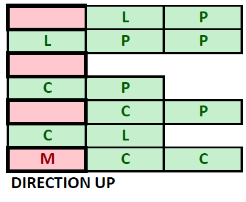

The Garden
==========

Create a program that helps you **harvest** vegetables. There are **three**
kinds of **vegetables** in your garden:

-   **Lettuce** – **'L', Potatoes** – **'P', Carrots** – **'C'**

**First**, you will receive the **rows** of the garden. Then for **each** row,
you will receive the **vegetables**, separated by space in the following format:

**"{vegetable1} {vegetable2} {vegetable3}… {vegetablen}"**

Then you will start receiving **commands**. Here are the possible ones you can
receive:

-   **"Harvest {row} {col}"** – you must go to the given place in the garden and
    harvest the vegetable, **if it exists**. When you harvest a vegetable, you
    leave an **empty space** in the cell – **' '.** Keep in mind, that you
    **can't harvest** a vegetable, which was already **harvested** or
    **harmed**.

-   **"Mole {row} {col} {direction}"** – there is a mole in that cell and it
    goes in that direction, which means the mole, goes from **this cell** until
    the last cell in the given direction. It **harms** the **given cell**,
    **skips the next**, and **harms the next one**, an so on **until the last
    cell**. **Mark** the **harmed** cells with a **space** - **' '**. Keep in
    mind, that you **can't harm** a vegetable, that was **already harmed** or
    **harvested**. There are four possible directions:

    -   **"Up", "Down", "Left", "Right"**

-   **"End of Harvest"** – ends the input.

Here is an example of the **mole's harm radius**:

In the end, **print the resulting garden**. The cells must be **separated by a
space**. Then **print** the **vegetbles** you have succesfully **harvested** and
the **count** of **harmed vegetables** you have found in the following format:

**"Carrots: {countOfCarrots}**

**Potatos: {countOfPotatos}**

**Lettuce: {countOfCucmbers}**

**Harmed vegetables: {count}"**

### Input / Constraints

-   On the first line, you will receive the **count** of **rows**.

-   On the next lines, for **each row**, you will receive the vegetables in the
    described format.

-   Next, until you receive **"End of Harvest"**, you will be receiving commands
    in the described format.

-   The input will always be **valid** and you don't need to check it
    explicitly.

### Output

-   Print the **resulting garden** – each cell separated by a single space.

-   Print the **harvested** and **harmed vegatables** in the format described
    above.

### Examples

| **Input**                                                                                                                                  | **Output**                                                                                     | **Comment**                                                                                                                                                                                                                                                                                                                                                                                                                                                                                                                                                                                                                                            |
|--------------------------------------------------------------------------------------------------------------------------------------------|------------------------------------------------------------------------------------------------|--------------------------------------------------------------------------------------------------------------------------------------------------------------------------------------------------------------------------------------------------------------------------------------------------------------------------------------------------------------------------------------------------------------------------------------------------------------------------------------------------------------------------------------------------------------------------------------------------------------------------------------------------------|
| **4 L P C L L L L C P P P C C C C P C L P C L P C L Harvest 0 2 Harvest 3 0 Harvest 4 2 Mole 2 2 up Mole 1 1 right End of Harvest**        | **L P L L L C P C C C C L P C L P C L Carrots: 1 Potatoes: 1 Lettuce: 0 Harmed vegetables: 4** | When we receive the "**Harvest**" command, we go to the **given coordinates** and harvest the **'C'** and leave an empty space **' '**. After that, we go to the **'P'** on 3 0 and we take it. After that we receive **invalid coordinates**, so we don't do anything. Upon receiving the **mole** command, we **harm** the vegetable in **its cell** and every vegetable in the described way – harm the current cell, **skip** the **next** and this repeats **until the end of the row/coll.** We leave **empty spaces** in the cells. In the end, we have **4 harmed vegetables**, **one** harvested **carrot** and **one** harvested **potato**. |
| **3 P L C C C C C C C L L P P P L L L Harvest 0 0 Harvest 1 3 Mole 2 0 up Harvest 2 5 Harvest 1 1 Harvest 0 2 Harvest 1 4 End of Harvest** | **L C C C L P P P L L Carrots: 4 Potatoes: 1 Lettuce: 1 Harmed vegetables: 1**                 |                                                                                                                                                                                                                                                                                                                                                                                                                                                                                                                                                                                                                                                        |

Make a Salad
============

Write a program that helps you **prepare vegetable salads**, which must be with
a **definite** amount of **calories**. You will receive **two lines**. The
**first** one will be the **vegetables**. The **second** one, the **calorie
values of the salads**. Both will be **separated** by a single **space**. They
will come in the following format:

**"{vegetable1} {vegetable2}… {vegetablen}"**

**"{calories1} {calories2}… {caloriesn}"**

Here is a table with the exact names of the **vegetables** and **their
calories**:

| **Vegetables** | **Calories** |
|----------------|--------------|
| tomato         | 80           |
| carrot         | 136          |
| lettuce        | 109          |
| potato         | 215          |

Start making the **salads** in the following way: take the **last received
calories** and start adding vegetables from the **first received vegetable**.
Each time you take a vegetable, you must **reduce** the **amount** of
**calories** for the **given salad** with **its calorie value** and **remove**
it from the collection. A salad is considered **ready**, when its **calorie
value** reaches **0**. When the **salad is ready**, **remove it** from the
collection. If the calories of the current vegetable **exceed** the amount of
**needed calories** for the **salad**, **finish** the salad and **throw** what
is left of the vegetable. When you run out of **either salads to make**, or
**vegetables**, print **the salads you made** (their calorie value) on a single
line, separated by space, beginning with the **first** salad you made in the
following format:

**"{salad1} {salad2}… {saladn}"**

At last, print either the vegetables that are left, or the calories of the
salads you couldn't prepare, **depending on the case** – if you have vegetables
left, print them, if you have salads left, print them on a single **line**,
**separated** by **space**.

### Input

-   On the **first** line, you will receive the **vegetables** – **strings**
    separated by a single space.

-   On the **second** line, you will receive the **salads' calories** –
    **integers**, separated by a single space.

-   Input will always be **valid**.

### Output

-   Print the finished salads' calories from the first made one to the last one
    in the format described above

### Examples

| **Input**                                                                | **Output**                           | **Comments**                                                                                                                                                                                                                                                                                                                                                                                                                                                                                                        |
|--------------------------------------------------------------------------|--------------------------------------|---------------------------------------------------------------------------------------------------------------------------------------------------------------------------------------------------------------------------------------------------------------------------------------------------------------------------------------------------------------------------------------------------------------------------------------------------------------------------------------------------------------------|
| tomato potato carrot lettuce tomato 250 563 478 330 470 112              | 112 470 330 478 563 250              | We take the **first** received vegetable - the **tomato**. It has **80** calories, so we take the **last** received salad calories – **112** and **subtract 80** from it. The salad needs **32** more **calories**. We **remove** the **vegetable** and take the **next** one – **potato**. It has **215 calories**. The **first** salad is **finished**, so we **remove** the **vegetable**, also the **salad's calories** from the collection. We take the **next one**, which needs **470** calories, and so on. |
| carrot tomato potato potato lettuce tomato potato potato 105 130 200 110 | 110 200 130 105 tomato potato potato |                                                                                                                                                                                                                                                                                                                                                                                                                                                                                                                     |

Healthy Heaven
==============

Preparation
-----------

Download the skeleton provided in Judge. **Do not** change the **StartUp** class
or its **namespace**.

Problem description
-------------------

Your task is to create a repository (a restaurant), which stores salads by
creating the **classes** described below.

### Vegetable

First, write a C\# class **Vegetable** with the following properties:

-   **Name: string**

-   **Calories: int**

The class **constructor** should receive **name** and **calories**.

The class also should have the methods:

-   Override the **ToString()** method in the following format:

    **" - {name} have {calories} calories"**

### Salad

**Next**, write a **C\#** class **Salad** that has **products** (a collection
field, which stores the entity **Vegetable**). All entities inside the
repository have the **same properties**. Also, the **Salad** class should have
those properties:

-   **Name: string**

The class **constructor** should receive **name**, also it should initialize the
**products** with a new instance of the collection**.**

The class also should have the methods:

-   **int GetTotalCalories()** – returns the sum of all vegetable calories in
    the salad

-   **int GetProductCount()** - **returns** the **number** of products

-   **void Add(Vegetable product)** – adds an entity to the products

-   Override **ToString()** – by the format bellow:

    **"\* Salad {name} is {calories} calories and have {product count}
    products:**  
    **{Vegetable 1}**  
    **{Vegetable 2}**  
    **{Vegetable 3}**  
    **{…}"**

### Restaurant

**Next**, write a **C\#** class **Restaurant** that has **data** (a collection
field, which stores the entity **Salad**). All entities inside the repository
have the **same properties**. Also, the **Restaurant** class should have those
properties:

-   **Name: string**

The class **constructor** should receive **name**, also it should initialize the
**data** with a new instance of the collection.

Implement the following features:

-   Field **data** – **collection** that holds added salads

-   Method **Add(Salad salad)** – adds an entity to the data

-   Method **Buy(string name)** – removes a salad by given name, if such exists,
    and returns boolean

-   Mehod **GetHealthiestSalad()** – returns the healthiest salad

-   Method **GenerateMenu()** - **returns** a **string** in the following
    **format**:

    "**{name} have {salad count} salads:**  
    **{Salad 1}**  
    **{Salad 2}**  
    **{…}**"

Constraints
-----------

-   The **names** of the vegetables and salads will be **always unique**.

-   The **calories** of the vegetables will always be with **positive values**.

Examples
--------

This is an example how the **Restaurant** class is **intended to be used**.

| Sample code usage                                                                                                                                                                                                                                                                                                                                                                                                                                                                                                                                                                                                                                                                                                                                                                                                                                                                                                                                                                                                                                                                                                                                                                                                                                                                                                                                                          |
|----------------------------------------------------------------------------------------------------------------------------------------------------------------------------------------------------------------------------------------------------------------------------------------------------------------------------------------------------------------------------------------------------------------------------------------------------------------------------------------------------------------------------------------------------------------------------------------------------------------------------------------------------------------------------------------------------------------------------------------------------------------------------------------------------------------------------------------------------------------------------------------------------------------------------------------------------------------------------------------------------------------------------------------------------------------------------------------------------------------------------------------------------------------------------------------------------------------------------------------------------------------------------------------------------------------------------------------------------------------------------|
| // Initialize the repository Restaurant restaurant = new Restaurant("Casa Domingo"); // Initialize the entities Vegetable tomato = new Vegetable("Tomato", 20); Vegetable cucumber = new Vegetable("Cucumber", 15); Salad salad = new Salad("Tomatoes with cucumbers"); salad.Add(tomato); salad.Add(cucumber); Console.WriteLine(salad.GetTotalCalories()); // 35 Console.WriteLine(salad.GetProductCount()); // 2 Console.WriteLine(salad.ToString()); // \* Salad Tomatoes with cucumbers is 35 calories and have 2 products: // - Tomato have 20 calories // - Cucumber have 15 calories restaurant.Add(salad); Console.WriteLine(restaurant.Buy("Invalid salad")); // False // Initialize the second entities Vegetable corn = new Vegetable("Corn", 90); Salad casaDomingo = new Salad("Casa Domingo"); casaDomingo.Add(tomato); casaDomingo.Add(cucumber); casaDomingo.Add(corn); restaurant.Add(casaDomingo); Console.WriteLine(restaurant.GetHealthiestSalad()); // Tomatoes with cucumbers Console.WriteLine(restaurant.GenerateMenu()); // Casa Domingo have 2 salads: // \* Salad Tomatoes with cucumbers is 35 calories and have 2 products: // - Tomato have 20 calories // - Cucumber have 15 calories // \* Salad Casa Domingo is 125 calories and have 3 products: // - Tomato have 20 calories // - Cucumber have 15 calories // - Corn have 90 calories |

Submission
----------

Zip all the files in the project folder except **bin** and **obj** folders
