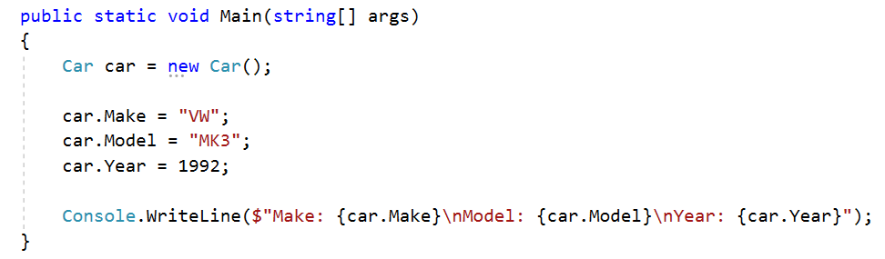
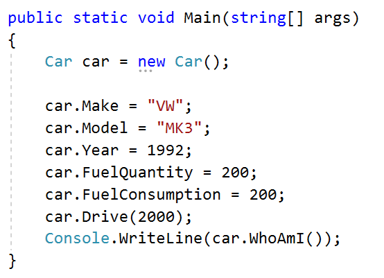
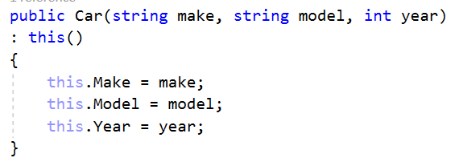
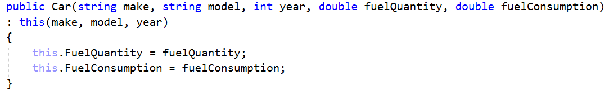
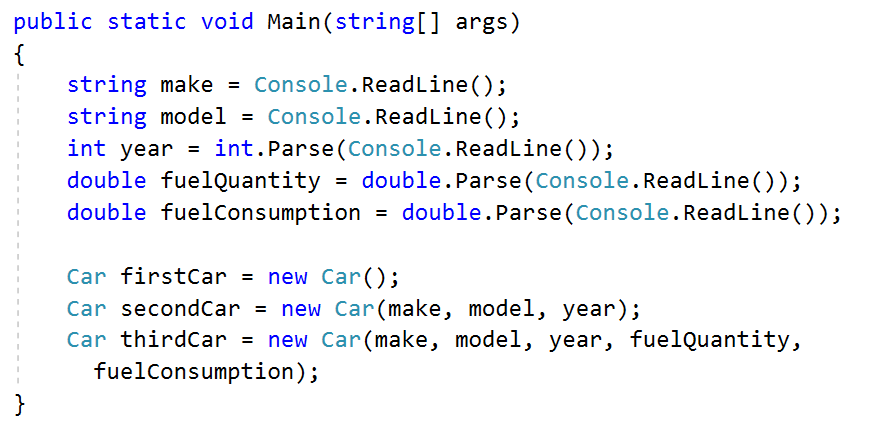
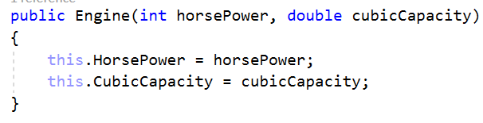
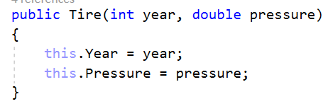
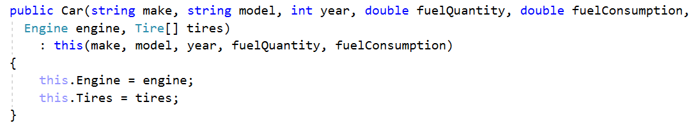
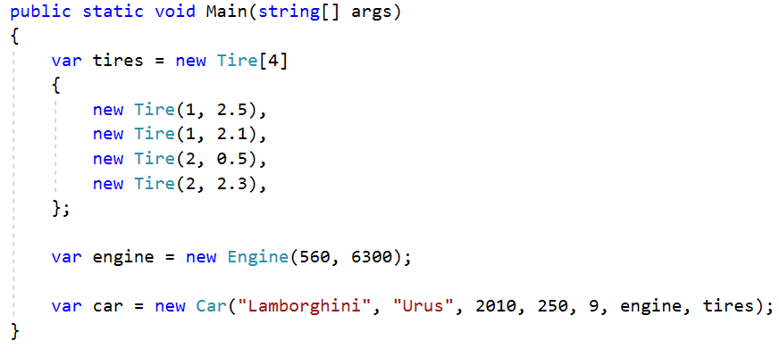

Defining Classes - Lab
======================

Problems for exercises and homework for the ["CSharp Advanced" course \@
Software University](https://softuni.bg/courses/csharp-advanced)*.*

You can check your solutions here:
<https://judge.softuni.bg/Contests/1478/Defining-Classes-Lab>

Problem 1. Car 
---------------

**NOTE**: You need a **StartUp** class with the namespace **CarManufacturer**.

Create a **class** named **Car**.

The class should have **private fields** for:

-   **make: string**

-   **model: string**

-   **year: int**

The class should also have **public properties** for:

-   **Make: string**

-   **Model: string**

-   **Year: int**

You should be able to use the class like this:

Problem 2. Car Extension
------------------------

**NOTE**: You need a **StartUp** class with the namespace **CarManufacturer**.

Create a class **Car** (you can use the class from the previous task)

The class should have private fields for:

-   **make: string**

-   **model: string**

-   **year: int**

-   **fuelQuantity: double**

-   **fuelConsumption: double**

The class should also have properties for:

-   **Make: string**

-   **Model: string**

-   **Year: int**

-   **FuelQuantity: double**

-   **FuelConsumption: double**

The class should also have methods for:

-   **Drive(double distance): void** – this method checks if the car fuel
    quantity minus the distance multiplied by the car fuel consumption is bigger
    than zero. If it is remove from the fuel quantity the result of the
    multiplication between the distance and the fuel consumption. Otherwise
    write on the console the following message: **"Not enough fuel to perform
    this trip!"**

-   **WhoAmI(): string –** returns the following message: **"Make:
    {this.Make}\\nModel: {this.Model}\\nYear: {this.Year}\\nFuel:
    {this.FuelQuantity:F2}L"**

You should be able to use the class like this:

Problem 3. Car Constructors
---------------------------

Using the class from the previous problem create one parametless constructor
with default values:

Make – VW, Model – Golf, Year – 2025, FuelQuantity – 200, FuelConsumption – 10

Create second constructor accepting **make, model** and **year** upon
initialization and calls the base constructor with it’s default values for
**fuelQuantity** and **fuelConsumption**.

Create third constructor accepting **make, model, year, fuelQuantity** and
**fuelConsumption** upon initialization and reuses the second constructor to set
the make, model and year values.

Go to **StartUp.cs** file and make 3 different instance of the **Class Car**
using the **different** overloads of the constructor.

Problem 4. Car Engine And Tires
-------------------------------

Using the Car class, you already created, define another class **Engine**.

The class should have private fields for:

-   **horsePower: int**

-   **cubicCapacity: double**

The class should also have properties for:

-   **HorsePower: int**

-   **CubicCapacity: double**

The class should also have constructor which accepts horsepower and
cubicCapacity upon initialization:

Now create class **Tire**.

The class should have private fields for:

-   **year: int**

-   **pressure: double**

The class should also have properties for:

-   **Year: int**

-   **Pressure: double**

The class should also have constructor which accepts year and pressure upon
initialization:

Finally go to **Car** class and create **private fields for engine and tire
array** and **public properties for Engine and Tire array**. Create another
constructor which **accepts make, model, year, fuelQuantity, fuelConsumption,
Engine** and **Tire** array upon initialization:

You should be able to use the classes like this:

Problem 5. Special Cars
-----------------------

This is the final and most interesting problem in this lab. Until you receive
the command **"No more tires"** you will be given tire info in the format:

**{year} {pressure}**

**{year} {pressure}**

**…**

**"No more tires"**

You have to collect all the tires provided because you gonna need them all. Next
until you receive the command **"Engines done"** you will be given engine info
and you also have to collect all that info.

**{horsePower} {cubicCapacity}**

**{horsePower} {cubicCapacity}**

**…**

**"Engines done"**

The final step is until you receive **"Show special"** you will be given
information about cars in the format:

**{make} {model} {year} {fuelQuantity} {fuelConsumption} {engineIndex}
{tiresIndex}**

**…**

**"Show special"**

Each time you have to create new car new Car with the information provided. The
car engine is the one on the engine index provided and the tires are the ones on
the tiresIndex provided. Finally collect all the cars created. When you receive
the command **"Show special"** drive 20 kilometers all cars where their year is
above or equal to 2017, have horse power above 330 and the sum of tire pressure
is between 9 and 10. Finally print information about each special car in the
following format:

"Make: {specialCar.Make}"

"Model: {specialCar.Model}"

"Year: {specialCar.Year}"

"HorsePowers: {specialCar.Engine.HorsePower}"

"FuelQuantity: {specialCar.FuelQuantity}"

| **Input**                                                                                                                                              | **Output**                                                           |
|--------------------------------------------------------------------------------------------------------------------------------------------------------|----------------------------------------------------------------------|
| 2 2.6 3 1.6 2 3.6 3 1.6 1 3.3 2 1.6 5 2.4 1 3.2 No more tires 331 2.2 145 2.0 Engines done Audi A5 2017 200 12 0 0 BMW X5 2007 175 18 1 1 Show special | Make: Audi Model: A5 Year: 2017 HorsePowers: 331 FuelQuantity: 197.6 |
