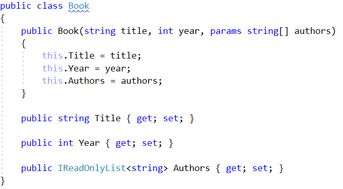
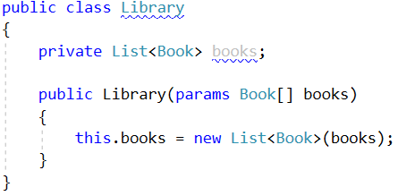
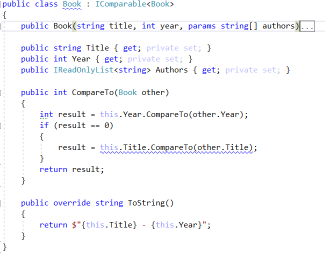

Lab: Iterators and Comparators
==============================

Problems for exercises and homework for the ["CSharp Advanced" course \@
Software University](https://softuni.bg/courses/csharp-advanced).

You can check your solutions here:
<https://judge.softuni.bg/Contests/1489/Iterators-and-Comparators-Lab>

Library
-------

**NOTE**: You need the namespace **IteratorsAndComparators**.

Create a class **Book**, which should have three public properties:

-   **string Title**

-   **int Year**

-   **List\<string\> Authors**

Authors can be **anonymous, one or many**. A Book should have only **one
constructor**.

Create a class **Library**, which should store a collection of books and
implement the **IEnumerable\<Book\>** interface.

-   **List\<Book\> books**

A Library could be intilized without books or with any number of books and
should have only **one constructor**.

### Examples

| StartUp.cs                                                                                                                                                                                                                                                                                                                                                     |
|----------------------------------------------------------------------------------------------------------------------------------------------------------------------------------------------------------------------------------------------------------------------------------------------------------------------------------------------------------------|
| public static void Main() {  Book bookOne = new Book("Animal Farm", 2003, "George Orwell"); Book bookTwo = new Book("The Documents in the Case", 2002, "Dorothy Sayers", "Robert Eustace"); Book bookThree = new Book("The Documents in the Case", 1930); Library libraryOne = new Library(); Library libraryTwo = new Library(bookOne, bookTwo, bookThree); } |

### Solution

Library Iterator
----------------

**NOTE**: You need the namespace **IteratorsAndComparators**.

Extend your solution from the prevoius task. Inside the Library class create a
**nested class LibraryIterator,** which should implement the
**IEnumerator\<Book\>** interface. Try to implement the bodies of the inherited
methods by yourself. You will need two more members:

-   **List\<Book\> books**

-   **int currentIndex**

Now you should be able to iterate through a Library in the Main method.

### Examples

| Startup.cs                                                                                                                                                                                                                                                                                                                                                                                                                         |
|------------------------------------------------------------------------------------------------------------------------------------------------------------------------------------------------------------------------------------------------------------------------------------------------------------------------------------------------------------------------------------------------------------------------------------|
| public static void Main() { Book bookOne = new Book("Animal Farm", 2003, "George Orwell"); Book bookTwo = new Book("The Documents in the Case", 2002, "Dorothy Sayers", "Robert Eustace"); Book bookThree = new Book("The Documents in the Case", 1930); Library libraryOne = new Library(); Library libraryTwo = new Library(bookOne, bookTwo, bookThree); foreach (var book in libraryTwo) { Console.WriteLine(book.Title); } }  |
| **Output**                                                                                                                                                                                                                                                                                                                                                                                                                         |
| Animal Farm The Documents in the Case The Documents in the Case                                                                                                                                                                                                                                                                                                                                                                    |

### Solution

Comparable Book
---------------

**NOTE**: You need the namespace **IteratorsAndComparators**.

Extend your solution from the prevoius task. Implement the
**IComparable\<Book\>** interface in the existing class **Book**. The comparison
between two books should happen in the following order:

-   First sort them in **ascending chronological** order (by year)

-   If two books are published in the **same year**, sort them
    **alphabetically**

Override the **ToString()** method in your Book class, so it returns a string in
the format:

-   {**title**} - {**year**}

Change your Library class, so that it stores the books in the correct order.

### Examples

| Startup.cs                                                                                                                                                                                                                                                                                                                                                                                                                   |
|------------------------------------------------------------------------------------------------------------------------------------------------------------------------------------------------------------------------------------------------------------------------------------------------------------------------------------------------------------------------------------------------------------------------------|
| public static void Main() { Book bookOne = new Book("Animal Farm", 2003, "George Orwell"); Book bookTwo = new Book("The Documents in the Case", 2002, "Dorothy Sayers", "Robert Eustace"); Book bookThree = new Book("The Documents in the Case", 1930); Library libraryOne = new Library(); Library libraryTwo = new Library(bookOne, bookTwo, bookThree); foreach (var book in libraryTwo) { Console.WriteLine(book); } }  |

### Examples

| **Output**                                                                           |
|--------------------------------------------------------------------------------------|
| The Documents in the Case - 1930 The Documents in the Case - 2002 Animal Farm - 2003 |

### Solution

Book Comparator
---------------

**NOTE**: You need the namespace **IteratorsAndComparators**.

Extend your solution from the prevoius task. Create a class **BookComparator,**
which should implement the **IComparer\<Book\>** interface and thus include the
following method:

-   **int Compare(Book, Book)**

**BookComparator** must **compare** two books by:

1.  Book title - **alphabetical order**

2.  Year of publishing a book - **from the newest to the oldest**

Modify your Library class once again to implement the **new sorting**.

### Examples

| Startup.cs                                                                                                                                                                                                                                                                                                              |
|-------------------------------------------------------------------------------------------------------------------------------------------------------------------------------------------------------------------------------------------------------------------------------------------------------------------------|
| public static void Main() {  Book bookOne = new Book("Animal Farm", 2003, "George Orwell"); Book bookTwo = new Book("The Documents in the Case", 2002, "Dorothy Sayers", "Robert Eustace"); Book bookThree = new Book("The Documents in the Case", 1930); Library library = new Library(bookOne, bookTwo, bookThree); } |
| **Output**                                                                                                                                                                                                                                                                                                              |
| Animal Farm - 2003 The Documents in the Case - 2002 The Documents in the Case - 1930                                                                                                                                                                                                                                    |

### Solution

