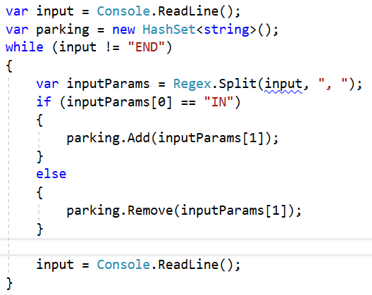

Lab: Sets and Dictionaries Advanced
===================================

Problems for exercises and homework for the ["C\# Advanced" course \@
SoftUni](https://softuni.bg/courses/csharp-advanced).

You can check your solutions here:
<https://judge.softuni.bg/Contests/1465/Sets-and-Dictionaries-Advanced-Lab>

Dictionaries
------------

### Count Same Values in Array

Write a program that counts in a given array of double values the number of
occurrences of each value.

#### Examples

| **Input**                               | **Output**                                             |
|-----------------------------------------|--------------------------------------------------------|
| \-2.5 4 3 -2.5 -5.5 4 3 3 -2.5 3        | \-2.5 - 3 times 4 - 2 times 3 - 4 times -5.5 - 1 times |
| 2 4 4 5 5 2 3 3 4 4 3 3 4 3 5 3 2 5 4 3 | 2 - 3 times 4 - 6 times 5 - 4 times 3 - 7 times        |

### Average Student Grades

Write a program, which reads the **name** of a student and their **grades** and
**adds** them to the **student record**, then **prints grades** along with their
**average grade**.

#### Examples

| **Input**                                                                                  | **Output**                                                                                                |
|--------------------------------------------------------------------------------------------|-----------------------------------------------------------------------------------------------------------|
| 7 Ivancho 5.20 Mariika 5.50 Ivancho 3.20 Mariika 2.50 Stamat 2.00 Mariika 3.46 Stamat 3.00 | Ivancho -\> 5.20 3.20 (avg: 4.20) Mariika -\> 5.50 2.50 3.46 (avg: 3.82) Stamat -\> 2.00 3.00 (avg: 2.50) |
| 4 Vladimir 4.50 Petko 3.00 Vladimir 5.00 Petko 3.66                                        | Vladimir -\> 4.50 5.00 (avg: 4.75) Petko -\> 3.00 3.66 (avg: 3.33)                                        |
| 5 Gosho 6.00 Gosho 5.50 Gosho 6.00 Ivan 4.40 Petko 3.30                                    | Gosho -\> 6.00 5.50 6.00 (avg: 5.83) Ivan -\> 4.40 (avg: 4.40) Petko -\> 3.30 (avg: 3.30)                 |

#### Hints

-   Use a **dictionary** (**string List\<double\>**)

-   Check if the name exists before adding the grade. If it doesn’t, add it to
    the dictionary.

-   Pass through all **key-value pairs** in the dictionary and print the
    results. You can use the **.Average()** method to quickly calculate the
    average value from a list.

### Product Shop

Write a program that prints information about food shops in Sofia and the
products they store. Until the "**Revision**" command you will receive an input
in the format: **"{shop}, {product}, {price}"**

Take in mind that if you receive a shop you already have received you must
collect its product information.

Your output must be ordered by shop name and must be in the format:

{shop}-\>

Product: {product}, Price: {price}

#### Examples

| **Input**                                                                                            | **Output**                                                                                                                                     |
|------------------------------------------------------------------------------------------------------|------------------------------------------------------------------------------------------------------------------------------------------------|
| lidl, juice, 2.30 fantastico, apple, 1.20 kaufland, banana, 1.10 fantastico, grape, 2.20 Revision    | fantastico-\> Product: apple, Price: 1.2 Product: grape, Price: 2.2 kaufland-\> Product: banana, Price: 1.1 lidl-\> Product: juice, Price: 2.3 |
| tmarket, peanuts, 2.20 GoGrill, meatballs, 3.30 GoGrill, HotDog, 1.40 tmarket, sweets, 2.20 Revision | GoGrill-\> Product: meatballs, Price: 3.3 Product: HotDog, Price: 1.4 tmarket-\> Product: peanuts, Price: 2.2 Product: sweets, Price: 2.2      |

### Cities by Continent and Country

Write a program to read **continents**, **countries** and their **cities**, put
them in a **nested dictionary** and **print** them.

#### Examples

| **Input**                                                                                                                                                                                    | **Output**                                                                                                                                                   |
|----------------------------------------------------------------------------------------------------------------------------------------------------------------------------------------------|--------------------------------------------------------------------------------------------------------------------------------------------------------------|
| 9 Europe Bulgaria Sofia Asia China Beijing Asia Japan Tokyo Europe Poland Warsaw Europe Germany Berlin Europe Poland Poznan Europe Bulgaria Plovdiv Africa Nigeria Abuja Asia China Shanghai | Europe: Bulgaria -\> Sofia, Plovdiv Poland -\> Warsaw, Poznan Germany -\> Berlin Asia: China -\> Beijing, Shanghai Japan -\> Tokyo Africa: Nigeria -\> Abuja |
| 3 Europe Germany Berlin Europe Bulgaria Varna Africa Egypt Cairo                                                                                                                             | Europe: Germany -\> Berlin Bulgaria -\> Varna Africa: Egypt -\> Cairo                                                                                        |
| 8 Africa Somalia Mogadishu Asia India Mumbai Asia India Delhi Europe France Paris Asia India Nagpur Europe Germany Hamburg Europe Poland Gdansk Europe Germany Danzig                        | Africa: Somalia -\> Mogadishu Asia: India -\> Mumbai, Delhi, Nagpur Europe: France -\> Paris Germany -\> Hamburg, Danzig Poland -\> Gdansk                   |

#### Hints

-   Use a **nested dictionary** (**string** (**Dictionary List\<string\>)**)

-   Check if the continent exists before adding the country. If it doesn’t, add
    it to the dictionary.

-   Check if the country exists, before adding the city. If it doesn’t, add it
    to the dictionary.

-   Pass through all **key-value pairs** in the dictionary and the values’
    key-value pairs and print the results.

Sets
----

### Record Unique Names

Write a program, which will take a list of **names** and print **only** the
**unique** names in the list.

#### Examples

| **Input**                                        | **Output**                    |   | **Input**                                         | **Output**                    |   | **Input**                      | **Output** |
|--------------------------------------------------|-------------------------------|---|---------------------------------------------------|-------------------------------|---|--------------------------------|------------|
| 8 Ivan Pesho Ivan Stamat Pesho Alice Peter Pesho | Ivan Pesho Stamat Alice Peter |   | 7 Lyle Bruce Alice Easton Shawn Alice Shawn Peter | Lyle Bruce Alice Easton Shawn |   | 6 Roki Roki Roki               | Roki       |
|                                                  |                               |   |                                                   |                               |   | Roki Roki Roki                 |            |

#### Hints

You can store the names in a **HashSet\<string\>** to extract only the unique
ones.

### Parking Lot

Write program that:

-   Record **car number** for every car that enter in **parking lot**

-   Remove **car number** when the car go out

-   Input will be string in format **[direction, carNumber]**

-   input end with string **"END"**

Print the output with all car numbers which are in parking lot

#### Examples

| **Input**                                                                                                                                | **Output**                          |
|------------------------------------------------------------------------------------------------------------------------------------------|-------------------------------------|
| IN, CA2844AA IN, CA1234TA OUT, CA2844AA IN, CA9999TT IN, CA2866HI OUT, CA1234TA IN, CA2844AA OUT, CA2866HI IN, CA9876HH IN, CA2822UU END | CA9999TT CA2844AA CA9876HH CA2822UU |
| IN, CA2844AA IN, CA1234TA OUT, CA2844AA OUT, CA1234TA END                                                                                | Parking Lot is Empty                |

#### Hints

-   Car numbers are **unique**

-   For print, first ask if set is empty

#### Solution

You might help yourself with the code below:

### SoftUni Party

#### There is a party in SoftUni. Many guests are invited and there are two types: VIP and regular. When guest come check if he/she exists in any of the two reservation lists.

#### All reservation numbers will be with 8 chars.

#### All VIP numbers start with a digit.

#### There will be 2 command lines. First is "PARTY" - party is on and guests start coming. Second is "END" – then party is over, and no more guest will come

#### Output has to be all the guests, who didn't come to the party (VIP must be first) and their count.

#### Examples

| **Input**                                                                         | **Output**          | **Input**                                                                                                                                                                                                                                                             | **Output**          |
|-----------------------------------------------------------------------------------|---------------------|-----------------------------------------------------------------------------------------------------------------------------------------------------------------------------------------------------------------------------------------------------------------------|---------------------|
| 7IK9Yo0h 9NoBUajQ Ce8vwPmE SVQXQCbc tSzE5t0p PARTY 9NoBUajQ Ce8vwPmE SVQXQCbc END | 2 7IK9Yo0h tSzE5t0p | m8rfQBvl fc1oZCE0 UgffRkOn 7ugX7bm0 9CQBGUeJ 2FQZT3uC dziNz78I mdSGyQCJ LjcVpmDL fPXNHpm1 HTTbwRmM B5yTkMQi 8N0FThqG xys2FYzn MDzcM9ZK PARTY 2FQZT3uC dziNz78I mdSGyQCJ LjcVpmDL fPXNHpm1 HTTbwRmM B5yTkMQi 8N0FThqG m8rfQBvl fc1oZCE0 UgffRkOn 7ugX7bm0 9CQBGUeJ END | 2 xys2FYzn MDzcM9ZK |
