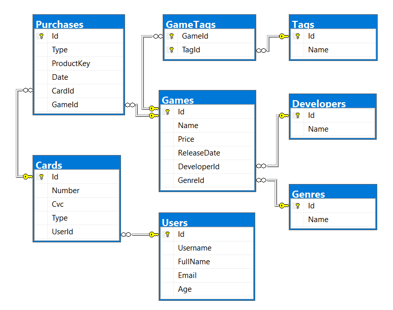

Databases Advanced Retake Exam – 1 Sep 2018
===========================================

Exam problems for the [Databases Advanced - Entity Framework course \@
SoftUni](https://softuni.bg/courses/databases-advanced-entity-framework). Submit
your solutions in the **SoftUni judge** system (delete all "**bin**"/"**obj**"
and "**packages**" folders).

Your task is to create a **database application**, using **Entity Framework
Core**, using the **Code First** approach. Design the **domain models** and
**methods** for manipulating the data, as described below.

VaporStore
==========

Project Skeleton Overview
-------------------------

You are given a **project skeleton**, which includes the following folders:

-   **Data** – contains the **VaporStoreDbContext** class, **Models** folder
    which contains the **entity classes** and the **Configuration** class with
    **connection string**

-   **DataProcessor** – contains the **Serializer** and **Deserializer**
    classes, which are used for **importing** and **exporting** data

-   **Datasets** – contains the **.json** and **.xml** files for the import part

-   **ImportResults** – contains the **export** results you make in the
    **Deserializer** class

-   **ExportResults** – contains the **import** results you make in the
    **Serializer** class

Problem 1. Model Definition (50 pts)
------------------------------------

*Note: Foreign key navigation properties are required!*

The application needs to store the following data:

### Game

-   **Id** – integer, **Primary Key**

-   **Name** – **text (required)**

-   **Price** – **decimal** (**non-negative, minimum value: 0**) **(required)**

-   **ReleaseDate** – **Date (required)**

-   **DeveloperId** – **integer**, foreign key **(required)**

-   **Developer** – the game’s **developer (required)**

-   **GenreId** – **integer**, foreign key **(required)**

-   **Genre** – the game’s **genre (required)**

-   **Purchases** - collection of type **Purchase**

-   **GameTags** - collection of type **GameTag**. Each game must have **at
    least one** tag.

### Developer

-   **Id** – integer, **Primary Key**

-   **Name** – **text (required)**

-   **Games** - collection of type **Game**

### Genre

-   **Id** – integer, **Primary Key**

-   **Name** – **text (required)**

-   **Games** - collection of type **Game**

### Tag

-   **Id** – integer, **Primary Key**

-   **Name** – **text (required)**

-   **GameTags** - collection of type **GameTag**

### GameTag

-   **GameId** – integer, **Primary Key**, **foreign key (required)**

-   **TagId** – integer, **Primary Key**, **foreign key (required)**

-   **Game** – **Game**

-   **Tag** – **Tag**

### User

-   **Id** – integer, **Primary Key**

-   **Username** – **text with length [3, 20] (required)**

-   **FullName** – **text,** which has **two** words, **consisting of Latin
    letters**. **Both** start with an **upper letter** and are separated by a
    **single space** (ex. **"John Smith"**) **(required)**

-   **Email** – **text (required)**

-   **Age** – **integer** in the **range [3, 103] (required)**

-   **Cards** – collection of type **Card**

### Card

-   **Id** – integer, **Primary Key**

-   **Number** – **text**, which consists of **4 pairs** of **4 digits**,
    separated by spaces (ex. “**1234 5678 9012 3456**”) **(required)**

-   **Cvc** – **text,** which consists of 3 digits (ex. “**123**”)
    **(required)**

-   **Type** – **enumeration** of type **CardType**, with possible values
    (“**Debit**”, “**Credit**”) **(required)**

-   **UserId** – **integer**, foreign key **(required)**

-   **User** – the card’s **user (required)**

-   **Purchases** – collection of type **Purchase**

### Purchase

-   **Id** – integer, **Primary Key**

-   **Type** – **enumeration** of type **PurchaseType**, with possible values
    (“**Retail**”, “**Digital**”) **(required)**

-   **ProductKey** – **text**, which consists of **3 pairs** of **4 uppercase
    Latin letters and digits**, separated by **dashes** (ex.
    “**ABCD-EFGH-1J3L**”) **(required)**

-   **Date** – **Date (required)**

-   **CardId** – **integer**, foreign key **(required)**

-   **Card** – the purchase’s **card (required)**

-   **GameId** – **integer**, foreign key **(required)**

-   **Game** – the purchase’s **game (required)**

Problem 2. Data Import (30pts)
------------------------------

For the functionality of the application, you need to create several methods
that manipulate the database. The **project skeleton** already provides you with
these methods, inside the **Deserializer class**. Usage of **Data Transfer
Objects** is **optional**.

Use the provided **JSON** and **XML** files to populate the database with data.
Import all the information from those files into the database.

You are **not allowed** to modify the provided **JSON** and **XML** files.

**If a record does not meet the requirements from the first section, print an
error message:**

| **Error message** |
|-------------------|
| Invalid Data      |

### JSON Import (20 pts)

#### Import Games, Developers, Genres and Tags

Using the file **games.json**, import the data from that file into the database.
Print information about each imported object in the format described below.

##### Constraints

-   If any validation errors occur (such as if a **Price** is negative, a
    **Name**/**ReleaseDate**/**Developer**/**Genre** is missing, **Tags** are
    **missing** or **empty**), **do not** import any part of the entity and
    **append an error message** to the **method output**.

-   **CultureInfo.InvariantCulture**.

-   If a **developer**/**genre**/**tag** with that name **doesn’t exist**,
    **create it**.

-   If a game is **invalid**, **do not** import its **genre, developer or
    tags**.

-   Dates are always in the format “**yyyy-MM-dd**”

##### Example

| **games.json**                                                                                                                                                                                                                                                                                                                                                                                                                                                                                                                                                                                                                                                                                                                                                                                                                                                                                      |
|-----------------------------------------------------------------------------------------------------------------------------------------------------------------------------------------------------------------------------------------------------------------------------------------------------------------------------------------------------------------------------------------------------------------------------------------------------------------------------------------------------------------------------------------------------------------------------------------------------------------------------------------------------------------------------------------------------------------------------------------------------------------------------------------------------------------------------------------------------------------------------------------------------|
| [ { "Price": 0, "ReleaseDate": "2013-07-09", "Developer": "Valid Dev", "Genre": "Valid Genre", "Tags": ["Valid Tag"] }, { "Name": "Invalid", "Price": -5, "ReleaseDate": "2013-07-09", "Developer": "Valid Dev", "Genre": "Valid Genre", "Tags": ["Valid Tag"] }, { "Name": "Invalid", "Price": 0, "ReleaseDate": "2013-07-09", "Genre": "Valid Genre", "Tags": ["Valid Tag"] }, { "Name": "Invalid", "Price": 0, "ReleaseDate": "2013-07-09", "Developer": "Valid Dev", "Tags": ["Valid Tag"] }, { "Name": "Invalid", "Price": 0, "ReleaseDate": "2013-07-09", "Developer": "Valid Dev", "Genre": "Valid Genre", "Tags": [] }, { "Name": "Dota 2", "Price": 0, "ReleaseDate": "2013-07-09", "Developer": "Valve", "Genre": "Action", "Tags": [ "Multi-player", "Co-op", "Steam Trading Cards", "Steam Workshop", "SteamVR Collectibles", "In-App Purchases", "Valve Anti-Cheat enabled" ] }, ... ] |
| **Output**                                                                                                                                                                                                                                                                                                                                                                                                                                                                                                                                                                                                                                                                                                                                                                                                                                                                                          |
| **Invalid Data Invalid Data Invalid Data Invalid Data Invalid Data Added Dota 2 (Action) with 7 tags ...**                                                                                                                                                                                                                                                                                                                                                                                                                                                                                                                                                                                                                                                                                                                                                                                          |

Upon **correct import logic**, you should have imported **74 games**, **66
developers**, **12 genres** and **25 tags**.

#### Import Users and Cards

Using the file **users.json**, import the data from that file into the database.
Print information about each imported object in the format described below.

##### Constraints

-   If any validation errors occur (such as invalid **full name**, too
    **short/long username**, missing **email**, too **low/high age**, incorrect
    **card number/CVC**, **no** cards, etc.), **ignore** the entity and **print
    an error message**.

##### Example

| **users.json**                                                                                                                                                                                                                                                                                                                                                                                                                                                                                                                                                                                                                                                                                                                                                                                                                                                                                                                                                                                                                                                                                                                                                                                                                                                                                                                                                                                                                                   |
|--------------------------------------------------------------------------------------------------------------------------------------------------------------------------------------------------------------------------------------------------------------------------------------------------------------------------------------------------------------------------------------------------------------------------------------------------------------------------------------------------------------------------------------------------------------------------------------------------------------------------------------------------------------------------------------------------------------------------------------------------------------------------------------------------------------------------------------------------------------------------------------------------------------------------------------------------------------------------------------------------------------------------------------------------------------------------------------------------------------------------------------------------------------------------------------------------------------------------------------------------------------------------------------------------------------------------------------------------------------------------------------------------------------------------------------------------|
| [ { "FullName": "", "Username": "invalid", "Email": "invalid\@invalid.com", "Age": 20, "Cards": [ { "Number": "1111 1111 1111 1111", "CVC": "111", "Type": "Debit" } ] }, { "FullName": "Invalid Invalidman", "Username": "", "Email": "invalid\@invalid.com", "Age": 20, "Cards": [ { "Number": "1111 1111 1111 1111", "CVC": "111", "Type": "Debit" } ] }, { "FullName": "Invalid Invalidman", "Username": "invalid", "Email": "", "Age": 20, "Cards": [ { "Number": "1111 1111 1111 1111", "CVC": "111", "Type": "Debit" } ] }, { "FullName": "Invalid Invalidman", "Username": "invalid", "Email": "invalid\@invalid.com", "Age": 2, "Cards": [ { "Number": "1111 1111 1111 1111", "CVC": "111", "Type": "Debit" } ] }, { "FullName": "Invalid Invalidman", "Username": "invalid", "Email": "invalid\@invalid.com", "Age": 104, "Cards": [ { "Number": "1111 1111 1111 1111", "CVC": "111", "Type": "Debit" } ] }, { "FullName": "Lorrie Silbert", "Username": "lsilbert", "Email": "lsilbert\@yahoo.com", "Age": 33, "Cards": [ { "Number": "1833 5024 0553 6211", "CVC": "903", "Type": "Debit" }, { "Number": "5625 0434 5999 6254", "CVC": "570", "Type": "Credit" }, { "Number": "4902 6975 5076 5316", "CVC": "091", "Type": "Debit" } ] }, { "FullName": "Anita Ruthven", "Username": "aruthven", "Email": "aruthven\@gmail.com", "Age": 75, "Cards": [ { "Number": "5208 8381 5687 8508", "CVC": "624", "Type": "Debit" } ] }, ... ] |
| **Output**                                                                                                                                                                                                                                                                                                                                                                                                                                                                                                                                                                                                                                                                                                                                                                                                                                                                                                                                                                                                                                                                                                                                                                                                                                                                                                                                                                                                                                       |
| **Invalid Data Invalid Data Invalid Data Invalid Data Invalid Data Imported lsilbert with 3 cards Imported aruthven with 1 cards**                                                                                                                                                                                                                                                                                                                                                                                                                                                                                                                                                                                                                                                                                                                                                                                                                                                                                                                                                                                                                                                                                                                                                                                                                                                                                                               |

Upon **correct import logic**, you should have imported **30 users** and **61
cards**.

### XML Import (10 pts)

#### Import Purchases

Using the file **purchases.xml**, import the data from the file into the
database. Print information about each imported object in the format described
below.

##### Constraints

-   If there are any validation errors, **do not import any part of the entity**
    and **append an error message to the method output**.

-   Dates will **always** be in the format: “**dd/MM/yyyy HH:mm**”

##### Example

| **purchases.xml**                                                                                                                                                                                                                                                                                                                                                                                                                                                                                                                                                              |
|--------------------------------------------------------------------------------------------------------------------------------------------------------------------------------------------------------------------------------------------------------------------------------------------------------------------------------------------------------------------------------------------------------------------------------------------------------------------------------------------------------------------------------------------------------------------------------|
| \<Purchases\> \<Purchase title="Dungeon Warfare 2"\> \<Type\>Digital\</Type\> \<Key\>ZTZ3-0D2S-G4TJ\</Key\> \<Card\>1833 5024 0553 6211\</Card\> \<Date\>07/12/2016 05:49\</Date\> \</Purchase\> \<Purchase title="The Crew 2"\> \<Type\>Retail\</Type\> \<Key\>DCU0-S60G-NTQJ\</Key\> \<Card\>5208 8381 5687 8508\</Card\> \<Date\>22/01/2017 09:33\</Date\> \</Purchase\> \<Purchase title="Slay the Spire"\> \<Type\>Digital\</Type\> \<Key\>KIJH-7JG6-0BHP\</Key\> \<Card\>5208 8381 5687 8508\</Card\> \<Date\>11/01/2018 19:46\</Date\> \</Purchase\> ... \</Purchases\> |
| **Output**                                                                                                                                                                                                                                                                                                                                                                                                                                                                                                                                                                     |
| **Imported Dungeon Warfare 2 for lsilbert Imported The Crew 2 for aruthven Imported Slay the Spire for aruthven ...**                                                                                                                                                                                                                                                                                                                                                                                                                                                          |

Upon **correct import logic**, you should have imported **88 purchases**.

Problem 3. Data Export (20 pts)
-------------------------------

Use the provided methods in the **Serializer** class. Usage of **Data Transfer
Objects** is **optional**.

### JSON Export (10 pts)

#### Export All Games by Genres

The given method in the project skeleton receives an **array of genre names**.
Export all **games** in those **genres, which have any purchases**. For each
**genre**, export its **id**, **genre name**, **games** and **total players**
(total purchase count). For each **game**, export its **id**, **name**,
**developer**, tags (separated by **", "**) and **total player count (purchase
count)**. Order the **games** by **player count** (**descending**), then by
**game id** (**ascending**).

Order the **genres** by **total player count (descending)**, then by **genre
id** (**ascending**)

##### Example

| **Serializer.ExportGamesByGenres(context, new[] { "Nudity", "Violent" })**                                                                                                                                                                                                                                                                                                                                                                                                                                                                                                                                                                                                                                                                                                                                                                                                                                      |
|-----------------------------------------------------------------------------------------------------------------------------------------------------------------------------------------------------------------------------------------------------------------------------------------------------------------------------------------------------------------------------------------------------------------------------------------------------------------------------------------------------------------------------------------------------------------------------------------------------------------------------------------------------------------------------------------------------------------------------------------------------------------------------------------------------------------------------------------------------------------------------------------------------------------|
| [ { "Id": 4, "Genre": "Violent", "Games": [ { "Id": 49, "Title": "Warframe", "Developer": "Digital Extremes", "Tags": "Single-player, In-App Purchases, Steam Trading Cards, Co-op, Multi-player, Partial Controller Support", "Players": 6 }, { "Id": 22, "Title": "Soul at Stake", "Developer": "Chongming Studio", "Tags": "Co-op, Multi-player, Online Multi-Player, Steam Cloud, Online Co-op", "Players": 2 }, { "Id": 40, "Title": "Black Desert Online", "Developer": "Pearl Abyss", "Tags": "In-App Purchases, Steam Trading Cards, Online Multi-Player, Online Co-op, MMO, Partial Controller Support", "Players": 1 }, { "Id": 71, "Title": "Dead by Daylight", "Developer": "Behaviour Digital Inc.", "Tags": "Steam Trading Cards, Co-op, Multi-player, Steam Achievements, Online Multi-Player, Full controller support, Steam Cloud, Online Co-op", "Players": 1 } ], "TotalPlayers": 10 } ... ] |

### XML Export (10 pts)

#### Export User Purchases by Type

Use the method provided in the project skeleton, which receives a **purchase
type** as a **string**. Export all users. For each **user**, export their
**username**, **purchases for that store type** and **total money spent for that
store type**. For each **purchase**, export its **card number**, **CVC**,
**date** in the format "**yyyy-MM-dd HH:mm**" (make sure you use
**CultureInfo.InvariantCulture**) and the **game**. For each **game**, export
its **title** (name), **genre** and **price**. Order the **users** by **total
spent** (**descending**), then by **username** (**ascending**). For each user,
order the purchases by **date (ascending)**. **Do not** export users, who
**don’t have any purchases**.

##### Example

| Serializer.ExportUserPurchasesByType(context, "Digital")                                                                                                                                                                                                                                                                                                                                                                                                                                                                                                                                                                                                                                                                                                                                                                                                                                                                                                                                                                                                                                                                                                   |
|------------------------------------------------------------------------------------------------------------------------------------------------------------------------------------------------------------------------------------------------------------------------------------------------------------------------------------------------------------------------------------------------------------------------------------------------------------------------------------------------------------------------------------------------------------------------------------------------------------------------------------------------------------------------------------------------------------------------------------------------------------------------------------------------------------------------------------------------------------------------------------------------------------------------------------------------------------------------------------------------------------------------------------------------------------------------------------------------------------------------------------------------------------|
| \<Users\> \<User username="mgraveson"\> \<Purchases\> \<Purchase\> \<Card\>7991 7779 5123 9211\</Card\> \<Cvc\>340\</Cvc\> \<Date\>2017-08-31 17:09\</Date\> \<Game title="Counter-Strike: Global Offensive"\> \<Genre\>Action\</Genre\> \<Price\>12.49\</Price\> \</Game\> \</Purchase\> \<Purchase\> \<Card\>7790 7962 4262 5606\</Card\> \<Cvc\>966\</Cvc\> \<Date\>2018-02-28 08:38\</Date\> \<Game title="Tom Clancy's Ghost Recon Wildlands"\> \<Genre\>Action\</Genre\> \<Price\>59.99\</Price\> \</Game\> \</Purchase\> \</Purchases\> \<TotalSpent\>72.48\</TotalSpent\> \</User\> \<User username="vsjollema"\> \<Purchases\> \<Purchase\> \<Card\>8608 6806 8238 3092\</Card\> \<Cvc\>081\</Cvc\> \<Date\>2017-10-01 01:14\</Date\> \<Game title="Garry's Mod"\> \<Genre\>Indie\</Genre\> \<Price\>9.99\</Price\> \</Game\> \</Purchase\> \<Purchase\> \<Card\>4846 1275 4235 3039\</Card\> \<Cvc\>268\</Cvc\> \<Date\>2017-11-12 03:51\</Date\> \<Game title="Total War: WARHAMMER II"\> \<Genre\>Action\</Genre\> \<Price\>59.99\</Price\> \</Game\> \</Purchase\> \</Purchases\> \<TotalSpent\>69.98\</TotalSpent\> \</User\> ... \</Users\> |

Problem 4. Bonus Task (10 pts)
------------------------------

Implement the bonus method in the **VaporStore.DataProcessor** project for an
**additional amount** of points.

### Update Email

Implement the method **DataProcessor.Bonus.UpdateEmail**, which receives the
context, a **username** and a **new email**.

If there is **no user** in the database by that **username**, **return** "**User
{username} not found**".

If there is **already** a user in the database with that email, **return**
"**Email {newEmail} is already taken**".

If both of those checks pass, **change** the **user’s email** and **return**
"**Changed {username}'s email successfully**".

#### Examples

| **Bonus.UpdateEmail(context, "atobin", "amontobin\@gmail.com")**  |
|-------------------------------------------------------------------|
| User invalid not found                                            |
| **Bonus.UpdateEmail(context, "invalid", "amontobin\@gmail.com")** |
| Changed atobin's email successfully                               |
| **Bonus.UpdateEmail(context, "atobin", "lsilbert\@yahoo.com")**   |
| Email lsilbert\@yahoo.com is already taken                        |
