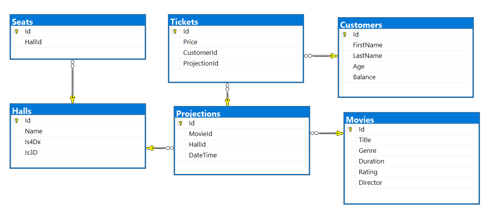

Databases Advanced Exam – 7 April 2019
======================================

Exam problems for the [Databases Advanced - Entity Framework course \@
SoftUni](https://softuni.bg/courses/entity-framework-core). Submit your
solutions in the **SoftUni judge** system (delete all "**bin**"/"**obj**" and
"**packages**" folders).

Your task is to create a **database application**, using **Entity Framework
Core**, using the **Code First** approach. Design the **domain models** and
**methods** for manipulating the data, as described below.

Cinema
======

Project Skeleton Overview
-------------------------

You are given a **project skeleton**, which includes the following folders:

-   **Data** – contains the **CinemaContext** class, **Models** folder which
    contains the **entity classes** and the **Configuration** class with
    **connection string**

-   **DataProcessor** – contains the **Serializer** and **Deserializer**
    classes, which are used for **importing** and **exporting** data

-   **Datasets** – contains the **.json** and **.xml** files for the import part

-   **ImportResults** – contains the **export** results you make in the
    **Deserializer** class

-   **ExportResults** – contains the **import** results you make in the
    **Serializer** class

Model Definition (50 pts)
-------------------------

*Note: Foreign key navigation properties are required!*

The application needs to store the following data:

### Movie

-   **Id** – integer, **Primary Key**

-   **Title** – **text with length [3, 20] (required)**

-   **Genre** – **enumeration** of type **Genre**, with possible values
    **(Action, Drama, Comedy, Crime, Western, Romance, Documentary, Children,
    Animation, Musical) (required)**

-   **Duration** – **TimeSpan (required)**

-   **Rating** – **double in the range [1,10] (required)**

-   **Director** – **text with length [3, 20] (required)**

-   **Projections** - collection of type **Projection**

### Hall

-   **Id** – integer, **Primary Key**

-   **Name** – **text with length [3, 20] (required)**

-   **Is4Dx -** bool

-   **Is3D -** bool

-   **Projections** - collection of type **Projection**

-   **Seats** - collection of type **Seat**

### Projection

-   **Id** – integer, **Primary Key**

-   **MovieId** – **integer**, foreign key **(required)**

-   **Movie** – the projection’s **movie**

-   **HallId** – **integer**, foreign key **(required)**

-   **Hall** – the projection’s **hall**

-   **DateTime -** DateTime **(required)**

-   **Tickets** - collection of type **Ticket**

### Customer

-   **Id** – integer, **Primary Key**

-   **FirstName** – **text with length [3, 20] (required)**

-   **LastName** – **text with length [3, 20] (required)**

-   **Age** – **integer in the range [12, 110] (required)**

-   **Balance** - **decimal** (non-negative, minimum value: **0.01**)
    **(required)**

-   **Tickets** - collection of type **Ticket**

### Ticket

-   **Id** – integer, **Primary Key**

-   **Price** – **decimal** (non-negative, minimum value: **0.01**)
    **(required)**

-   **CustomerId** – **integer**, foreign key **(required)**

-   **Customer** – the customer’s **ticket**

-   **ProjectionId** – **integer**, foreign key **(required)**

-   **Projection** – the projection’s **ticket**

### Seat

-   **Id** – integer, **Primary Key**

-   **HallId** – **integer**, foreign key **(required)**

-   **Hall** – the seat’s **hall**

Data Import (25pts)
-------------------

For the functionality of the application, you need to create several methods
that manipulate the database. The **project skeleton** already provides you with
these methods, inside the **Deserializer class**. Usage of **Data Transfer
Objects** is **optional**.

Use the provided **JSON** and **XML** files to populate the database with data.
Import all the information from those files into the database.

You are **not allowed** to modify the provided **JSON** and **XML** files.

**If a record does not meet the requirements from the first section, print an
error message:**

| **Error message** |
|-------------------|
| Invalid Data!     |

### JSON Import

#### Import Movies

Using the file **movies.json**, import the data from that file into the
database. Print information about each imported object in the format described
below.

##### Constraints

-   If any validation errors occur (such as if Rating is not between 1 and 10, a
    **Title/Genre/Duration/Rating/Director** is missing, or they exceed required
    the min and max length), **do not** import any part of the entity and
    **append an error message** to the **method output**.

-   If a **title** already exists, do not import it and append an error message.

| **Success message**                                                                                 |
|-----------------------------------------------------------------------------------------------------|
| Successfully imported {**movie title**} with genre {**movie genre**} and rating {**movie rating**}! |

##### Example

| **movies.json**                                                                                                                                                                                                                                                                                                                                                                                                                                                                                                 |
|-----------------------------------------------------------------------------------------------------------------------------------------------------------------------------------------------------------------------------------------------------------------------------------------------------------------------------------------------------------------------------------------------------------------------------------------------------------------------------------------------------------------|
| [ { "Title": "Little Big Man", "Genre": "Western", "Duration": "01:58:00", "Rating": 28, "Director": "Duffie Abrahamson" }, { "Title": "Gui Si (Silk)", "Genre": "Drama", "Duration": "02:21:00", "Rating": 9, "Director": "Perl Swyne" }, { "Title": "F", "Genre": "Drama", "Duration": "01:08:00", "Rating": 2, "Director": "Emiline Newby" }, { "Title": "F/X2 (a.k.a. F/X 2 - The Deadly Art of Illusion)", "Genre": "Action", "Duration": "01:57:00", "Rating": 7, "Director": "Sheppard Cescoti" }, ... ] |
| **Output**                                                                                                                                                                                                                                                                                                                                                                                                                                                                                                      |
| **Invalid data! Successfully imported Gui Si (Silk) with genre Drama and rating 9.00! Invalid data! Invalid data! Successfully imported Prey, The (La proie) with genre Action and rating 5.00! Successfully imported SIS with genre Action and rating 10.00! ...**                                                                                                                                                                                                                                             |

Upon **correct import logic**, you should have imported **21 movies**.

#### Import Halls and Seats

Using the file **halls-seats.json**, import the data from that file into the
database. Print information about each imported object in the format described
below.

##### Constraints

-   If any validation errors occur, such as invalid hall name, zero or negative
    seats count, **ignore** the entity and **print an error message**.

| **Success message**                                                                   |
|---------------------------------------------------------------------------------------|
| Successfully imported {**name**}({**projection type**}) with {**seats count**} seats! |

##### Example

| **hall-seats.json**                                                                                                                                                                                                                                                                                   |
|-------------------------------------------------------------------------------------------------------------------------------------------------------------------------------------------------------------------------------------------------------------------------------------------------------|
| [ {  "Name": "Methocarbamol", "Is4Dx": false, "Is3D": true, "Seats": 52 }, { "Name": "Glycopyrrolate", "Is4Dx": true, "Is3D": false, "Seats": 36 }, { "Name": "Corn Grass", "Is4Dx": true, "Is3D": true, "Seats": 40 }, { "Name": "Aminophylline", "Is4Dx": false, "Is3D": false, "Seats": 31 } ... ] |
| **Output**                                                                                                                                                                                                                                                                                            |
| **Successfully imported Methocarbamol(3D) with 52 seats! Successfully imported Glycopyrrolate(4Dx) with 36 seats! Successfully imported Corn Grass(4Dx/3D) with 40 seats! Successfully imported Aminophylline(Normal) with 31 seats! ...**                                                            |

Upon **correct import logic**, you should have imported **9 halls** and **309
seats**.

### XML Import

#### Import Projections

Using the file **projections.xml**, import the data from the file into the
database. Print information about each imported object in the format described
below.

##### Constraints

-   If there are any validation errors (such as invalid **movie** or **hall**),
    **do not import any part of the entity** and **append an error message to
    the method output**.

-   Dates will **always** be in the format: "**yyyy-MM-dd HH:mm:ss**"

| **Success message**                                                              |
|----------------------------------------------------------------------------------|
| Successfully imported projection {**movie title**} on {**projection datetime**}! |

-   **CultureInfo.InvariantCulture**.

-   Projection datetime should be in the format "**MM/dd/yyyy**"

##### Example

| **projections.xml**                                                                                                                                                                                                                                                                                                                                                                                                                                                                                                                                                                                                                                                                   |
|---------------------------------------------------------------------------------------------------------------------------------------------------------------------------------------------------------------------------------------------------------------------------------------------------------------------------------------------------------------------------------------------------------------------------------------------------------------------------------------------------------------------------------------------------------------------------------------------------------------------------------------------------------------------------------------|
| \<Projections\>  \<Projection\> \<MovieId\>38\</MovieId\> \<HallId\>4\</HallId\> \<DateTime\>2019-04-27 13:33:20\</DateTime\> \</Projection\> \<Projection\> \<MovieId\>6\</MovieId\> \<HallId\>4\</HallId\> \<DateTime\>2019-05-12 05:51:29\</DateTime\> \</Projection\> \<Projection\> \<MovieId\>21\</MovieId\> \<HallId\>5\</HallId\> \<DateTime\>2019-05-03 16:56:12\</DateTime\> \</Projection\> \<Projection\> \<MovieId\>10\</MovieId\> \<HallId\>5\</HallId\> \<DateTime\>2019-05-01 00:11:21\</DateTime\> \</Projection\> \<Projection\> \<MovieId\>40\</MovieId\> \<HallId\>4\</HallId\> \<DateTime\>2019-04-26 08:56:57\</DateTime\> \</Projection\> ... \</Projections\> |
| **Output**                                                                                                                                                                                                                                                                                                                                                                                                                                                                                                                                                                                                                                                                            |
| **Invalid data! Successfully imported projection Trojan Eddie on 05/12/2019! Successfully imported projection Gloriously Wasted on 05/03/2019! Successfully imported projection Fahrenhype 9/11 on 05/01/2019!**                                                                                                                                                                                                                                                                                                                                                                                                                                                                      |
| **Invalid data! ...**                                                                                                                                                                                                                                                                                                                                                                                                                                                                                                                                                                                                                                                                 |

Upon **correct import logic**, you should have imported **29 projections**.

#### Import Customers Tickets

Using the file **customers-tickets.xml**, import the data from the file into the
database. Print information about each imported object in the format described
below.

##### Constraints

-   If there are any validation errors (such invalid **names**, **age**,
    **balance**, etc.), **do not import any part of the entity** and **append an
    error message to the method output**.

| **Success message**                                                                                                         |
|-----------------------------------------------------------------------------------------------------------------------------|
| Successfully imported customer {**customer first name**} {**customer last name**} with bought tickets: {**tickets count**}! |

##### Example

| **customers-tickets.xml**                                                                                                                                                                                                                                                                                                                                                                                                                                                                                                                                                                                                                                                                                                                                                                                                                                                                                                                                                                                                                                                                                                                                                                                                                                                                                                                                                                                                                                                                                                                                                                                                                                                                                                                                                                                                                                                                                |
|----------------------------------------------------------------------------------------------------------------------------------------------------------------------------------------------------------------------------------------------------------------------------------------------------------------------------------------------------------------------------------------------------------------------------------------------------------------------------------------------------------------------------------------------------------------------------------------------------------------------------------------------------------------------------------------------------------------------------------------------------------------------------------------------------------------------------------------------------------------------------------------------------------------------------------------------------------------------------------------------------------------------------------------------------------------------------------------------------------------------------------------------------------------------------------------------------------------------------------------------------------------------------------------------------------------------------------------------------------------------------------------------------------------------------------------------------------------------------------------------------------------------------------------------------------------------------------------------------------------------------------------------------------------------------------------------------------------------------------------------------------------------------------------------------------------------------------------------------------------------------------------------------------|
| \<Customers\> \<Customer\> \<FirstName\>Randi\</FirstName\> \<LastName\>Ferraraccio\</LastName\> \<Age\>20\</Age\> \<Balance\>59.44\</Balance\> \<Tickets\> \<Ticket\> \<ProjectionId\>1\</ProjectionId\> \<Price\>7\</Price\> \</Ticket\> \<Ticket\> \<ProjectionId\>1\</ProjectionId\> \<Price\>15\</Price\> \</Ticket\> \<Ticket\> \<ProjectionId\>1\</ProjectionId\> \<Price\>12.13\</Price\> \</Ticket\> \<Ticket\> \<ProjectionId\>1\</ProjectionId\> \<Price\>11\</Price\> \</Ticket\> \<Ticket\> \<ProjectionId\>1\</ProjectionId\> \<Price\>9.13\</Price\> \</Ticket\> \<Ticket\> \<ProjectionId\>1\</ProjectionId\> \<Price\>9.13\</Price\> \</Ticket\> \</Tickets\> \</Customer\> \<Customer\> \<FirstName\>Duff\</FirstName\> \<LastName\>Honig\</LastName\> \<Age\>89\</Age\> \<Balance\>82.17\</Balance\> \<Tickets\> \<Ticket\> \<ProjectionId\>25\</ProjectionId\> \<Price\>12.13\</Price\> \</Ticket\> \<Ticket\> \<ProjectionId\>25\</ProjectionId\> \<Price\>11\</Price\> \</Ticket\> \<Ticket\> \<ProjectionId\>25\</ProjectionId\> \<Price\>9.13\</Price\> \</Ticket\> \<Ticket\> \<ProjectionId\>3\</ProjectionId\> \<Price\>9.13\</Price\> \</Ticket\> \<Ticket\> \<ProjectionId\>3\</ProjectionId\> \<Price\>9.13\</Price\> \</Ticket\> \<Ticket\> \<ProjectionId\>3\</ProjectionId\> \<Price\>9.13\</Price\> \</Ticket\> \</Tickets\> \</Customer\> \<Customer\> \<FirstName\>Bondy\</FirstName\> \<LastName\>Linsay\</LastName\> \<Age\>15\</Age\> \<Balance\>230.20\</Balance\> \<Tickets\> \<Ticket\> \<ProjectionId\>3\</ProjectionId\> \<Price\>12.13\</Price\> \</Ticket\> \<Ticket\> \<ProjectionId\>3\</ProjectionId\> \<Price\>11\</Price\> \</Ticket\> \<Ticket\> \<ProjectionId\>3\</ProjectionId\> \<Price\>9.13\</Price\> \</Ticket\> \<Ticket\> \<ProjectionId\>3\</ProjectionId\> \<Price\>7\</Price\> \</Ticket\> \</Tickets\> \</Customer\> ... \</Customers\> |
| **Output**                                                                                                                                                                                                                                                                                                                                                                                                                                                                                                                                                                                                                                                                                                                                                                                                                                                                                                                                                                                                                                                                                                                                                                                                                                                                                                                                                                                                                                                                                                                                                                                                                                                                                                                                                                                                                                                                                               |
| **Successfully imported customer Randi Ferraraccio with bought tickets: 6! Successfully imported customer Duff Honig with bought tickets: 6! Successfully imported customer Bondy Linsay with bought tickets: 4! ...**                                                                                                                                                                                                                                                                                                                                                                                                                                                                                                                                                                                                                                                                                                                                                                                                                                                                                                                                                                                                                                                                                                                                                                                                                                                                                                                                                                                                                                                                                                                                                                                                                                                                                   |

Upon **correct import logic**, you should have imported **79 customers and 168
tickets**.

Data Export (25 pts)
--------------------

Use the provided methods in the **Serializer** class. Usage of **Data Transfer
Objects** is **optional**.

### JSON Export

#### Export Top Movies

The given method in the project skeleton receives movie rating. Export all
**movies** which have rating more or equal to the given and **have at least one
projection with sold tickets**. For each **movie**, export its **name**,
**rating formatted to the second digit, total incomes formatted same way** and
**customers.** For each **customer**, export its **first name**, last **name**
and **balance formatted to the second digit.** Order the customers by balance
(**descending**), then by first name (**ascending**) and last name
(**ascending**). Take first 10 records and order the **movies** by **rating**
(**descending**), then by **total incomes** (**descending**).

##### Example

| **Serializer.ExportTopMovies(context, rating)**                                                                                                                                                                                                                                                                                                                                                                                                                                                                                                                                                                                                                                                                                                                                                                                                                                                                                                                                                                                                                                                                                                                                                                                                                                                                                              |
|----------------------------------------------------------------------------------------------------------------------------------------------------------------------------------------------------------------------------------------------------------------------------------------------------------------------------------------------------------------------------------------------------------------------------------------------------------------------------------------------------------------------------------------------------------------------------------------------------------------------------------------------------------------------------------------------------------------------------------------------------------------------------------------------------------------------------------------------------------------------------------------------------------------------------------------------------------------------------------------------------------------------------------------------------------------------------------------------------------------------------------------------------------------------------------------------------------------------------------------------------------------------------------------------------------------------------------------------|
| [ { "MovieName": "SIS", "Rating": "10.00", "TotalIncomes": "184.04", "Customers": [ { "FirstName": "Davita", "LastName": "Lister", "Balance": "279.76" }, { "FirstName": "Arluene", "LastName": "Farman", "Balance": "118.33" { "FirstName": "Caralie", "LastName": "Longthorn", "Balance": "169.18" }, { "FirstName": "Caralie", "LastName": "Longthorn", "Balance": "169.18" }, { "FirstName": "Belinda", "LastName": "Fraanchyonok", "Balance": "14.69" }, { "FirstName": "Belinda", "LastName": "Fraanchyonok", "Balance": "14.69" }, { "FirstName": "Belinda", "LastName": "Fraanchyonok", "Balance": "14.69" }, { "FirstName": "Merle", "LastName": "Pinnell", "Balance": "133.05" }, { "FirstName": "Merle", "LastName": "Pinnell", "Balance": "133.05" }, { "FirstName": "Duff", "LastName": "Honig", "Balance": "82.17" }, { "FirstName": "Duff", "LastName": "Honig", "Balance": "82.17" }, { "FirstName": "Duff", "LastName": "Honig", "Balance": "82.17" }, { "FirstName": "Etty", "LastName": "Stockow", "Balance": "372.02" }, { "FirstName": "Etty", "LastName": "Stockow", "Balance": "372.02" }, { "FirstName": "Etty", "LastName": "Stockow", "Balance": "372.02" }, { "FirstName": "Janet", "LastName": "Matchett", "Balance": "23.50" }, { "FirstName": "Janet", "LastName": "Matchett", "Balance": "23.50" } ] }, ... ] |

### XML Export

#### Export Top Customers

Use the method provided in the project skeleton, which receives customer age.
Export customers with age above or equal to the given. For each **customer**,
export their **first name**, **last name, spent money for tickets (formatted to
the second digit) and spent time (**in format: "**hh\\:mm\\:ss**"**).** Take
first **10** records and order the result by **spent money** in **descending
order.**

##### Example

| Serializer.TopCustomers(context, age)                                                                                                                                                                                                                                                                                                                                                                                                                          |
|----------------------------------------------------------------------------------------------------------------------------------------------------------------------------------------------------------------------------------------------------------------------------------------------------------------------------------------------------------------------------------------------------------------------------------------------------------------|
| \<Customers\> \<Customer FirstName="Marjy" LastName="Starbeck"\> \<SpentMoney\>82.65\</SpentMoney\> \<SpentTime\>17:04:00\</SpentTime\> \</Customer\> \<Customer FirstName="Jerrie" LastName="O\\'Carroll"\> \<SpentMoney\>67.13\</SpentMoney\> \<SpentTime\>13:40:00\</SpentTime\> \</Customer\> \<Customer FirstName="Randi" LastName="Ferraraccio"\> \<SpentMoney\>63.39\</SpentMoney\> \<SpentTime\>17:42:00\</SpentTime\> \</Customer\>... \</Customers\> |
