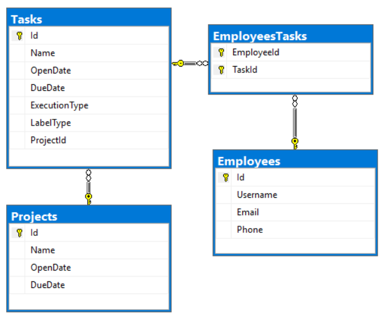

Databases Advanced Exam - 7 December 2019
=========================================

Exam problems for the [Databases Advanced - Entity Framework course \@
SoftUni](https://softuni.bg/courses/entity-framework-core). Submit your
solutions in the **SoftUni judge** system (delete all "**bin**"/"**obj**" and
"**packages**" folders).

**Automapper** is not allowed.

Your task is to create a **database application**, using **Entity Framework
Core**, using the **Code First** approach. Design the **domain models** and
**methods** for manipulating the data, as described below.

TeisterMask
===========

Project Skeleton Overview
-------------------------

You are given a **project skeleton**, which includes the following folders:

-   **Data** - contains the **TeisterMaskContext** class, **Models** folder
    which contains the **entity classes** and the **Configuration** class with
    **connection string**

-   **DataProcessor** - contains the **Serializer** and **Deserializer**
    classes, which are used for **importing** and **exporting** data

-   **Datasets** - contains the **.json** and **.xml** files for the import part

-   **ImportResults** - contains the **export** results you make in the
    **Deserializer** class

-   **ExportResults** - contains the **import** results you make in the
    **Serializer** class

Model Definition (50 pts)
-------------------------

The application needs to store the following data:

### Employee

-   **Id** - integer, Primary Key

-   **Username** - text with length **[3, 40]**. Should contain only **lower**
    or **upper** case letters and/or **digits**. (**required**)

-   **Email** – text (**required**). Validate it! There is attribute for this
    job.

-   **Phone** - text. **Consists only of three groups** (**separated by '-'),
    the first two consist of three digits and the last one - of 4 digits.**
    (**required**)

-   **EmployeesTasks -** collection of type **EmployeeTask**

### Project

-   **Id** - integer, **Primary Key**

-   **Name** - text with length **[2, 40]** (**required**)

-   **OpenDate** - date and time (**required**)

-   **DueDate** - date and time (**can be null**)

-   **Tasks** - collection of type **Task**

### Task

-   **Id** - integer, **Primary Key**

-   **Name** - text with length **[2, 40]** (**required**)

-   **OpenDate** - date and time (**required**)

-   **DueDate** - date and time (**required**)

-   **ExecutionType** - enumeration of type **ExecutionType**, with possible
    values (**ProductBacklog**, **SprintBacklog**, **InProgress**, **Finished**)
    (**required**)

-   **LabelType** - enumeration of type **LabelType**, with possible values
    (**Priority**, **CSharpAdvanced**, **JavaAdvanced**, **EntityFramework**,
    **Hibernate**) (**required**)

-   **ProjectId** - integer, **foreign key** (**required**)

-   **Project** - **Project**

-   **EmployeesTasks** - collection of type **EmployeeTask**

### EmployeeTask

-   **EmployeeId** - integer, **Primary Key**, **foreign key** (**required**)

-   **Employee** - **Employee**

-   **TaskId** - integer, **Primary Key**, **foreign key** (**required**)

-   **Task** - **Task**

Data Import (25pts)
-------------------

For the functionality of the application, you need to create several methods
that manipulate the database. The **project skeleton** already provides you with
these methods, inside the **Deserializer class**. Usage of **Data Transfer
Objects** is **optional**.

Use the provided **JSON** and **XML** files to populate the database with data.
Import all the information from those files into the database.

You are **not allowed** to modify the provided **JSON** and **XML** files.

**If a record does not meet the requirements from the first section, print an
error message:**

| **Error message** |
|-------------------|
| Invalid Data!     |

### XML Import

#### Import Projects

Using the file **projects.xml**, import the data from the file into the
database. Print information about each imported object in the format described
below.

##### Constraints

-   If there are **any validation errors** for the **project** entity (such as
    invalid **name** or **open date**), **do not** import any part of the entity
    and **append an error message** to the **method output**.

-   If there are **any validation errors** for the **task** entity (such as
    invalid **name**, **open** or **due date** are missing, **task open date**
    is before **project open date** or **task due date** is after **project due
    date**), **do not import it (only the task itself, not the whole project)**
    and **append an error message to the method output**.

>   **NOTE**: Dates will be in format **dd/MM/yyyy**, do not forget to use
>   **CultureInfo.InvariantCulture**

| **Success message**                                                            |
|--------------------------------------------------------------------------------|
| Successfully imported project - {**projectName**} with {**tasksCount**} tasks. |

##### Example

| **projects.xml**                                                                                                                                                                                                                                                                                                                                                                                                                                                                                                                                                                                 |
|--------------------------------------------------------------------------------------------------------------------------------------------------------------------------------------------------------------------------------------------------------------------------------------------------------------------------------------------------------------------------------------------------------------------------------------------------------------------------------------------------------------------------------------------------------------------------------------------------|
| \<?xml version='1.0' encoding='UTF-8'?\> \<Projects\> \<Project\> \<Name\>S\</Name\> \<OpenDate\>25/01/2018\</OpenDate\> \<DueDate\>16/08/2019\</DueDate\> \<Tasks\> \<Task\> \<Name\>Australian\</Name\> \<OpenDate\>19/08/2018\</OpenDate\> \<DueDate\>13/07/2019\</DueDate\> \<ExecutionType\>2\</ExecutionType\> \<LabelType\>0\</LabelType\> \</Task\> \<Task\> \<Name\>Upland Boneset\</Name\> \<OpenDate\>24/10/2018\</OpenDate\> \<DueDate\>11/06/2019\</DueDate\> \<ExecutionType\>2\</ExecutionType\> \<LabelType\>3\</LabelType\> \</Task\> \</Tasks\> \</Project\> ... \</Projects\> |
| **Output**                                                                                                                                                                                                                                                                                                                                                                                                                                                                                                                                                                                       |
| **Invalid data! Invalid data! Successfully imported project - America with 2 tasks. Successfully imported project - Hyster-Yale with 10 tasks. Invalid data! Invalid data! Invalid data! Invalid data! ...**                                                                                                                                                                                                                                                                                                                                                                                     |

Upon **correct import logic**, you should have imported **42 projects** and **62
tasks**.

### JSON Import

#### Import Employees

Using the file **employees.json**, import the data from that file into the
database. Print information about each imported object in the format described
below.

##### Constraints

-   If any validation errors occur (such as invalid **username**, **email** or
    **phone**), **do not** import any part of the entity and **append an error
    message** to the **method output**.

-   Take only the unique tasks.

-   If a **task** does **not exist** in the database, **append an error
    message** to the **method output** and **continue** with the next **task**.

| **Success message**                                                                          |
|----------------------------------------------------------------------------------------------|
| Successfully imported employee - {**employeeUsername**} with {**employeeTasksCount**} tasks. |

##### Example

| **employees.json**                                                                                                                                                                                                                                                                                                                                            |
|---------------------------------------------------------------------------------------------------------------------------------------------------------------------------------------------------------------------------------------------------------------------------------------------------------------------------------------------------------------|
| [ { "Username": "jstanett0", "Email": "kknapper0\@opera.com", "Phone": "819-699-1096", "Tasks": [ 34, 32, 65, 30, 30, 45, 36, 67 ] }, ... ]                                                                                                                                                                                                                   |
| **Output**                                                                                                                                                                                                                                                                                                                                                    |
| **Invalid data! Invalid data! Successfully imported employee - jstanett0 with 5 tasks. Invalid data! Invalid data! Invalid data! Invalid data! Successfully imported employee - mmcellen1 with 15 tasks. Invalid data! Invalid data! Successfully imported employee - cmartinho2 with 5 tasks. Successfully imported employee - mdilucia3 with 9 tasks. ...** |

Upon **correct import logic**, you should have imported **30 employees** and
**214 employee tasks**.

Data Export (25 pts)
--------------------

Use the provided methods in the **Serializer** class. Usage of **Data Transfer
Objects** is **optional**.

### JSON Export

#### Export Most Busiest Employees

Select the **top** 10 **employees** who have **at least one task** that **its
open date** is **after or equal** to the **given date** with their **tasks**
that meet the same requirement (to have their open date after or equal to the
giver date). For each **employee**, export their **username** and their
**tasks.** For each **task**, export its **name** and **open date** (**must** be
in format "**d**"), **due date** (**must** be in format "**d**"), **label** and
**execution** type**.** Order the **tasks** by **due date** (**descending**),
then by **name** (**ascending**). Order the **employees** by **all tasks count**
(**descending**), then by **username** (**ascending**).

**NOTE**: Do not forget to use **CultureInfo.InvariantCulture**

##### Example

| Serializer.ExportMostBusiestEmployees(context, date)                                                                                                                                                                                                                                                                                                                                                                                                                                                                                                                                                                                                                                                                                                                                                                                                                                                                                                                                                                                                                                                                                                                                                                                                                                                                                                                                                                                                                                                                                                                                                                                                                                                                                                                                                                                                                                                                                                                                                                                                                                                                                                                                |
|-------------------------------------------------------------------------------------------------------------------------------------------------------------------------------------------------------------------------------------------------------------------------------------------------------------------------------------------------------------------------------------------------------------------------------------------------------------------------------------------------------------------------------------------------------------------------------------------------------------------------------------------------------------------------------------------------------------------------------------------------------------------------------------------------------------------------------------------------------------------------------------------------------------------------------------------------------------------------------------------------------------------------------------------------------------------------------------------------------------------------------------------------------------------------------------------------------------------------------------------------------------------------------------------------------------------------------------------------------------------------------------------------------------------------------------------------------------------------------------------------------------------------------------------------------------------------------------------------------------------------------------------------------------------------------------------------------------------------------------------------------------------------------------------------------------------------------------------------------------------------------------------------------------------------------------------------------------------------------------------------------------------------------------------------------------------------------------------------------------------------------------------------------------------------------------|
| [ { "Username": "mmcellen1", "Tasks": [ { "TaskName": "Pointed Gourd", "OpenDate": "10/08/2018", "DueDate": "10/24/2019", "LabelType": "Priority", "ExecutionType": "ProductBacklog" }, { "TaskName": "Columbian", "OpenDate": "10/24/2018", "DueDate": "10/20/2019", "LabelType": "Hibernate", "ExecutionType": "InProgress" }, { "TaskName": "Cornflag", "OpenDate": "09/27/2018", "DueDate": "09/25/2019", "LabelType": "CSharpAdvanced", "ExecutionType": "SprintBacklog" }, { "TaskName": "Charleston Mousetail", "OpenDate": "08/10/2018", "DueDate": "07/07/2019", "LabelType": "Hibernate", "ExecutionType": "ProductBacklog" }, { "TaskName": "California Dwarf-flax", "OpenDate": "10/01/2018", "DueDate": "06/01/2019", "LabelType": "Hibernate", "ExecutionType": "Finished" }, { "TaskName": "Digitgrass", "OpenDate": "06/02/2018", "DueDate": "05/18/2019", "LabelType": "EntityFramework", "ExecutionType": "ProductBacklog" }, { "TaskName": "Hairy Mountain Mahogany", "OpenDate": "09/21/2018", "DueDate": "04/29/2019", "LabelType": "Priority", "ExecutionType": "SprintBacklog" }, { "TaskName": "White", "OpenDate": "10/04/2018", "DueDate": "04/21/2019", "LabelType": "Hibernate", "ExecutionType": "SprintBacklog" }, { "TaskName": "Bryum", "OpenDate": "11/02/2018", "DueDate": "01/19/2019", "LabelType": "EntityFramework", "ExecutionType": "ProductBacklog" }, { "TaskName": "American Star-thistle", "OpenDate": "09/21/2018", "DueDate": "11/29/2018", "LabelType": "CSharpAdvanced", "ExecutionType": "ProductBacklog" }, { "TaskName": "Wirestem Buckwheat", "OpenDate": "04/13/2018", "DueDate": "11/22/2018", "LabelType": "Hibernate", "ExecutionType": "InProgress" }, { "TaskName": "Spreading Sandwort", "OpenDate": "02/19/2018", "DueDate": "11/20/2018", "LabelType": "Hibernate", "ExecutionType": "InProgress" }, { "TaskName": "Cypress Panicgrass", "OpenDate": "10/19/2018", "DueDate": "11/17/2018", "LabelType": "EntityFramework", "ExecutionType": "InProgress" }, { "TaskName": "Calophyllum", "OpenDate": "10/09/2018", "DueDate": "11/15/2018", "LabelType": "CSharpAdvanced", "ExecutionType": "InProgress" } ] }, ... ] |

### XML Export

#### Export Projects with Their Tasks

Export all **projects** that have at least **one** task. For each **project**,
export its **name**, **tasks count**, and if it **has end (due) date** which is
represented like "**Yes**" and "**No**"**.** For each **task**, export its
**name** and **label type.** Order the **tasks** by **name** (**ascending**).
Order the **projects** by **tasks count** (**descending**), then by **name**
(**ascending**).

##### Example

| **Serializer.ExportProjectWithTheirTasks(context)**                                                                                                                                                                                                                                                                                                                                                                                                                                                                                                                                                                                                                                                                                                                                                                                                                                                                                                                                                                                     |
|-----------------------------------------------------------------------------------------------------------------------------------------------------------------------------------------------------------------------------------------------------------------------------------------------------------------------------------------------------------------------------------------------------------------------------------------------------------------------------------------------------------------------------------------------------------------------------------------------------------------------------------------------------------------------------------------------------------------------------------------------------------------------------------------------------------------------------------------------------------------------------------------------------------------------------------------------------------------------------------------------------------------------------------------|
| \<?xml version="1.0" encoding="utf-16"?\> \<Projects\> \<Project TasksCount="10"\> \<ProjectName\>Hyster-Yale\</ProjectName\> \<HasEndDate\>No\</HasEndDate\> \<Tasks\> \<Task\> \<Name\>Broadleaf\</Name\> \<Label\>JavaAdvanced\</Label\> \</Task\> \<Task\> \<Name\>Bryum\</Name\> \<Label\>EntityFramework\</Label\> \</Task\> \<Task\> \<Name\>Cornflag\</Name\> \<Label\>CSharpAdvanced\</Label\> \</Task\> \<Task\> \<Name\>Crandall\</Name\> \<Label\>Priority\</Label\> \</Task\> \<Task\> \<Name\>Debeque\</Name\> \<Label\>JavaAdvanced\</Label\> \</Task\> \<Task\> \<Name\>Guadalupe\</Name\> \<Label\>JavaAdvanced\</Label\> \</Task\> \<Task\> \<Name\>Guadeloupe\</Name\> \<Label\>JavaAdvanced\</Label\> \</Task\> \<Task\> \<Name\>Longbract Pohlia Moss\</Name\> \<Label\>EntityFramework\</Label\> \</Task\> \<Task\> \<Name\>Meyen's Sedge\</Name\> \<Label\>EntityFramework\</Label\> \</Task\> \<Task\> \<Name\>Pacific\</Name\> \<Label\>Priority\</Label\> \</Task\> \</Tasks\> \</Project\> ... \</Projects\> |
