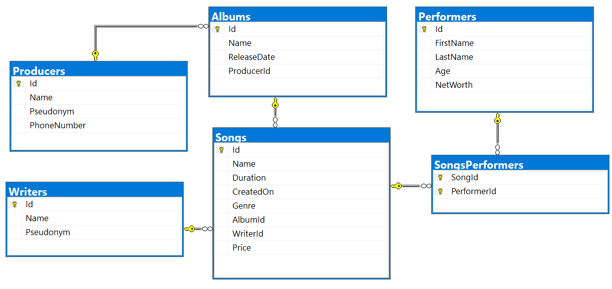

Entity Framework Core: Exam
===========================

Exam problems for the [Databases Advanced - Entity Framework course \@
SoftUni](https://softuni.bg/courses/entity-framework-core). Submit your
solutions in the **SoftUni judge** system (delete all "**bin**"/"**obj**",
"**datasets**" and "**import/export results**" folders).

Your task is to create a database application, using **Entity Framework Core**
using the **Code First** approach. Design the **domain models** and **methods**
for manipulating the data, as described below.

MusicHub
========

People love listening to music, but they see that YouTube is getting older and
older. You want to make people happy and you’ve decided to make a better version
of YouTube – **MusicHub**. The only one problem is that you have only six hours
to create your **MusicHub** app before YouTube shows their new release. It's
time for you to start coding. Good luck and impress us.

Project Skeleton Overview
-------------------------

You are given a **project skeleton**, which includes the following folders:

-   **Data** – contains the **MusicHubDbContext** class, **Models** folder which
    contains the **entity classes** and the **Configuration** class with
    **connection string**

-   **DataProcessor** – contains the **Serializer** and **Deserializer**
    classes, which are used for **importing** and **exporting** data

-   **Datasets** – contains the **.json** and **.xml** files for the import part

-   **ImportResults** – contains the **import** results you make in the
    **Deserializer** class

-   **ExportResults** – contains the **export** results you make in the
    **Serializer** class

1. Model Definition (50 pts)
----------------------------

Each **Song** has a **Performer** and **Writer**. Each **Album** consists of one
or more **Songs**. Each performer can perform many songs and each Writer can
write many songs.

The application needs to store the following data:

### Song

-   **Id** – **integer**, **Primary Key**

-   **Name** – **text** with **min length 3** and **max length 20**
    (**required**)

-   **Duration** – **TimeSpan** (**required**)

-   **CreatedOn** – **Date** (**required**)

-   **Genre** ­– **Genre** enumeration with possible values: "**Blues**,
    **Rap**, **PopMusic**, **Rock, Jazz"** (**required**)

-   **AlbumId**– **integer** foreign key

-   **Album**– the song’s album

-   **WriterId** - **integer**, foreign key (**required**)

-   **Writer** – the song’s writer

-   **Price** – **decimal** (**non-negative, minimum value: 0**) (**required**)

-   **SongPerformers** - collection of type **SongPerformer**

### Album

-   **Id** – **integer**, **Primary Key**

-   **Name** – **text** with **min length 3** and **max length 40**
    (**required**)

-   **ReleaseDate** – **Date** (**required**)

-   **Price** – **calculated property** (**the sum of all song prices in the
    album**)

-   **ProducerId** – **integer foreign key**

-   **Producer** – **the album’s producer**

-   **Songs** – collection of all songs in the album

### Performer

-   **Id** – **integer**, **Primary Key**

-   **FirstName**– **text** with **min length 3** and **max length 20**
    (**required**)

-   **LastName**– **text** with **min length 3** and **max length 20**
    (**required**)

-   **Age** – **integer** (in range between **18** and **70**) (**required**)

-   **NetWorth** – **decimal** (**non-negative, minimum value: 0**)
    (**required**)

-   **PerformerSongs** - collection of type **SongPerformer**

### Producer

-   **Id** – **integer**, **Primary Key**

-   **Name**– **text** with **min length 3** and **max length 30 (required)**

-   **Pseudonym** – **text**, consisting of two words separated with space and
    each word must start with **one** upper letter and continue with many
    lower-case letters (**Example:** "**Bon Jovi**")

-   **PhoneNumber** – **text**, consisting **only of three groups** (**separated
    by space**) **of three digits and starting always with** "**+359**"
    (**Example:** "**+359 887 234 267**")

-   **Albums** – **collection of type Album**

### Writer

-   **Id** – **integer**, **Primary Key**

-   **Name**– **text** with **min length 3** and **max length 20**
    (**required**)

-   **Pseudonym** – **text**, consisting of two words separated with space and
    each word must start with **one** upper letter and continue with many
    lower-case letters (**Example:** "**Freddie Mercury**")

-   **Songs** – **collection of type Song**

### SongPerformer

-   **SongId** – **integer**, **Primary Key**

-   **Song** – the performer’s **song** (**required**)

-   **PerformerId** – **integer**, **Primary Key**

-   **Performer** – the song’s **performer** (**required**)

2. Data Import (30pts)
----------------------

For the functionality of the application, you need to create several methods
that manipulate the database. The **project skeleton** already provides you with
these methods, inside the **Deserializer class**. Use **Data Transfer Objects**
as needed.

Use the provided **JSON** and **XML** files to populate the database with data.
Import all the information from those files into the database.

You are **not allowed** to modify the provided JSON and XML files.

**If a record does not meet the requirements from the first section, print an
error message which is mentioned bellow:**

### JSON Import (20 pts)

#### Import Writers

Using the file **ImportWriters.json**, import the data from that file into the
database. Print information about each imported object in the format described
below.

##### Constraints

-   If any validation errors occur (such as if a writer **name is too
    long/short** or a **pseudonym** is **not in the correct format**) proceed as
    described under

| **Success message**    | **Error message** |
|------------------------|-------------------|
| Imported {writer name} | Invalid data      |

##### Example

| **ImportWriters.json**                                                                                                                                                                                                                                                                                             |
|--------------------------------------------------------------------------------------------------------------------------------------------------------------------------------------------------------------------------------------------------------------------------------------------------------------------|
| [ { "Name": null, "Pseudonym": "Fredek AAuletta" }, { "Name": "Invalid", "Pseudonym": "Thomasina DDaffern" }, { "Name": "no", "Pseudonym": null }, { "Name": "Justin Adwards", "Pseudonym": "J Aw" }, { "Name": "Jenifer Martin", "Pseudonym": "JM" }, { "Name": "Mik Jonathan", "Pseudonym": "The Mik" }, **…** ] |
| **Output**                                                                                                                                                                                                                                                                                                         |
| Invalid data Invalid data Invalid data Invalid data Invalid data Imported Mik Jonathan …                                                                                                                                                                                                                           |

Upon **correct import logic**, you should have imported **23 writers**.

#### Import Producers and Albums

Using the file **ImportProducersAlbums.json**, import the data from that file
into the database. Print information about each imported object in the format
described below.

##### Constraints

-   The release and incarceration dates will be in the format "**dd/MM/yyyy**".
    Make sure you use **CultureInfo.InvariantCulture**.

-   If any validation errors occur (such as invalid **pseudonym** or invalid
    **phoneNumber**), **ignore** the entity and **print an error message**.

-   If any error occurs in the albums (such as invalid album name) do not import
    the producer too.

##### If the producer has a phone number, the success message is:

| **Success message**                                                                   | **Error message** |
|---------------------------------------------------------------------------------------|-------------------|
| Imported {producer name} with phone: {phone number} produces {count of albums} albums | Invalid data      |

##### If the producer doesn’t have phone number, the success message is:

| **Success message**                                                             | **Error message** |
|---------------------------------------------------------------------------------|-------------------|
| Imported {producer name} with no phone number produces {count of albums} albums | Invalid data      |

##### Example

| **ImportProducersAlbums.json**                                                                                                                                                                                                                                                                                                                                                                                                                                                                                                                                                                                                                                                                                                                                                                                                                                                                                                                                                                                                                                                             |
|--------------------------------------------------------------------------------------------------------------------------------------------------------------------------------------------------------------------------------------------------------------------------------------------------------------------------------------------------------------------------------------------------------------------------------------------------------------------------------------------------------------------------------------------------------------------------------------------------------------------------------------------------------------------------------------------------------------------------------------------------------------------------------------------------------------------------------------------------------------------------------------------------------------------------------------------------------------------------------------------------------------------------------------------------------------------------------------------|
| [ { "Name": "Invalid", "Pseudonym": "Rog Coiley", "PhoneNumber": "(105) 9339880", "Albums": [ { "Name": "Sweetbitter", "ReleaseDate": "07/1/2018" }, { "Name": "Emergency", "ReleaseDate": "16/09/2018" } ] }, { "Name": "Invalid", "Pseudonym": "Rog", "PhoneNumber": "+359 899 323 045", "Albums": [ { "Name": "The drawing board", "ReleaseDate": "05/08/2018" }, { "Name": "For two songs", "ReleaseDate": "13/09/2018" } ] }, { "Name": "Ll", "Pseudonym": "Ashbey Cartledge", "PhoneNumber": "+359 899 323 045", "Albums": [ { "Name": "District zero", "ReleaseDate": "05/09/2018" }, { "Name": "Eye of the camera", "ReleaseDate": "09/09/2018" }, { "Name": "Favoritism", "ReleaseDate": "05/09/2018" } ] }, { "Name": "Ab Pittham", "Pseudonym": null, "PhoneNumber": null, "Albums": [] }, { "Name": "Georgi Milkov", "Pseudonym": "Gosho Goshev", "PhoneNumber": "+359 899 345 045", "Albums": [ { "Name": "Fight and flight", "ReleaseDate": "05/11/2018" }, { "Name": "Cherry", "ReleaseDate": "09/06/2018" }, { "Name": "No history", "ReleaseDate": "05/03/2019" } ] } … ] |
| **Output**                                                                                                                                                                                                                                                                                                                                                                                                                                                                                                                                                                                                                                                                                                                                                                                                                                                                                                                                                                                                                                                                                 |
| Invalid data Invalid data Invalid data Imported Ab Pittham with no phone number produces 0 albums Imported Georgi Milkov with phone: +359 899 345 045 produces 3 albums Invalid data …                                                                                                                                                                                                                                                                                                                                                                                                                                                                                                                                                                                                                                                                                                                                                                                                                                                                                                     |

Upon **correct import logic**, you should have imported **9 producers** and **16
albums**.

### XML Import (10 pts)

#### Import Songs

Using the file **ImportSongs.xml**, import the data from the file into the
database. Print information about each imported object in the format described
below.

If any of the model requirements is violated continue with the next entity.

##### Constraints

-   If there are any validation errors (such as **negative** price, invalid
    **song name,** invalid genre or invalid album/writer id), proceed as
    described above.

-   Duration will be in format "**c**".

-   CreatedOn will be in format "**dd/MM/yyyy**".

| **Success message**                                                     | **Error message** |
|-------------------------------------------------------------------------|-------------------|
| Imported {song name} ({song genre} genre) with duration {song duration} | Invalid data      |

##### Example

| **ImportSongs.xml**                                                                                                                                                                                                                                                                                                                                                                                                                                                                                                                                                                                                                                                                                                                                                                                                                                                                                                                                                                                                                                                                                                                                                                                                 |
|---------------------------------------------------------------------------------------------------------------------------------------------------------------------------------------------------------------------------------------------------------------------------------------------------------------------------------------------------------------------------------------------------------------------------------------------------------------------------------------------------------------------------------------------------------------------------------------------------------------------------------------------------------------------------------------------------------------------------------------------------------------------------------------------------------------------------------------------------------------------------------------------------------------------------------------------------------------------------------------------------------------------------------------------------------------------------------------------------------------------------------------------------------------------------------------------------------------------|
| \<?xml version='1.0' encoding='UTF-8'?\> \<Songs\> \<Song\> \<Name\>What Goes Around\</Name\> \<Duration\>00:03:23\</Duration\> \<CreatedOn\>21/12/2018\</CreatedOn\> \<Genre\>Blues\</Genre\> \<AlbumId\>2\</AlbumId\> \<WriterId\>2\</WriterId\> \<Price\>12\</Price\> \</Song\> \<Song\> \<Name\>Morning After\</Name\> \<Duration\>00:04:23\</Duration\> \<CreatedOn\>21/12/2007\</CreatedOn\> \<Genre\>Rap\</Genre\> \<AlbumId\>4\</AlbumId\> \<WriterId\>3\</WriterId\> \<Price\>10\</Price\> \</Song\> \<Song\> \<Name\>River\</Name\> \<Duration\>00:03:10\</Duration\> \<CreatedOn\>01/12/2018\</CreatedOn\> \<Genre\>PopMusic\</Genre\> \<AlbumId\>1\</AlbumId\> \<WriterId\>5\</WriterId\> \<Price\>8.24\</Price\> \</Song\> \<Song\> \<Name\>Lose Yourself\</Name\> \<Duration\>00:03:30\</Duration\> \<CreatedOn\>01/08/2016\</CreatedOn\> \<Genre\>Rock\</Genre\> \<AlbumId\>8\</AlbumId\> \<WriterId\>9\</WriterId\> \<Price\>6.50\</Price\> \</Song\> \<Song\> \<Name\>In the start\</Name\> \<Duration\>00:03:15\</Duration\> \<CreatedOn\>08/08/2016\</CreatedOn\> \<Genre\>PopMusic\</Genre\> \<AlbumId\>12\</AlbumId\> \<WriterId\>11\</WriterId\> \<Price\>3.50\</Price\> \</Song\>…           |
| \</Songs\>                                                                                                                                                                                                                                                                                                                                                                                                                                                                                                                                                                                                                                                                                                                                                                                                                                                                                                                                                                                                                                                                                                                                                                                                          |
| **Output**                                                                                                                                                                                                                                                                                                                                                                                                                                                                                                                                                                                                                                                                                                                                                                                                                                                                                                                                                                                                                                                                                                                                                                                                          |
| Imported What Goes Around (Blues genre) with duration 00:03:23 Imported Morning After (Rap genre) with duration 00:04:23 Imported River (PopMusic genre) with duration 00:03:10 Imported Lose Yourself (Rock genre) with duration 00:03:30 Imported In the start (PopMusic genre) with duration 00:03:15 Invalid data …                                                                                                                                                                                                                                                                                                                                                                                                                                                                                                                                                                                                                                                                                                                                                                                                                                                                                             |

Upon **correct import logic**, you should have imported **32 songs**.

#### Import Song Performers

Using the file **ImportSongPerformers.xml**, import the data from the file into
the database. Print information about each imported object in the format
described below.

If any of the model requirements is violated continue with the next entity.

##### Constraints

-   If there are any validation errors (such as **age** is invalid, invalid
    **performer name, net worth** or invalid song id do not import the performer
    too), proceed as described above.

| **Success message**                                   | **Error message** |
|-------------------------------------------------------|-------------------|
| Imported {performer first name} ({songs count} songs) | Invalid data      |

##### Example

| **ImportSongPerformers.xml**                                                                                                                                                                                                                                                                                                                                                                                                                                                                                                                                                                                                                                                                                                                                                                                                                                                                                                                                                                                                                 |
|----------------------------------------------------------------------------------------------------------------------------------------------------------------------------------------------------------------------------------------------------------------------------------------------------------------------------------------------------------------------------------------------------------------------------------------------------------------------------------------------------------------------------------------------------------------------------------------------------------------------------------------------------------------------------------------------------------------------------------------------------------------------------------------------------------------------------------------------------------------------------------------------------------------------------------------------------------------------------------------------------------------------------------------------|
| \<?xml version='1.0' encoding='UTF-8'?\> \<Performers\>  \<Performer\> \<FirstName\>Peter\</FirstName\> \<LastName\>Bree\</LastName\> \<Age\>25\</Age\> \<NetWorth\>3243\</NetWorth\> \<PerformersSongs\> \<Song id="2" /\> \<Song id="1" /\> \</PerformersSongs\> \</Performer\> \<Performer\> \<FirstName\>Gennifer\</FirstName\> \<LastName\>Lopez\</LastName\> \<Age\>38\</Age\> \<NetWorth\>5531\</NetWorth\> \<PerformersSongs\> \<Song id="3" /\> \<Song id="4" /\> \<Song id="5" /\> \</PerformersSongs\> \</Performer\> \<Performer\> \<FirstName\>Tine\</FirstName\> \<LastName\>Althorp\</LastName\> \<Age\>35\</Age\> \<NetWorth\>1184\</NetWorth\> \<PerformersSongs\> \<Song id="6" /\> \<Song id="7" /\> \<Song id="8" /\> \</PerformersSongs\> \</Performer\> \<Performer\> \<FirstName\>Minta\</FirstName\> \<LastName\>Quixley\</LastName\> \<Age\>4\</Age\> \<NetWorth\>9794\</NetWorth\> \<PerformersSongs\> \<Song id="6" /\> \<Song id="7" /\> \<Song id="8" /\> \</PerformersSongs\> \</Performer\> … \</Performers\> |
| **Output**                                                                                                                                                                                                                                                                                                                                                                                                                                                                                                                                                                                                                                                                                                                                                                                                                                                                                                                                                                                                                                   |
| Imported Peter (2 songs) Imported Gennifer (3 songs) Imported Tine (3 songs) Invalid data …                                                                                                                                                                                                                                                                                                                                                                                                                                                                                                                                                                                                                                                                                                                                                                                                                                                                                                                                                  |

Upon **correct import logic**, you should have imported **12 records**.

3. Data Export (20 pts)
-----------------------

Use the provided methods in the **Serializer** class. Usage of **Data Transfer
Objects** is **optional**.

### JSON Export (10 pts)

#### Export All Albums Produced by Given Producer

The given method in the project skeleton receives a **producer id**. Export all
albums which are produced by the provided producer id. For each **album**, get
the **name**, **release date** in format "**MM/dd/yyyy**", **producer name**,
the **album songs** with each **song name**, **price formatted to the second
digit** and the song **writer** name. **Sort** the songs by song **name**
(descending) and by **writer** (ascending). At the end export **the total album
price** with exactly t**wo digits after the decimal place**. **Sort** the albums
by their **price** (descending).

##### Example

| **Serializer.ExportAlbumsInfo (context, 9)**                                                                                                                                                                                                                                                         |
|------------------------------------------------------------------------------------------------------------------------------------------------------------------------------------------------------------------------------------------------------------------------------------------------------|
| [ { "AlbumName": "Devil's advocate", "ReleaseDate": "07/21/2018", "ProducerName": "Evgeni Dimitrov", "Songs": [ { "SongName": "Numb", "Price": "13.99", "Writer": "Kara-lynn Sharpous" }, { "SongName": "Ibuprofen", "Price": "26.50", "Writer": "Stanford Daykin" } ], "AlbumPrice": "40.49" }, … ] |

### XML Export (10 pts)

#### Export Song above given duration

Use the method provided in the project skeleton, which receives a song
**duration** (**in seconds**). Export the songs which are **above** the given
duration. For each **song**, export its **name**, **performer full name**,
**writer name**, album **producer** and **duration in format**("**c**"). Sort
the songs by their **name** (ascending), by **writer** (ascending) and by
**performer** (ascending).

##### Example

| **Serializer.ExportSongsAboveDuration(context, 4)**                                                                                                                                                                                                                                                                                                                                                                                                                                                   |
|-------------------------------------------------------------------------------------------------------------------------------------------------------------------------------------------------------------------------------------------------------------------------------------------------------------------------------------------------------------------------------------------------------------------------------------------------------------------------------------------------------|
| \<?xml version="1.0" encoding="utf-8"?\> \<Songs\>  \<Song\> \<SongName\>Away\</SongName\> \<Writer\>Norina Renihan\</Writer\> \<Performer\>Lula Zuan\</Performer\> \<AlbumProducer\>Georgi Milkov\</AlbumProducer\> \<Duration\>00:05:35\</Duration\> \</Song\> \<Song\> \<SongName\>Bentasil\</SongName\> \<Writer\>Mik Jonathan\</Writer\> \<Performer\>Zabrina Amor\</Performer\> \<AlbumProducer\>Dobromir Slavchev\</AlbumProducer\> \<Duration\>00:04:03\</Duration\>                          |
| \</Song\>                                                                                                                                                                                                                                                                                                                                                                                                                                                                                             |
| **…** \</Songs\>                                                                                                                                                                                                                                                                                                                                                                                                                                                                                      |
