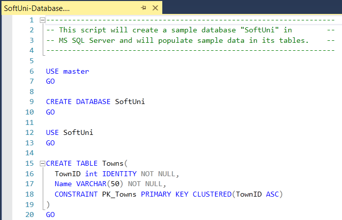
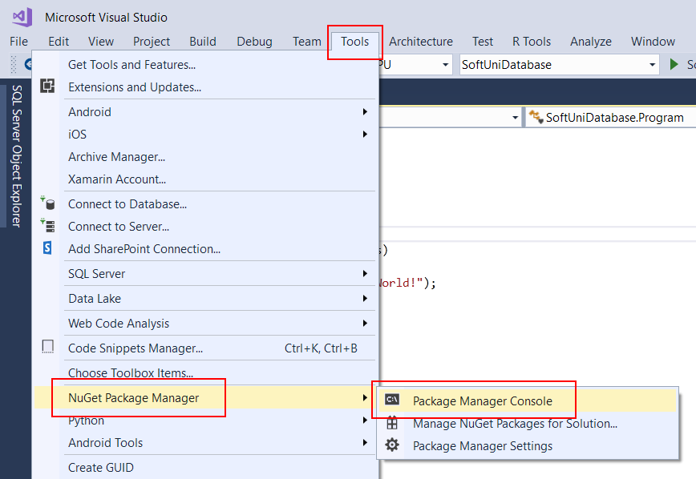
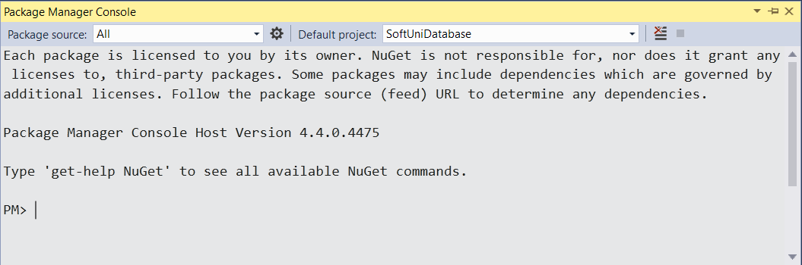
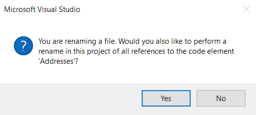
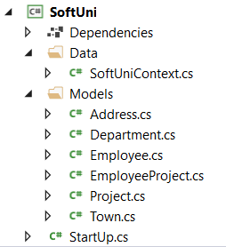
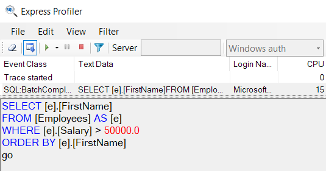
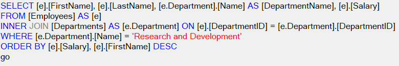
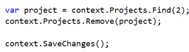
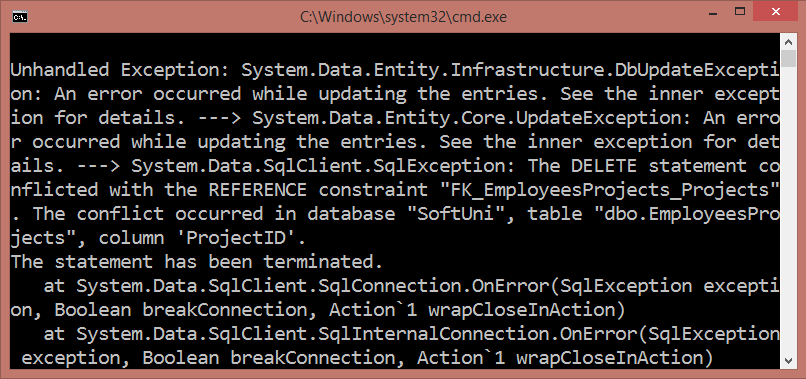
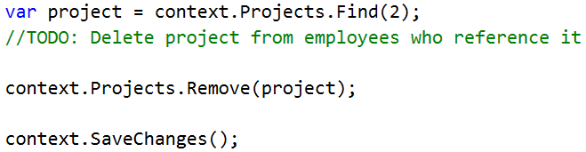

Exercises: Introduction to Entity Framework
===========================================

This document defines the **exercise assignments** for the ["Databases Advanced
– EF Core" course \@ Software
University](https://softuni.bg/trainings/2251/databases-advanced-entity-framework-february-2019).

Import the SoftUni Database
---------------------------

Import the SoftUni database into SQL Management Studio by **executing** the
provided **.sql** script.

Database First
--------------

Model the existing database by using Database First.

First create a new empty **.Net Core ConsoleApplication** and after it is
created open the **Package Manager Console**:

It will look something like this:

Use it to run the following commands **one by one**:

| Install-Package Microsoft.EntityFrameworkCore.Tools –v 2.2.0 Install-Package Microsoft.EntityFrameworkCore.SqlServer –v 2.2.0 Install-Package Microsoft.EntityFrameworkCore.SqlServer.Design |
|----------------------------------------------------------------------------------------------------------------------------------------------------------------------------------------------|

These are the **packages** you will need, in order to **scaffold** our
**SoftUniContext** from the **SoftUni database**.

Next, we must **execute** the **command** to **scaffold** our **context class**.
It will consist of 4 things:

-   First, the name of the command:

| Scaffold-DbContext |
|--------------------|

-   Second, the connection we will be using (our connection string):

| \-Connection "Server=\<ServerName\>;Database=\<DatabaseName\>;Integrated Security=True;" |
|------------------------------------------------------------------------------------------|

For **ServerName**, use the name of your local MS SQL Server instance or
"**.**".

For **DatabaseName**, use the name of the database you want to use, in this case
– **SoftUni**.

-   Third, we need to declare our service provider, we’ll be using
    **Microsoft.EntityFrameworkCore.SqlServer**:

| \-Provider Microsoft.EntityFrameworkCore.SqlServer |
|----------------------------------------------------|

-   And the fourth thing we’ll do, is to give it a directory where all of our
    models will go (e.g. **Models**):

| \-OutputDir Data/Models |
|-------------------------|

Our final command will look like this:

| Scaffold-DbContext -Connection "Server=.;Database=SoftUni;Integrated Security=True;" -Provider Microsoft.EntityFrameworkCore.SqlServer -OutputDir Data/Models |
|---------------------------------------------------------------------------------------------------------------------------------------------------------------|

Execute the **whole command** on a **single line**

Entity Framework Core has successfully **mapped the database schema to C\#
classes**. However, it isn't good enough with names – all classes have been
pluralized. Use the **Solution Explorer** in Visual Studio to move the
**SoftUniContext** class out of **Models** into the **Data** folder and rename
all of our classes properly. Use **right click → Rename** or the **F2** shortcut
and press **OK** on this **pop up window** after each class:

This way Visual Studio will also **rename** the **classes everywhere** they’re
used.

The final result should look like this:

Don’t forget to fix the **SoftUniContext’s** namespace after moving it and add a
reference to the **Models** namespace:

**Make sure** that your namespaces are **exactly** the same as these:

| SoftUni                            |
| SoftUni.Data SoftUni.Models        |
|------------------------------------|

Finally, we want to clean up the packages we won’t be using anymore from the
package manager GUI or by running these commands:

| Uninstall-Package Microsoft.EntityFrameworkCore.Tools -r Uninstall-Package Microsoft.EntityFrameworkCore.SqlServer.Design -RemoveDependencies |
|-----------------------------------------------------------------------------------------------------------------------------------------------|

Employees Full Information
--------------------------

**NOTE**: You will need method public static string
GetEmployeesFullInformation(SoftUniContext context) and public StartUp class.

Now we can use the **SoftUniContext** to extract data from our database. Your
first task is to extract **all employees** and return their **first**, **last**
and **middle** name, their **job title** and **salary**, rounded to **2
symbols** after the decimal separator, all of those separated with a space.
Order them by **employee id**.

### Example

| Output                                       |
|----------------------------------------------|
| Guy Gilbert R Production Technician 12500.00 |
| Kevin Brown F Marketing Assistant 13500.00   |
| …                                            |

Employees with Salary Over 50 000
---------------------------------

**NOTE**: You will need method public static string
GetEmployeesWithSalaryOver50000(SoftUniContext context) and public StartUp
class.

Your task is to extract **all employees** with **salary** over **50000**. Return
their **first names and salaries** in format **“{firstName} - {salary}”.Salary**
must be rounded to **2 symbols,** after the decimal separator. Sort them
**alphabetically** by first name.

### Example

| Output           |
|------------------|
| Brian - 72100.00 |
| Dylan - 50500.00 |
| …                |

Use **Express Profiler** and check if the query Entity Framework Core sent is
correct (there is only one query, but there may be more that are performed by EF
for checks).

Employees from Research and Development
---------------------------------------

**NOTE**: You will need method public static string
GetEmployeesFromResearchAndDevelopment(SoftUniContext context) and public
StartUp class.

Extract all employees from the **Research and Development** department. Order
them by **salary** (in ascending order), then by **first name** (in descending
order). Return only their **first name**, **last name**, **department name** and
**salary** rounded to **2 symbols,** after the decimal separator in the format
shown below:

### Example

| Output                                                    |
|-----------------------------------------------------------|
| Gigi Matthew from Research and Development - \$40900.00   |
| Diane Margheim from Research and Development - \$40900.00 |
| …                                                         |

Use Express Profiler and check if the made query by Entity Framework is correct
(there is only one query).

Adding a New Address and Updating Employee
------------------------------------------

**NOTE**: You will need method public static string
AddNewAddressToEmployee(SoftUniContext context) and public StartUp class.

Create a new address with **text** "**Vitoshka 15**" and **TownId 4**. Set that
address to the employee with last name "**Nakov**".

Then order by **descending** all the employees by their **Address’ Id**, take
**10** rows and from them, take the **AddressText**. Return the results each on
a new line:

### Example

| Output                         |
|--------------------------------|
| Vitoshka 15                    |
| 163 Nishava Str, ent A, apt. 1 |
| …                              |

After this **restore** your **database** for the tasks ahead!

### Hints

Create the address and find the employee with last name equal to "**Nakov**" in
order to assign the address to him.

Employees and Projects
----------------------

**NOTE**: You will need method public static string
GetEmployeesInPeriod(SoftUniContext context) and public StartUp class.

Find the first **10** employees who have **projects** started in the period
**2001 - 2003** (inclusive). Print each employee's **first name**, **last name,
manager’s first name** and **last name.** Then return **all** of their
**projects** in the format "--\<**ProjectName**\> - \<**StartDate**\> -
\<**EndDate**\>", each on a **new row**. If a project has no end date, print
"**not finished**" instead.

### Constraints

Use date format: "**M/d/yyyy h:mm:ss tt**".

### Example

| Output                                                              |
|---------------------------------------------------------------------|
| Guy Gilbert – Manager: Jo Brown                                     |
| \--Half-Finger Gloves - 6/1/2002 12:00:00 AM - 6/1/2003 12:00:00 AM |
| \--Racing Socks - 11/22/2005 12:00:00 AM - not finished             |
| …                                                                   |

Addresses by Town
-----------------

**NOTE**: You will need method public static string
GetAddressesByTown(SoftUniContext context) and public StartUp class.

Find all addresses, **ordered** by the **number of employees** who live there
(**descending**), then by **town name** (**ascending**), and finally by
**address text** (**ascending**). Take only the **first 10 addresses**. For each
address return it in the format "\<**AddressText**\>, \<**TownName**\> -
\<**EmployeeCount**\> employees"

### Example

| Output                                              |
|-----------------------------------------------------|
| 163 Nishava Str, ent A, apt. 1, Sofia - 3 employees |
| 7726 Driftwood Drive, Monroe - 2 employees          |
| …                                                   |

Employee 147
------------

**NOTE**: You will need method public static string
GetEmployee147(SoftUniContext context) and public StartUp class.

Get the **employee with id 147.** Return only his/her **first name**, **last
name**, **job title** and **projects** (print only their names). The projects
should be **ordered by name** (**ascending**). Format of the output.

### Example

| Output                                |
|---------------------------------------|
| Linda Randall - Production Technician |
| HL Touring Handlebars                 |
| …                                     |

Departments with More Than 5 Employees
--------------------------------------

**NOTE**: You will need method public static string
GetDepartmentsWithMoreThan5Employees(SoftUniContext context) and public StartUp
class.

Find **all departments** with more than **5 employees**. Order them by
**employee count** (**ascending**), then by **department name**
(**alphabetically**).  
For each department, print the **department name** and the **manager’s first**
and **last name** on the **first row**.  
Then print the **first name**, the **last name** and the **job title** of every
**employee** on a new row.  
Order the employees by **first name** (**ascending**), then by **last name**
(**ascending**).  
Format of the output: For each department print it in the format
"\<**DepartmentName**\> - \<**ManagerFirstName**\> \<**ManagerLastName**\>" and
for each employee print it in the format "\<**EmployeeFirstName**\>
\<**EmployeeFirstName**\> - \<**JobTitle**\>".

### Example

| Output                            |
|-----------------------------------|
| Engineering – Terri Duffy         |
| Gail Erickson - Design Engineer   |
| Jossef Goldberg - Design Engineer |
| …                                 |

Find Latest 10 Projects
-----------------------

**NOTE**: You will need method public static string
GetLatestProjects(SoftUniContext context) and public StartUp class.

Write a program that return information about the **last 10 started projects**.
**Sort them by name** lexicographically and return **their name, description and
start date**, each on a new row. Format of the output

### Constraints

Use date format: "**M/d/yyyy h:mm:ss tt**".

### Example

| Output                                                                                                                                                                                                                |
|-----------------------------------------------------------------------------------------------------------------------------------------------------------------------------------------------------------------------|
| All-Purpose Bike Stand                                                                                                                                                                                                |
| Research, design and development of All-Purpose Bike Stand. Perfect all-purpose bike stand for working on your bike at home. Quick-adjusting clamps and steel construction.                                           |
| 9/1/2005 12:00:00 AM                                                                                                                                                                                                  |
| …                                                                                                                                                                                                                     |

Increase Salaries
-----------------

**NOTE**: You will need method public static string
IncreaseSalaries(SoftUniContext context) and public StartUp class.

Write a program that increase salaries of all employees that are in the
**Engineering**, **Tool Design**, **Marketing** or **Information Services**
department by **12%**. Then **return first name, last name and salary** (2
symbols after the decimal separator) for those employees whose salary was
increased. Order them by **first name** (**ascending**), then by **last name**
(**ascending**). Format of the output.

### Example

| Output                      |
|-----------------------------|
| Ashvini Sharma (\$36400.00) |
| Dan Bacon (\$30688.00)      |
| …                           |

Find Employees by First Name Starting With "Sa"
-----------------------------------------------

**NOTE**: You will need method public static string
GetEmployeesByFirstNameStartingWithSa(SoftUniContext context) and public StartUp
class.

Write a program that finds all employees whose first name starts with "**Sa**".
Return their **first**, **last name**, their **job title** and **salary**,
rounded to **2 symbols** after the decimal separator in the format given in the
example below. Order them by **first name**, then by **last name**
(**ascending**).

### Example

| Output                                                |
|-------------------------------------------------------|
| Sairaj Uddin - Scheduling Assistant - (\$16000.00)    |
| Samantha Smith - Production Technician - (\$14000.00) |
| …                                                     |

Delete Project by Id
--------------------

**NOTE**: You will need method public static string
DeleteProjectById(SoftUniContext context) and public StartUp class.

Let's **delete** the project with id **2**. Then, take 10 projects and return
their names, each on a new line. Remember to restore your database after this
task.

### Example

| Output             |
|--------------------|
| Classic Vest       |
| Full-Finger Gloves |
| …                  |

### Hints

If we try to delete the project directly:

This happens:

The project is **referenced** by the junction (many-to-many) table
**EmployeesProjects**. Therefore we cannot safely delete it. First, we need to
remove any references to that row in the **Projects** table.

This is done by removing the project from all employees who reference it.

Remove Town
-----------

**NOTE**: You will need method public static string RemoveTown(SoftUniContext
context) and public StartUp class.

Write a program that **deletes a town** with name **„Seattle”**. Also, **delete
all addresses** that are in those towns. Return the **number** of **addresses**
that were **deleted** in format “{count} addresses in Seattle were deleted”.
There will be **employees** living at those addresses, which will be a problem
when trying to delete the addresses. So, start by setting the **AddressId** of
each employee for the given address to **null**. After all of them are set to
null, you may safely remove all the addresses from the **context.Addresses** and
finally remove the **given town**.

### Example

| Output                               |
|--------------------------------------|
| 44 addresses in Seattle were deleted |
