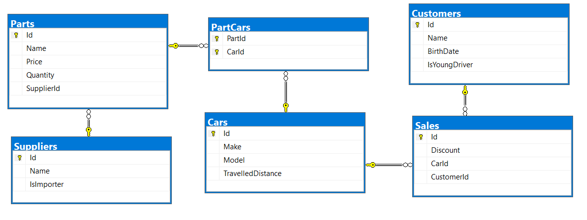

Exercises: XML Processing
=========================

This document defines the **exercise assignments** for the ["Databases Advanced
– EF Core" course \@ Software
University](https://softuni.bg/trainings/1741/databases-advanced-entity-framework-october-2017).

Product Shop Database
=====================

A products shop holds **users**, **products** and **categories** for the
products. Users can **sell** and **buy** products.

-   Users have an **id**, **first name** (optional) and **last name** and
    **age** (optional).

-   Products have an **id**, **nam**, **price**, **buyerId** (optional) and
    **sellerId** as IDs of users.

-   Categories have an **id** and **name**.

-   Using Entity Framework Code First create a database following the above
    description.

-   **Users** should have **many products sold** and **many products bought**.

-   **Products** should have **many categories**

-   **Categories** should have **many products**

-   **CategoryProducts** should **map products** and **categories**

Import Data
-----------

### Import Users

**NOTE**: You will need method public static string
ImportUsers(ProductShopContext context, string inputXml) and public StartUp
class.

Import the users from the provided file **users.xml**.

Your method should return string with message \$"Successfully imported
{Users.Count}";

### Import Products

**NOTE**: You will need method public static string
ImportProducts(ProductShopContext context, string inputXml) and public StartUp
class.

Import the products from the provided file **products.xml**.

Your method should return string with message \$"Successfully imported
{Products.Count}";

### Import Categories

**NOTE**: You will need method public static string
ImportCategories(ProductShopContext context, string inputXml) and public StartUp
class.

Import the categories from the provided file **categories.xml**.

Some of the names will be null, so you don’t have to add them in the database.
Just skip the record and continue.

Your method should return string with message \$"Successfully imported
{Categories.Count}";

### Import Categories and Products

**NOTE**: You will need method public static string
ImportCategoryProducts(ProductShopContext context, string inputXml) and public
StartUp class.

Import the categories and products ids from the provided file
**categories-products.xml**. If provided category or product id, doesn’t exists,
skip the whole entry!

Your method should return string with message \$"Successfully imported
{CategoryProducts.Count}";

Query and Export Data
---------------------

Write the below described queries and **export** the returned data to the
specified **format**. Make sure that Entity Framework generates only a **single
query** for each task.

### Products In Range

**NOTE**: You will need method public static string
GetProductsInRange(ProductShopContext context) and public StartUp class.

Get all products in a specified **price range** between 500 and 1000
(inclusive). Order them by price (from lowest to highest). Select only the
**product name**, **price** and the **full name of the buyer**. Take top **10**
records.

**Return** the list of suppliers **to XML** in the format provided below.

| **products-in-range.xml**                                                                                                                                                                                                                                                                                                                                                                         |
|---------------------------------------------------------------------------------------------------------------------------------------------------------------------------------------------------------------------------------------------------------------------------------------------------------------------------------------------------------------------------------------------------|
| \<?xml version="1.0" encoding="utf-16"?\> \<Products\>  \<Product\> \<name\>TRAMADOL HYDROCHLORIDE\</name\> \<price\>516.48\</price\> \</Product\> \<Product\> \<name\>Allopurinol\</name\> \<price\>518.5\</price\> \<buyer\>Wallas Duffyn\</buyer\> \</Product\> \<Product\> \<name\>Parsley\</name\> \<price\>519.06\</price\> \<buyer\>Brendin Predohl\</buyer\> \</Product\> … \</Products\> |

### Sold Products

**NOTE**: You will need method public static string
GetSoldProducts(ProductShopContext context) and public StartUp class.

Get all users who have **at least 1 sold item**. Order them by **last name**,
then by **first name**. Select the person's **first** and **last name**. For
each of the **sold products**, select the product's **name** and **price**. Take
top **5** records.

**Return** the list of suppliers **to XML** in the format provided below.

| **users-sold-products.xml**                                                                                                                                                                                                                                                                                                                                                                                                                                 |
|-------------------------------------------------------------------------------------------------------------------------------------------------------------------------------------------------------------------------------------------------------------------------------------------------------------------------------------------------------------------------------------------------------------------------------------------------------------|
| \<?xml version="1.0" encoding="utf-16"?\> \<Users\>  \<User\> \<firstName\>Almire\</firstName\> \<lastName\>Ainslee\</lastName\> \<soldProducts\> \<Product\> \<name\>olio activ mouthwash\</name\> \<price\>206.06\</price\> \</Product\> \<Product\> \<name\>Acnezzol Base\</name\> \<price\>710.6\</price\> \</Product\> \<Product\> \<name\>ENALAPRIL MALEATE\</name\> \<price\>210.42\</price\> \</Product\> \</soldProducts\> \</User\>... \</Users\> |

### Categories By Products Count

**NOTE**: You will need method public static string
GetCategoriesByProductsCount(ProductShopContext context) and public StartUp
class.

Get **all categories**. For each category select its **name**, the **number of
products**, the **average price of those products** and the **total revenue**
(total price sum) of those products (regardless if they have a buyer or not).
Order them by the **number of products** (**descending**) then by total revenue.

**Return** the list of suppliers **to XML** in the format provided below.

| **categories-by-products.xml**                                                                                                                                                                                                                                                                                                                                                                                            |
|---------------------------------------------------------------------------------------------------------------------------------------------------------------------------------------------------------------------------------------------------------------------------------------------------------------------------------------------------------------------------------------------------------------------------|
| \<?xml version="1.0" encoding="utf-16"?\> \<Categories\> \<Category\> \<name\>Garden\</name\> \<count\>23\</count\> \<averagePrice\>709.94739130434782608695652174\</averagePrice\> \<totalRevenue\>16328.79\</totalRevenue\> \</Category\> \<Category\> \<name\>Adult\</name\> \<count\>22\</count\> \<averagePrice\>704.41\</averagePrice\> \<totalRevenue\>15497.02\</totalRevenue\> \</Category\> ... \</Categories\> |

### Users and Products

**NOTE**: You will need method public static string
GetUsersWithProducts(ProductShopContext context) and public StartUp class.

Select all users who have **at least 1 sold product**. Order them by the
**number of sold products** (from highest to lowest). Select only their
**first** and **last name**, **age, count** of sold products and for each
product - **name** and **price** sorted by price (descending).

Follow the format below to better understand how to structure your data.

**Return** the list of suppliers **to XML** in the format provided below.

| **users-and-products.xml**                                                                                                                                                                                                                                                                                                                                                                                                                                                                                                                                                  |
|-----------------------------------------------------------------------------------------------------------------------------------------------------------------------------------------------------------------------------------------------------------------------------------------------------------------------------------------------------------------------------------------------------------------------------------------------------------------------------------------------------------------------------------------------------------------------------|
| \<Users\> \<count\>54\</count\> \<users\> \<User\> \<firstName\>Cathee\</firstName\> \<lastName\>Rallings\</lastName\> \<age\>33\</age\> \<SoldProducts\> \<count\>9\</count\> \<products\> \<Product\> \<name\>Fair Foundation SPF 15\</name\> \<price\>1394.24\</price\> \</Product\> \<Product\> \<name\>IOPE RETIGEN MOISTURE TWIN CAKE NO.21\</name\> \<price\>1257.71\</price\> \</Product\> \<Product\> \<name\>ESIKA\</name\> \<price\>879.37\</price\> \</Product\> \<Product\> \<name\>allergy eye\</name\> \<price\>426.91\</price\> \</Product\> ... \</Users\> |

Car Dealer Database
===================

Setup Database
--------------

A car dealer needs information about cars, their parts, parts suppliers,
customers and sales.

-   **Cars** have **make, model**, travelled distance in kilometers

-   **Parts** have **name**, **price** and **quantity**

-   Part **supplier** have **name** and info whether he **uses imported parts**

-   **Customer** has **name**, **date of birth** and info whether he **is young
    driver**

-   **Sale** has **car**, **customer** and **discount percentage**

A **price of a car** is formed by **total price of its parts**.

-   A **car** has **many parts** and **one part** can be placed **in many cars**

-   **One supplier** can supply **many parts** and each **part** can be
    delivered by **only one supplier**

-   In **one sale**, only **one car** can be sold

-   **Each sale** has **one customer** and **a customer** can buy **many cars**

Import Data
-----------

Import data from the provided files (**suppliers.xml, parts.xml, cars.xml,
customers.xml**).

### Import Suppliers

**NOTE**: You will need method public static string
ImportSuppliers(CarDealerContext context, string inputXml) and public StartUp
class.

Import the suppliers from the provided file **suppliers.xml**.

Your method should return string with message \$"Successfully imported
{suppliers.Count}";

### Import Parts

**NOTE**: You will need method public static string ImportParts(CarDealerContext
context, string inputXml) and public StartUp class.

Import the parts from the provided file **parts.xml**. If the supplierId doesn’t
exists, skip the record.

Your method should return string with message \$"Successfully imported
{parts.Count}";

### Import Cars

**NOTE**: You will need method public static string ImportCars(CarDealerContext
context, string inputXml) and public StartUp class.

Import the cars from the provided file **cars.xml**. Select unique car part ids.
If the part id doesn’t exists, skip the part record.

Your method should return string with message \$"Successfully imported
{cars.Count}";

### Import Customers

**NOTE**: You will need method public static string
ImportCustomers(CarDealerContext context, string inputXml) and public StartUp
class.

Import the customers from the provided file **customers.xml**.

Your method should return string with message \$"Successfully imported
{customers.Count}";

### Import Sales

**NOTE**: You will need method public static string ImportSales(CarDealerContext
context, string inputXml) and public StartUp class.

Import the sales from the provided file **sales.xml**. If car doesn’t exists,
skip whole entity.

Your method should return string with message \$"Successfully imported
{sales.Count}";

Query and Export Data
---------------------

Write the below described queries and **export** the returned data to the
specified **format**. Make sure that Entity Framework generates only a **single
query** for each task.

### Cars With Distance

**NOTE**: You will need method public static string
GetCarsWithDistance(CarDealerContext context) and public StartUp class.

Get all **cars** with distance more than 2,000,000. Order them by make, then by
model alphabetically. Take top 10 records.

**Return** the list of suppliers **to XML** in the format provided below.

| **cars.xml**                                                                                                                                                                                                                                                                                                                                                                                                                   |
|--------------------------------------------------------------------------------------------------------------------------------------------------------------------------------------------------------------------------------------------------------------------------------------------------------------------------------------------------------------------------------------------------------------------------------|
| \<?xml version="1.0" encoding="utf-8"?\> \<cars\> \<car\> \<make\>BMW\</make\> \<model\>1M Coupe\</model\> \<travelled-distance\>39826890\</travelled-distance\> \</car\> \<car\> \<make\>BMW\</make\> \<model\>E67\</model\> \<travelled-distance\>476830509\</travelled-distance\> \</car\> \<car\> \<make\>BMW\</make\> \<model\>E88\</model\> \<travelled-distance\>27453411\</travelled-distance\> \</car\> ... \</cars\> |

### Cars from make BMW

**NOTE**: You will need method public static string
GetCarsFromMakeBmw(CarDealerContext context) and public StartUp class.

Get all **cars** from make **BMW** and **order them by model alphabetically**
and by **travelled distance descending**.

**Return** the list of suppliers **to XML** in the format provided below.

| **ferrari-cars.xml**                                                                                                                                                                                           |
|----------------------------------------------------------------------------------------------------------------------------------------------------------------------------------------------------------------|
| \<cars\> \<car id="7" model="1M Coupe" travelled-distance="39826890" /\> \<car id="16" model="E67" travelled-distance="476830509" /\> \<car id="5" model="E88" travelled-distance="27453411" /\> ... \</cars\> |

### Local Suppliers

**NOTE**: You will need method public static string
GetLocalSuppliers(CarDealerContext context) and public StartUp class.

Get all **suppliers** that **do not import parts from abroad**. Get their
**id**, **name** and **the number of parts they can offer to supply**.

**Return** the list of suppliers **to XML** in the format provided below.

| **local-suppliers.xml**                                                                                                                                                                   |
|-------------------------------------------------------------------------------------------------------------------------------------------------------------------------------------------|
| \<?xml version="1.0" encoding="utf-8"?\> \<suppliers\> \<suplier id="2" name="VF Corporation" parts-count="3" /\> \<suplier id="5" name="Saks Inc" parts-count="2" /\> ... \</suppliers\> |

### Cars with Their List of Parts

**NOTE**: You will need method public static string
GetCarsWithTheirListOfParts(CarDealerContext context) and public StartUp class.

Get all **cars along with their list of parts**. For the **car** get only
**make, model** and **travelled distance** and for the **parts** get only
**name** and **price** and sort all pars by price (descending). Sort all cars by
travelled distance (**descending**) then by model (**ascending**). Select top 5
records.

**Return** the list of suppliers **to XML** in the format provided below.

| **cars-and-parts.xml**                                                                                                                                                                                                                                                                                                           |
|----------------------------------------------------------------------------------------------------------------------------------------------------------------------------------------------------------------------------------------------------------------------------------------------------------------------------------|
| \<?xml version="1.0" encoding="utf-16"?\> \<cars\> \<car make="Opel" model="Astra" travelled-distance="516628215"\> \<parts\> \<part name="Master cylinder" price="130.99" /\> \<part name="Water tank" price="100.99" /\> \<part name="Front Right Side Inner door handle" price="100.99" /\> \</parts\> \</car\> ... \</cars\> |

### Total Sales by Customer

**NOTE**: You will need method public static string
GetTotalSalesByCustomer(CarDealerContext context) and public StartUp class.

Get all **customers** that have bought **at least 1 car** and get their
**names**, **bought cars count** and **total spent money** on cars. **Order**
the result list **by total spent money descending**.

**Return** the list of suppliers **to XML** in the format provided below.

| **customers-total-sales.xml**                                                                                                                                                                                                                                                                                                  |
|--------------------------------------------------------------------------------------------------------------------------------------------------------------------------------------------------------------------------------------------------------------------------------------------------------------------------------|
| \<?xml version="1.0" encoding="utf-16"?\> \<customers\> \<customer full-name="Taina Achenbach" bought-cars="1" spent-money="5588.17" /\> \<customer full-name="Johnette Derryberry" bought-cars="1" spent-money="2694.84" /\> \<customer full-name="Jimmy Grossi" bought-cars="1" spent-money="2366.38" /\> ... \</customers\> |

### Sales with Applied Discount

**NOTE**: You will need method public static string
GetSalesWithAppliedDiscount(CarDealerContext context) and public StartUp class.

Get all **sales** with information about the **car**, **customer** and **price**
of the sale **with and without discount**.

**Return** the list of suppliers **to XML** in the format provided below.

| **sales-discounts.xml**                                                                                                                                                                                                                                                                                                                     |
|---------------------------------------------------------------------------------------------------------------------------------------------------------------------------------------------------------------------------------------------------------------------------------------------------------------------------------------------|
| \<?xml version="1.0" encoding="utf-16"?\> \<sales\> \<sale\> \<car make="BMW" model="M5 F10" travelled-distance="435603343" /\> \<discount\>30.00\</discount\> \<customer-name\>Hipolito Lamoreaux\</customer-name\> \<price\>707.97\</price\> \<price-with-discount\>495.58\</price-with-discount\> \</ExportSaleDiscount\> ... \</sales\> |
