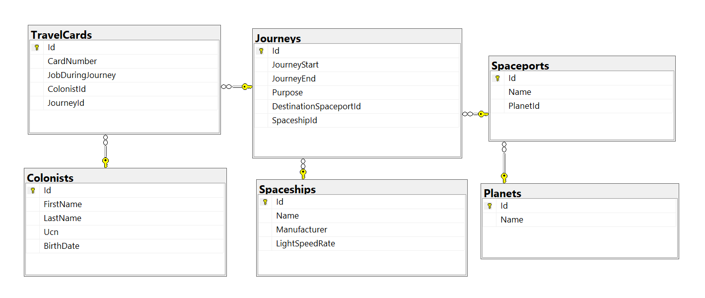

Database Basics (MSSQL) Demo Exam 
==================================

 Colonial Journey
=================

2000 years from now, the known space is colonized by the human race. However,
the four Citadel Council races are planning to populate new home worlds in the
SoftUnia Galaxy as part of a strategy called the SoftUnia Initiative. 20000
citizens are send aboard space transportation vessels. The Council has asked you
to create a Colonization Management system so they can keep track of the
colonists' journeys trough the stars.

 Database Overview
------------------

You have given an Entity / Relationship Diagram of the CJMS Database:

The **ColonialJourney** Database holds information about colonists, their travel
cards, information about the journeys, types of space vessels and destination
planets. Your task is to create a database called **ColonialJourney**. Then you
will have to create several **tables**.

-   **Planets** – contains information about **planets**.

-   **Spaceports** – contains information about **space ports**.

-   **Spaceships –** contains information about **space ships**.

-   **Colonists –** contains information about **colonists**.

-   **Journeys –** contains information about **journeys**.

-   **TravelCards –** contains information about **travel cards**.

Make sure you implement the whole database correctly on your local machine, so
that you could work with it.

The instructions you are given will be the minimal needed for you to implement
the database.

Section 1. DDL (30 pts)
=======================

You have been tasked to create the tables in the database by the following
models:

### Planets

| **Column** | **Data Type**                                 | **Constraints**                              |
|------------|-----------------------------------------------|----------------------------------------------|
| Id         | **Integer,** from **1** to **2,147,483,647.** | Unique table **identificator**, **Identity** |
| Name       | **String** up to 30 symbols. Non Unicode      | **NULL** is **not** allowed                  |

### Spaceports

| **Column** | **Data Type**                                 | **Constraints**                                              |
|------------|-----------------------------------------------|--------------------------------------------------------------|
| Id         | **Integer,** from **1** to **2,147,483,647.** | Unique table **identificator**, **Identity**                 |
| Name       | **String** up to 50 symbols. Non Unicode      | **NULL** is **not** allowed                                  |
| PlanetId   | **Integer,** from **1** to **2,147,483,647.** | **NULL** is **not** allowed, Relationship with table Planets |

### Spaceships

| **Column**     | **Data Type**                               | **Constraints**                              |
|----------------|---------------------------------------------|----------------------------------------------|
| Id             | **Integer** from **0** to **2,147,483,647** | Unique table **identificator**, **Identity** |
| Name           | **String** up to 50 symbols. Non Unicode    | **NULL** is **not** allowed                  |
|                |                                             |                                              |
| Manufacturer   | **String** up to 30 symbols. Non Unicode    | **NULL** is **not** allowed                  |
| LightSpeedRate | **Integer** from **0** to **2,147,483,647** | Has a **default value** of 0.                |

### Colonists

| **Column** | **Data Type**                               | **Constraints**                                |
|------------|---------------------------------------------|------------------------------------------------|
| Id         | **Integer** from **0** to **2,147,483,647** | Unique table **identificator**, **Identity**   |
| FirstName  | **String** up to 20 symbols. Non Unicode    | **NULL** is **not** allowed                    |
| LastName   | **String** up to 20 symbols. Non Unicode    | **NULL** is **not** allowed                    |
| Ucn        | **String** up to 10 symbols. Non Unicode    | **NULL** is **not** allowed                    |
|            |                                             | **UNIQUE** values.                             |
| BirthDate  | **Date**                                    | **NULL** is **not** allowed                    |

### Journeys

| **Column**             | **Data Type**                               | **Constraints**                                                                                                          |
|------------------------|---------------------------------------------|--------------------------------------------------------------------------------------------------------------------------|
| Id                     | **Integer** from **0** to **2,147,483,647** | Unique table **identificator**, **Identity**                                                                             |
| JourneyStart           | **DateTime**                                | **NULL** is **not** allowed                                                                                              |
| JourneyEnd             | **DateTime**                                | **NULL** is **not** allowed                                                                                              |
| Purpose                | **String** up to 11 symbols. Non Unicode    | Should **only** contain one of the following purposes: “**Medical**”, “**Technical**”, “**Educational**”, “**Military**” |
| DestinationSpaceportId | **Integer** from **0** to **2,147,483,647** | **NULL** is **not** allowed, Relationship with table Spaceports.                                                         |
| SpaceshipId            | **Integer** from **0** to **2,147,483,647** | **NULL** is **not** allowed, Relationship with table Spaceships                                                          |

### TravelCards

| **Column**       | **Data Type**                                                 | **Constraints**                                                                                                          |
|------------------|---------------------------------------------------------------|--------------------------------------------------------------------------------------------------------------------------|
| Id               | **Integer** from **0** to **2,147,483,647**                   | Unique table **identificator**, **Identity**                                                                             |
| CardNumber       | A **string** containing exactly **10 characters**.Non Unicode | **NULL** is **not** allowed                                                                                              |
|                  |                                                               | **UNIQUE** values.                                                                                                       |
| JobDuringJourney | **String** up to 8 symbols. Non Unicode                       | Should **only** contain one of the following jobs: “**Pilot**”, “**Engineer**”, “**Trooper**”, “**Cleaner**”, “**Cook**” |
| ColonistId       | **Integer** from **0** to **2,147,483,647**                   | **NULL** is **not** allowed, Relationship with table Colonists                                                           |
| JourneyId        | **Integer** from **0** to **2,147,483,647**                   | **NULL** is **not** allowed, Relationship with table Journeys                                                            |

Database Design
---------------

Submit all of yours **create statements** to the **Judge** system.

Section 2. DML (10 pts)
=======================

**Before you start, you must import “DataSet-ColonialJourney.sql”. If you have
created the structure correctly, the data should be successfully inserted
without any errors.**

In this section, you have to do some data manipulations:

Insert
------

**Insert** sample data into the database. Write a query to add the following
records into the corresponding tables. **All Ids should be auto-generated**.

**Planets**

| **Name** |
|----------|
| Mars     |
| Earth    |
| Jupiter  |
| Saturn   |

  
**Spaceships**

| **Name** | **Manufacturer** | **LightSpeedRate** |
|----------|------------------|--------------------|
| Golf     | VW               | 3                  |
| WakaWaka | Wakanda          | 4                  |
| Falcon9  | SpaceX           | 1                  |
| Bed      | Vidolov          | 6                  |

Update
------

Update all spaceships light speed rate with 1 where the **Id** is between **8**
and **12.**

Delete
------

Delete first three inserted **Journeys** (be careful with the relationships).

Section 3. Querying (40 pts)
============================

**You need to start with a fresh dataset, so recreate your DB and import the
sample data again (DataSet-ColonialJourney.sql).**

Select all travel cards
-----------------------

Extract from the database, all **travel cards.** Sort the results by **card
number ascending.**

### Required Columns

-   **CardNumber**

-   **JobDuringJourney**

### Example

| **CardNumber** | **JobDuringJourney** |
|----------------|----------------------|
| **0032031181** | Engineer             |
| 0037637193     | Engineer             |
| ...            | ...                  |

Select all colonists
--------------------

Extract from the database, all **colonists.** Sort the results by **first
name**, them by **last name**, and finally by **id** in **ascending** order.

### Required Columns

-   **Id**

-   **FullName**

-   **Ucn**

### Example

| **Id** | **FullName**       | **Ucn**    |
|--------|--------------------|------------|
| 35     | Aigneis McConville | 9225403496 |
| 92     | Althea Kelinge     | 9998159318 |
| ...    | ...                | ...        |

Select all military journeys
----------------------------

Extract from the database, all **Military** journeys. Sort the results
**ascending** by **journey start.**

### Required Columns

-   **Id**

-   **JourneyStart**

-   **JourneyEnd**

### Example

| **Id** | **JourneyStart** | **JourneyEnd** |
|--------|------------------|----------------|
| 7      | 04/01/2019       | 09/12/2049     |
| 3      | 21/02/2019       | 03/01/2049     |
| ...    | ...              | ...            |

Select all pilots
-----------------

Extract from the database all colonists, which have a **pilot job.** Sort the
result by **id, ascending.**

### \`Required Columns

-   **Id**

-   **FullName**

### Example

| **id** | **full_name** |
|--------|---------------|
| 6      | Clark Cowan   |
| 18     | Wald Bim      |
| ...    | ...           |

Count colonists
---------------

Count all colonists that are on **technical journey.**

### Required Columns

-   **Count**

### Example

| **count** |
|-----------|
| 16        |

Select the fastest spaceship
----------------------------

Extract from the database the fastest **spaceship** and its destination
**spaceport name**. In other words, the ship with the **highest** light speed
rate.

### Required Columns

-   **SpaceshipName**

-   **SpaceportName**

### Example

| **SpaceshipName** | **SpaceportName** |
|-------------------|-------------------|
| SSE Priestess     | Yggdrasil Station |

Select spaceships with pilots younger than 30 years
---------------------------------------------------

Extract from the database those **spaceships**, which have pilots, **younger**
than 30 years old. In other words, 30 years from 01/01/2019. Sort the results
**alphabetically** by spaceship **name**.

### Required Columns

-   **Name**

-   **Manufacturer**

### Example

| **Name** | **Manufacturer** |
|----------|------------------|
| Anarchy  | Fivebridge       |
| ...      | ...              |

Select all educational mission planets and spaceports
-----------------------------------------------------

Extract from the database names of all **planets** and their **spaceports**,
which have **educational** missions. Sort the results by **spaceport name** in
**descending** order.

### Required Columns

-   **PlanetName**

-   **SpaceportName**

### Example

| **PlanetName** | **SpaceportName** |
|----------------|-------------------|
| Kascarth       | Yggdrasil Station |
| Lescore        | Tartarus          |
| ...            | ...               |

Select all planets and their journey count
------------------------------------------

Extract from the database all **planets’ names** and their **journeys count**.
Order the results by journeys **count**, **descending** and by **planet name
ascending**.

### Required Columns

-   **PlanetName**

-   **JourneysCount**

### Example

| **PlanetName** | **JourneysCount** |
|----------------|-------------------|
| Otroyphus      | 4                 |
| Eipra          | 2                 |
| ...            | ...               |

Select the shortest journey
---------------------------

Extract from the database the **shortest journey,** its destination **spaceport
name**, **planet name** and **purpose**.

### Required Columns

-   **Id**

-   **PlanetName**

-   **SpaceportName**

-   **JourneyPurpose**

### Example

| **Id** | **PlanetName** | **SpaceportName** | **JourneyPurpose** |
|--------|----------------|-------------------|--------------------|
| 3      | Casmadus       | Minerva Station   | Military           |

Select the less popular job
---------------------------

Extract from the database the **less popular job** in the **longest journey**.
In other words, the job with less assign colonists.

### Required Columns

-   **JourneyId**

-   **JobName**

### Example

| **JourneyId** | **JobName** |
|---------------|-------------|
| 7             | Engineer    |

Select Second Oldest Important Colonist
---------------------------------------

Find all colonists and their job during journey with rank 2. Keep in mind that
all the selected colonists with rank 2 must be the oldest ones. You can use
ranking over their job during their journey.

### Required Columns

-   **JobDuringJourney**

-   **FullName**

-   **JobRank**

### Example

| **JobDuringJourney** | **FullName**    | **JobRank** |
|----------------------|-----------------|-------------|
| Cleaner              | Hale O'Doireidh | 2           |
| Cook                 | Laurie Askin    | 2           |
| …                    | …               | …           |

Planets and Spaceports
----------------------

Find all planets and all of their spaceports. Select planet name and the count
of the spaceports. Sort them by spaceports count (descending), then by name
(ascending).

### Required Columns

-   **Name**

-   **Count**

### Example

| **Name** | **Count** |
|----------|-----------|
| Kascarth | 4         |
| Jeayama  | 3         |
| …        | …         |

Section 4. Programmability (20 pts)
===================================

Get Colonists Count
-------------------

Create a **user defined function** with the name
**dbo.udf_GetColonistsCount(PlanetName VARCHAR (30))** that receives **planet
name** and returns the count of all colonists sent to that planet.

### Example

| **Query**                                     |        |
|-----------------------------------------------|--------|
| SELECT dbo.udf_GetColonistsCount('Otroyphus') |        |
| PlanetName                                    | Count  |
| **Otroyphus**                                 | **35** |

Change Journey Purpose
----------------------

Create a **user defined stored procedure**, named
**usp_ChangeJourneyPurpose(\@JourneyId, \@NewPurpose)**, that receives an
**journey id** and **purpose**, and attempts to **change the purpose of that
journey**. An purpose will only be changed if all of these conditions **pass**:

-   If the **journey id** doesn’t exists, then it **cannot be changed. Raise an
    error** with the message “**The journey does not exist!**”

-   If the **journey** has already that purpose, **raise an error** with the
    message “**You cannot change the purpose!**”

If all the above conditions pass, **change the purpose of that journey**.

### Example

| **Query**                                                                   | **Output**                         |
|-----------------------------------------------------------------------------|------------------------------------|
| **EXEC usp_ChangeJourneyPurpose 1, 'Technical'**                            | **998 2455**                       |
| **SELECT \* FROM Journeys**                                                 |                                    |
| **EXEC usp_ChangeJourneyPurpose 2, 'Educational'**                          | **You cannot change the purpose!** |
| **EXEC usp_ChangeJourneyPurpose 196, 'Technical'**                          | **The journey does not exist!**    |

Deleted Journeys
----------------

Create a new table **“DeletedJourneys**” with columns **(Id, JourneyStart,
JourneyEnd, Purpose, DestinationSpaceportId, SpaceshipId)**. Create a
**trigger**, which fires when journey is deleted. After deleting the journey,
**insert all of the data into the new table “DeletedJourneys”**.

Note: Submit only your **CREATE TRIGGER** statement!

### Example

| **Query**                                                                         |
|-----------------------------------------------------------------------------------|
| **DELETE FROM TravelCards WHERE JourneyId = 1 DELETE FROM Journeys WHERE Id = 1** |
| **Response**                                                                      |
| **(5 rows affected) (1 rows affected) (1 rows affected)**                         |
