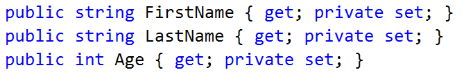
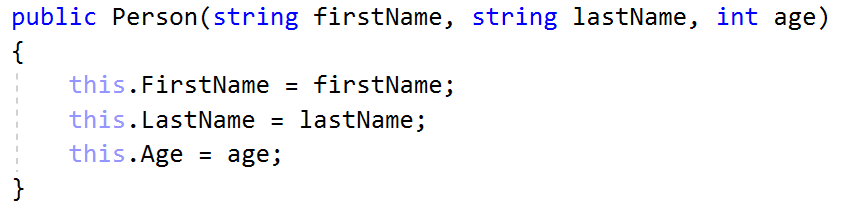
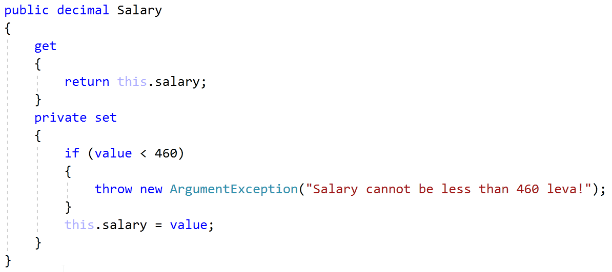
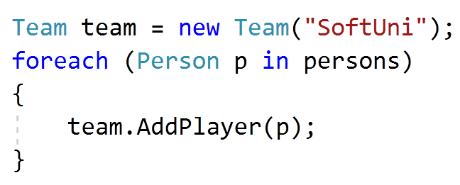
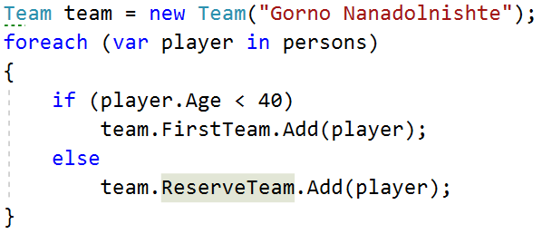
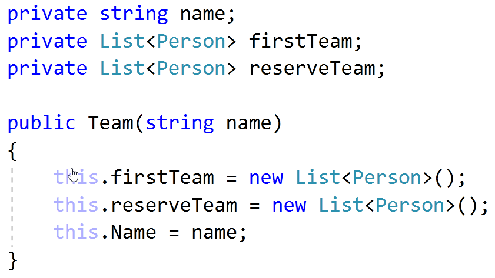
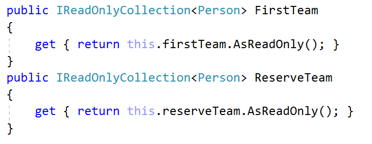
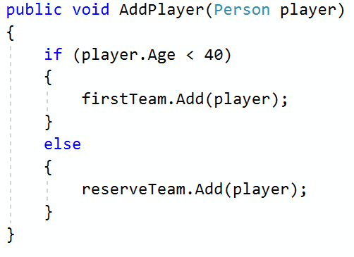

Lab: Encapsulation
==================

Problems for exercises and homework for the ["C\# OOP" course \@
SoftUni"](https://softuni.bg/trainings/2244/csharp-oop-february-2019).

You can check your solutions here:
<https://judge.softuni.bg/Contests/1497/Encapsulation-Lab>

Sort Persons by Name and Age
----------------------------

**NOTE**: You need a public **StartUp** class with the namespace
**PersonsInfo**.

Create a class **Person**, which should have **public** properties with
**private** setters for:

-   **FirstName**: **string**

-   **LastName**: **string**

-   **Age**: **int**

-   **ToString()**: **string** - **override**

You should be able to use the class like this:

| StartUp.cs                                                                                                                                                                                                                                                                                                                                                                                                  |
|-------------------------------------------------------------------------------------------------------------------------------------------------------------------------------------------------------------------------------------------------------------------------------------------------------------------------------------------------------------------------------------------------------------|
| public static void Main() { var lines = int.Parse(Console.ReadLine()); var persons = new List\<Person\>(); for (int i = 0; i \< lines; i++) { var cmdArgs = Console.ReadLine().Split(); var person = new Person(cmdArgs[0], cmdArgs[1], int.Parse(cmdArgs[2])); persons.Add(person); } persons.OrderBy(p =\> p.FirstName) .ThenBy(p =\> p.Age) .ToList() .ForEach(p =\> Console.WriteLine(p.ToString())); } |

### Examples

| **Input**                                                                                  | **Output**                                                                                                                                                     |
|--------------------------------------------------------------------------------------------|----------------------------------------------------------------------------------------------------------------------------------------------------------------|
| 5 Asen Ivanov 65 Boiko Borisov 57 Ventsislav Ivanov 27 Asen Harizanoov 44 Boiko Angelov 35 | Asen Harizanoov is 44 years old. Asen Ivanov is 65 years old. Boiko Angelov is 35 years old. Boiko Borisov is 57 years old. Ventsislav Ivanov is 27 years old. |

### Solution

Create a **new class** and ensure **proper naming**. Define the **public**
properties:

Create a constructor for Person, which takes 3 parameters firstName, lastName,
age:

Override **ToString()** method:

Salary Increase
---------------

**NOTE**: You need a public **StartUp** class with the namespace
**PersonsInfo**.

**Refactor the project from the last task.**

Read a Person with their names, age and salary. Read the percentage of the bonus
to every Person salary. People younger than 30 **get half the increase**. Expand
**Person** from the previous task.

New **properties** and **methods:**

-   **Salary**: **decimal**

-   **IncreaseSalary**(**decimal percentage**)

You should be able to use the class like this:

| StartUp.cs                                                                                                                                                                                                                                                                                                                                                                                                                                             |
|--------------------------------------------------------------------------------------------------------------------------------------------------------------------------------------------------------------------------------------------------------------------------------------------------------------------------------------------------------------------------------------------------------------------------------------------------------|
| var lines = int.Parse(Console.ReadLine()); var persons = new List\<Person\>(); for (int i = 0; i \< lines; i++) { var cmdArgs = Console.ReadLine().Split(); var person = new Person(cmdArgs[0], cmdArgs[1], int.Parse(cmdArgs[2]), decimal.Parse(cmdArgs[3])); persons.Add(person); } var parcentage = decimal.Parse(Console.ReadLine()); persons.ForEach(p =\> p.IncreaseSalary(parcentage)); persons.ForEach(p =\> Console.WriteLine(p.ToString())); |

### Examples

| **Input**                                                                                                                | **Output**                                                                                                                                                                                |
|--------------------------------------------------------------------------------------------------------------------------|-------------------------------------------------------------------------------------------------------------------------------------------------------------------------------------------|
| 5 Asen Ivanov 65 2200 Boiko Borisov 57 3333 Ventsislav Ivanov 27 600 Asen Harizanoov 44 666.66 Boiko Angelov 35 559.4 20 | Asen Ivanov receives 2640.00 leva. Boiko Borisov receives 3999.60 leva. Ventsislav Ivanov receives 660.00 leva. Asen Harizanoov receives 799.99 leva. Boiko Angelov receives 671.28 leva. |

### Solution

Add a new **public** property for **salary** and **refactor constructor**. Add
new **method**, which will **update** salary with a bonus

Refactor the **ToString()** method for this task.

Validation of Data
------------------

**NOTE**: You need a public **StartUp** class with the namespace
**PersonsInfo**.

Expand Person with proper validation for every field:

-   **Names must be at least 3 symbols**

-   **Age must not be zero or negative**

-   **Salary can't be less than 460.0**

Print proper messages to the user:

-   **“Age cannot be zero or a negative integer!”**

-   **“First name cannot contain fewer than 3 symbols!”**

-   **“Last name cannot contain fewer than 3 symbols!”**

-   **“Salary cannot be less than 460 leva!”**

Use ArgumentExeption with messages from example.

### Examples

| **Input**                                                                                                 | **Output**                                                                                                                                                                                                        |
|-----------------------------------------------------------------------------------------------------------|-------------------------------------------------------------------------------------------------------------------------------------------------------------------------------------------------------------------|
| 5 Asen Ivanov -6 2200 B Borisov 57 3333 Ventsislav Ivanov 27 600 Asen H 44 666.66 Boiko Angelov 35 300 20 | Age cannot be zero or a negative integer! First name cannot contain fewer than 3 symbols! Last name cannot contain fewer than 3 symbols! Salary cannot be less than 460 leva! Ventsislav Ivanov gets 660.00 leva. |

### Solution

Add validation to all of the setters in Person. Validation may look like this or
something similar:

First and Reserve Team
----------------------

**NOTE**: You need a public **StartUp** class with the namespace
**PersonsInfo**.

Create a Team class. Add to this team all of the people you have received. Those
who are younger than 40 go to the first team, others go to the reverse team. At
the end print the sizes of the first and the reserved team.

The class should have **private fields** for:

-   **name**: **string**

-   **firstTeam**: **List\<Person\>**

-   **reserveTeam**: **List\<Person\>**

The class should have **constructors**:

-   **Team(string name)**

The class should also have **public properties** for:

-   **FirstTeam: List\<Person\> (read only!)**

-   **ReserveTeam: List\<Person\> (read only!)**

And a method for adding players:

-   **AddPlayer**(**Person person**): **void**

You should be able to use the class like this:

You should **NOT** be able to use the class like this:

### Examples

| **Input**                                                                                                           | **Output**                                            |
|---------------------------------------------------------------------------------------------------------------------|-------------------------------------------------------|
| 5 Asen Ivanov 20 2200 Boiko Borisov 57 3333 Ventsislav Ivanov 27 600 Grigor Dimitrov 25 666.66 Boiko Angelov 35 555 | First team has 4 players. Reserve team has 1 players. |

### Solution

Add a new class Team. Its fields and **constructor** should look like:

Properties for **FirstTeam** and **ReserveTeam** have only getters:

There will be only one method, which adds players to teams:

