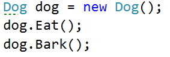
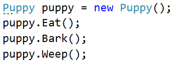
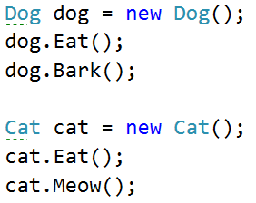

Lab: Inheritance
================

Problems for exercises and homework for the ["C\# OOP" course \@
SoftUni"](https://softuni.bg/trainings/2244/csharp-oop-february-2019).

You can check your solutions here:
<https://judge.softuni.bg/Contests/1499/Inheritance-Lab>

Part I: Inheritance
===================

Single Inheritance
------------------

**NOTE**: You need a public **StartUp** class with the namespace **Farm**.

Create two classes named **Animal** and **Dog**.

**Animal** with a single public method **Eat()** that prints: **"eating…"**

**Dog** with a single public method **Bark()** that prints: **"barking…"**

**Dog** should inherit from **Animal**.

### Hints

Use the **: operator** to build a hierarchy

Multiple Inheritance
--------------------

**NOTE**: You need a public **StartUp** class with the namespace **Farm**.

Create three classes named **Animal**, **Dog** and **Puppy**.

**Animal** with a single public method **Eat()** that prints: **"eating…"**

**Dog** with a single public method **Bark()** that prints: **"barking…"**

**Puppy** with a single public method **Weep()** that prints: **"weeping…"**

**Dog** should inherit from **Animal**. **Puppy** should inherit from **Dog**.

Hierarchical Inheritance
------------------------

**NOTE**: You need a public **StartUp** class with the namespace **Farm**.

Create three classes named **Animal**, **Dog** and **Cat**.

**Animal** with a single public method **Eat()** that prints: **"eating…"**

**Dog** with a single public method **Bark()** that prints: **"barking…"**

**Cat** with a single public method **Meow()** that prints: **"meowing…"**

**Dog** and **Cat** should inherit from **Animal**.

Part II: Reusing Classes
========================

Random List
-----------

**NOTE**: You need a public **StartUp** class with the namespace
**CustomRandomList**.

Create a **RandomList** class that has all the functionality of
**List\<string\>**.

Add additional function that **returns** and **removes** a random element from
the list.

-   Public method: **RandomString(): string**

Stack of Strings
----------------

**NOTE**: You need a public **StartUp** class with the namespace
**CustomStack**.

Create a class **StackOfStrings** which extends **Stack** and can store only
strings and has the following functionality:

-   Public method: **IsEmpty(): bool**

-   Public method: **AddRange(): Stack\<string\>**
