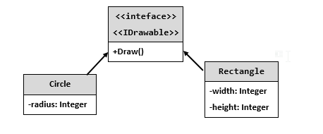
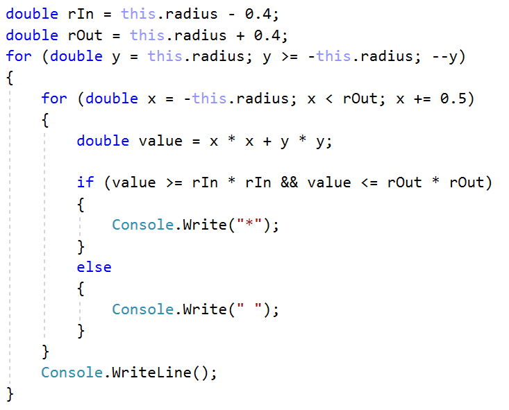
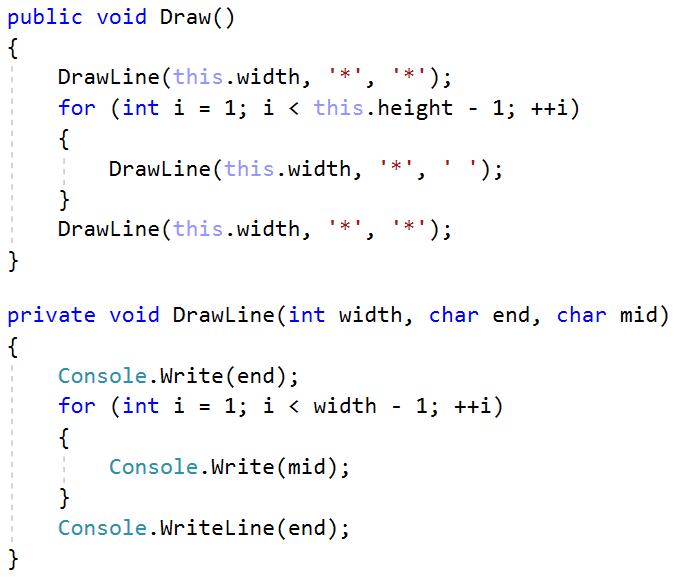
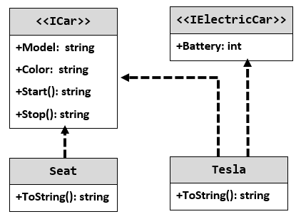

Lab: Interfaces and Abstraction
===============================

Problems for exercises and homework for the ["C\# OOP" course \@
SoftUni"](https://softuni.bg/trainings/2244/csharp-oop-february-2019).

You can check your solutions here:
<https://judge.softuni.bg/Contests/1501/Interfaces-and-Abstraction-Lab>

Shapes
------

**NOTE**: You need a public **StartUp** class with the namespace **Shapes**.

Build hierarchy of interfaces and classes:

You should be able to use the class like this:

| StartUp.cs                                                                                                                                                                                                                                           |
|------------------------------------------------------------------------------------------------------------------------------------------------------------------------------------------------------------------------------------------------------|
| var radius = int.Parse(Console.ReadLine()); IDrawable circle = new Circle(radius); var width = int.Parse(Console.ReadLine()); var height = int.Parse(Console.ReadLine()); IDrawable rect = new Rectangle(width, height); circle.Draw(); rect.Draw(); |

### Examples

| **Input** | **Output**                                                                                                      |
|-----------|-----------------------------------------------------------------------------------------------------------------|
| 3 4 5     | \*\*\*\*\*\*\* \*\* \*\* \*\* \*\* \* \* \*\* \*\* \*\* \*\* \*\*\*\*\*\*\* \*\*\*\* \* \* \* \* \* \* \*\*\*\* |

### Solution

The algorithm for drawing a circle is:

The algorithm for drawing a rectangle is:

Cars
----

**NOTE**: You need a public **StartUp** class with the namespace **Cars**.

Build a hierarchy of interfaces and classes:

Your hierarchy must be used with this code:

| StartUp.cs                                                                                                                                                  |
|-------------------------------------------------------------------------------------------------------------------------------------------------------------|
| ICar seat = new Seat("Leon", "Grey"); ICar tesla = new Tesla("Model 3", "Red", 2); Console.WriteLine(seat.ToString()); Console.WriteLine(tesla.ToString()); |

### Examples

| **Output**                                                                                   |
|----------------------------------------------------------------------------------------------|
| Grey Seat Leon Engine start Breaaak! Red Tesla Model 3 with 2 Batteries                      |
| Engine start Breaaak!                                                                        |
