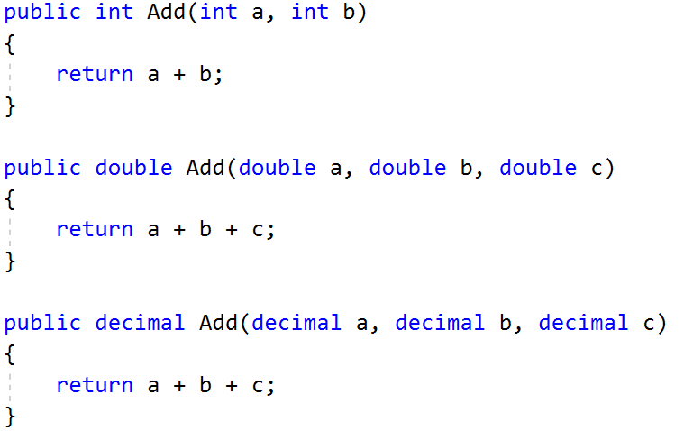
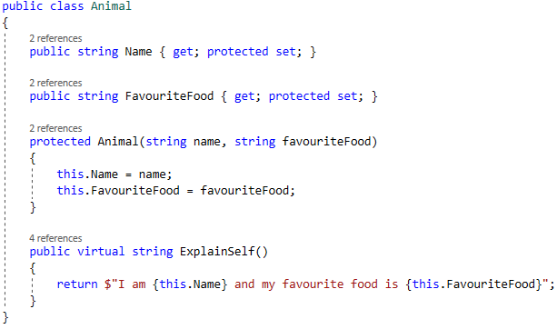
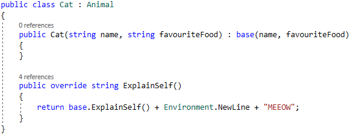

Lab: Polymorphism
=================

Problems for exercises and homework for the ["C\# OOP" course \@
SoftUni"](https://softuni.bg/trainings/2244/csharp-oop-february-2019).

You can check your solutions here:
<https://judge.softuni.bg/Contests/1503/Polymorphism-Lab>

MathOperation
-------------

**NOTE**: You need a public **StartUp** class with the namespace **Operations**.

Create a class **MathOperations**, which should have 3 times method **Add().**
Method **Add()** has to be invoked with:

-   Add(int, int): **int**

-   Add(double, double, double): **double**

-   Add(decimal, decimal, decimal): **decimal**

You should be able to use the class like this:

| StartUp.cs                                                                                                                                                                                      |
|-------------------------------------------------------------------------------------------------------------------------------------------------------------------------------------------------|
| public static void Main() { MathOperations mo = new MathOperations(); Console.WriteLine(mo.Add(2, 3)); Console.WriteLine(mo.Add(2.2, 3.3, 5.5)); Console.WriteLine(mo.Add(2.2m, 3.3m, 4.4m)); } |

### Examples

| **Output** |
|------------|
| 5 11 9.9   |

### Solution

Created MathOperation class should look like this:

Animals
-------

**NOTE**: You need a public **StartUp** class with the namespace **Animals**.

Create a class Animal, which holds two fields:

-   name: string

-   favouriteFood: string

Animal has one virtual method **ExplainSelf(): string.**  
You should add two new classes - **Cat** and **Dog. Override** the
**ExplainSelf()** method by adding concrete animal sound on a new line. (Look at
examples below)

You should be able to use the class like this:

| StartUp.cs                                                                                                                                                   |
|--------------------------------------------------------------------------------------------------------------------------------------------------------------|
| Animal cat = new Cat("Pesho", "Whiskas"); Animal dog = new Dog("Gosho", "Meat"); Console.WriteLine(cat.ExplainSelf()); Console.WriteLine(dog.ExplainSelf()); |

### Examples

| **Output**                                                                                       |
|--------------------------------------------------------------------------------------------------|
| I am Pesho and my fovourite food is Whiskas MEEOW I am Gosho and my fovourite food is Meat DJAAF |

### Solution

Shapes
------

**NOTE**: You need a public **StartUp** class with the namespace **Shapes**.

Create a class hierarchy, starting with **abstract** class Shape:

-   **Abstract methods:**

    -   **CalculatePerimeter(): doulbe**

    -   **CalculateArea(): double**

-   **Virtual methods:**

    -   **Draw(): string**

Extend the Shape class with two children:

-   **Rectangle**

-   **Circle**

Each of them need to have:

-   **Fields:**

    -   **height and width for Rectangle**

    -   **radius for Circle**

-   **Encapsulation for these fields**

-   **A public constructor**

-   **Concrete methods for calculations (perimeter and area)**

-   **Override methods for drawing**
