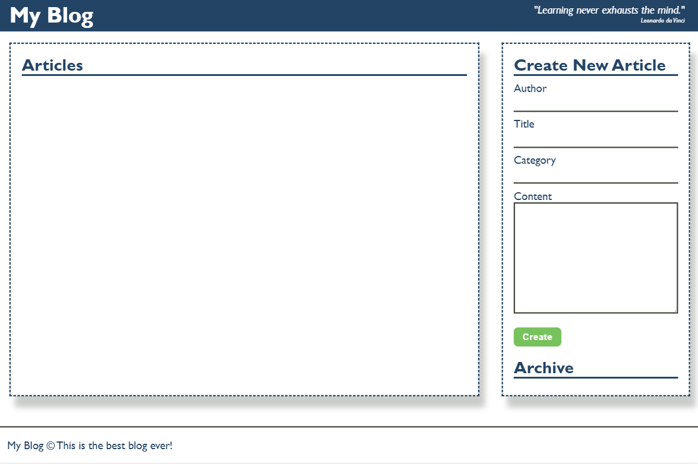
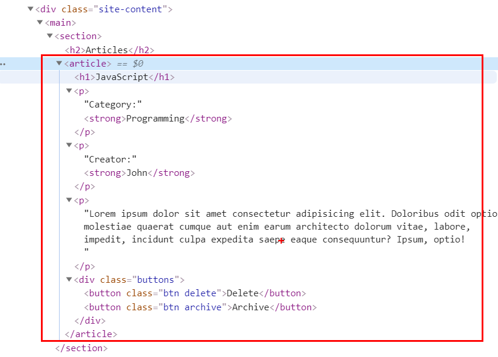
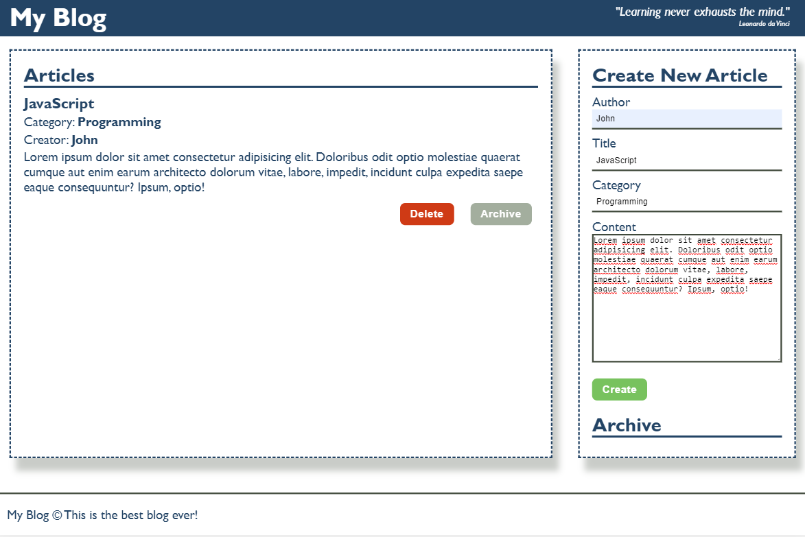
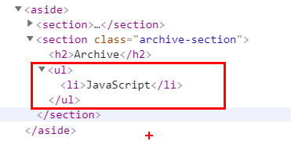
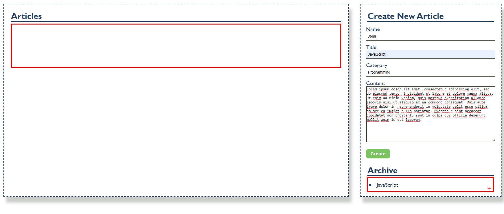
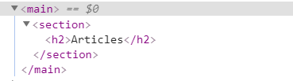
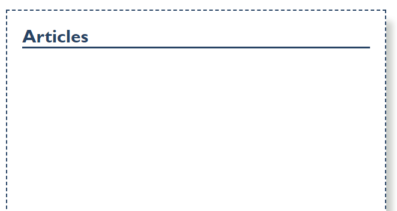

**JS Advanced: Exam – 23.02.20**

Exam problems for the ["JavaScript Advanced" course \@
SoftUni](https://softuni.bg/courses/js-advanced).

Problem 1. Blog (DOM Manipulation)
==================================

### Use the Given Skeleton to Solve This Problem.

**Note: You Have NO Permission to Change Directly the Given HTML (Index.html
File).**

### Your Task

Write the missing JavaScript code to make the Blog application work as expected.

You should be able to **create** new articles.

Each article has **name, title, category** and **content**. When you click the
**[Create]** button, a new **article item** should be added to the articles
**section**.

The new item should have the **following structure**:

The new item should have the **following structure**:

Append two buttons, which are in a **div** element with class **"buttons"** to
each article item

**[Delete]** button should have the following classes: **"btn" and "delete"**

**[Archive]** button should have the following classes: **"btn" and "archive"**

When you click the **[Archive]** button you should move the article to the
**ul** in the archive section. Archive section should be **sorted by title**.

*Important! Do not move the entire article, but only the title of the article.*

When you click the **[Delete]** button you should delete the entire article.

*GOOD LUCK!*
