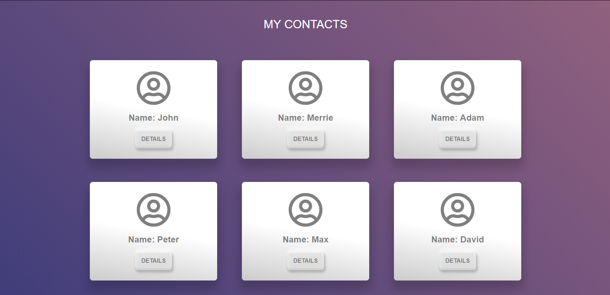
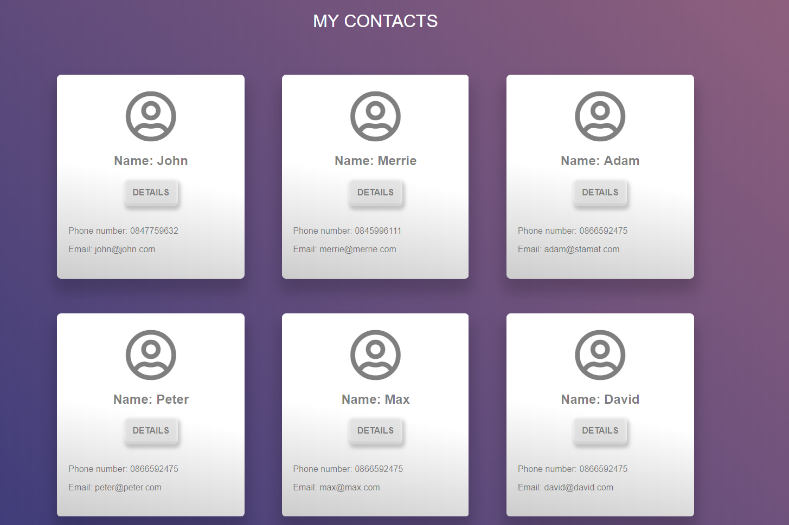

Lab: Templating
===============

Problems for in-class lab for the ["JavaScript Applications" course \@
SoftUni](https://softuni.bg/courses/js-apps).

Contacts Book
-------------

Create a simple page containing some cards with contacts. Each card should have
a **name** and a **button "Details"**. Each time the button is pressed, you have
to **toggle a div** containing more detailed information about the corresponding
contact.

You will be provided with the **HTML, CSS** and a **JavaScript** file with all
the contacts data. You have to create a **separate template** for the contact
cards and display all of them on the main page. At the end, the page should look
like this:

### Hints

First, create a **separate html file**, where you will put **your contact
cards**:

L**oop through all the contacts** and **render the data** about each of them

The next step is to create the functionality for displaying all cards.

-   Create a function that gets the **template.html** file

-   Pass the **contacts** variable to the context

-   Create the **template**

-   Get the **div** and fill it with the **compiled HTML**

-   Create the **function** that **shows** the additional info about each
    contact
