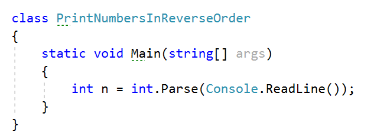
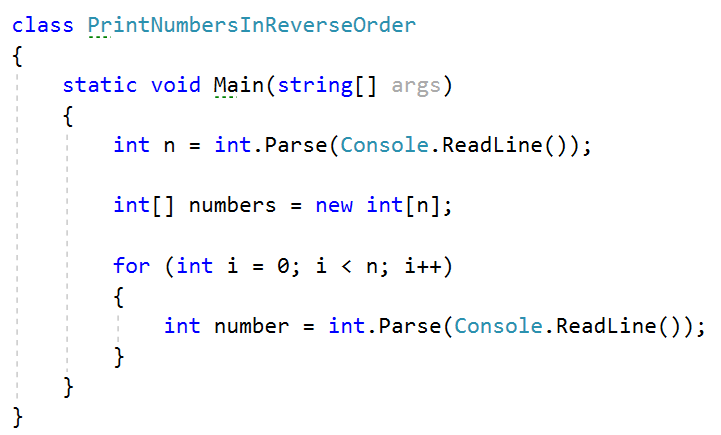
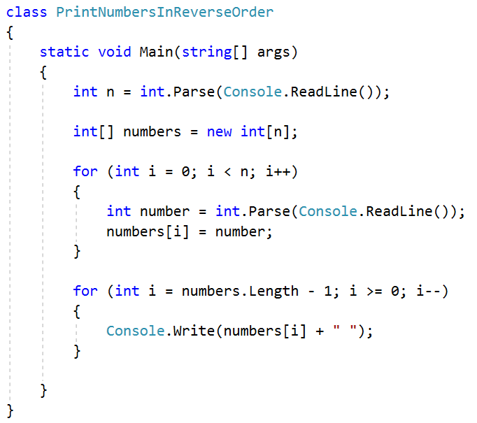
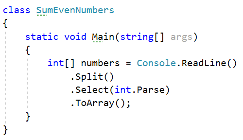
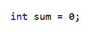
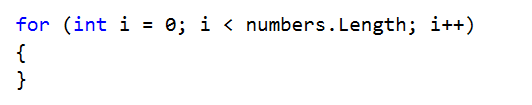
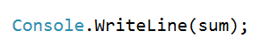
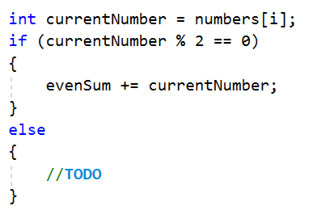
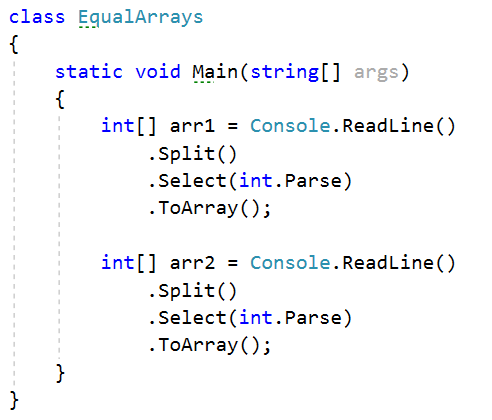
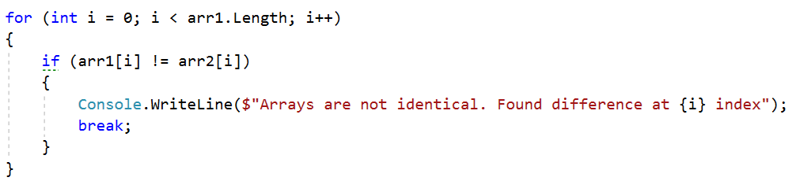

Lab: Arrays
===========

Problems for exercises and homework for the ["Technology Fundamentals" course \@
SoftUni](https://softuni.bg/courses/technology-fundamentals).

You can check your solutions here: <https://judge.softuni.bg/Contests/1202>

Day of Week
-----------

Enter a day number [1…7] and print the name (in English) or "Invalid day!"

### Examples

| **Input** | **Output**   |
|-----------|--------------|
| 1         | Monday       |
| 2         | Wednesday    |
| 10        | Invalid day! |

Print Numbers in Reverse Order
------------------------------

Read n numbers and print them in reverse order.

### Examples

| **Input**  | **Output** |
|------------|------------|
| 3 10 20 30 | 30 20 10   |
| 3 30 20 10 | 10 20 30   |
| 1 10       | 10         |

###  Hints

First, we need to read **n** from the console.

Create an **array of integer** with **n** size.

Read **n** numbers using for loop.

**Set** number to the corresponding **index**.

Print the array in reversed order.

Rounding Numbers
----------------

Read an array of real numbers (space separated), round them in "**away from 0**"
style and print the output as in the examples:

### Examples

| **Input**                  | **Output**                                                   |
|----------------------------|--------------------------------------------------------------|
| 0.9 1.5 2.4 2.5 3.14       | 0.9 =\> 1 1.5 =\> 2 2.4 =\> 2 2.5 =\> 3 3.14 =\> 3           |
| \-5.01 -1.599 -2.5 -1.50 0 | \-5.01 =\> -5 -1.599 =\> -2 -2.5 =\> -3 -1.50 =\> -2 0 =\> 0 |

Reverse Array of Strings
------------------------

Read an array of strings (space separated values), reverse it and print its
elements:

### Examples

| **Input**   | **Output** |
|-------------|------------|
| a b c d e   | e d c b a  |
| \-1 hi ho w | w ho hi -1 |

Sum Even Numbers
----------------

Read an array from the console and sum only the even numbers.

### Examples

| **Input**   | **Output** |
|-------------|------------|
| 1 2 3 4 5 6 | 12         |
| 3 5 7 9     | 0          |
| 2 4 6 8 10  | 30         |

### Hints

First, we need to read the array.

We will need a variable for the sum.

Iterate through all elements in the array with for loop.

Check if the number at current index is even.

Print the total sum

Even and Odd Subtraction
------------------------

Write a program that calculates the difference between the sum of the even and
the sum of the odd numbers in an array.

### Examples

| **Input**   | **Output** | **Comments**                                               |
|-------------|------------|------------------------------------------------------------|
| 1 2 3 4 5 6 | 3          | Even: 2 + 4 + 6 = 12 Odd: 1 + 3 + 5 = 9 Result: 12 – 9 = 3 |
| 3 5 7 9     | \-24       | Even: 0 Odd: 3 + 5 + 7 + 9 = 24 Result: 0 – 24 = -24       |
| 2 4 6 8 10  | 30         | Even: 2 + 4 + 6 + 8 + 10 = 30 Odd: 0 Result: 30 – 0 = 30   |

### Hints

First, we need to read the array.

We will need two variables – even and odd sum.

Iterate through all elements in the array with for loop.

Check the current number – if it is even add it to the even sum, otherwise add
It to the odd sum.

Print the difference.

Equal Arrays
------------

Read two arrays and print on the console whether they are identical or not.
Arrays are identical if their elements are equal. If the arrays are identical
find the sum of the first one and print on the console following message:
"Arrays are identical. Sum: {sum}", otherwise find the first index where the
arrays differ and print on the console following message: "Arrays are not
identical. Found difference at {index} index".

### Examples

| **Input**           | **Output**                                            |
|---------------------|-------------------------------------------------------|
| 10 20 30 10 20 30   | Arrays are identical. Sum: 60                         |
| 1 2 3 4 5 1 2 4 3 5 | Arrays are not identical. Found difference at 2 index |
| 1 10                | Arrays are not identical. Found difference at 0 index |

### Hints

First, we need to read two arrays.

Iterate through arrays and compare element. If the elements are not equal print
the required message and break the loop.

Think about how to solve the other part of the problem.

Condense Array to Number
------------------------

Write a program to read **an array of integers** and **condense** them by
**summing** adjacent couples of elements until a **single integer** is obtained.
For example, if we have 3 elements {2, 10, 3}, we sum the first two and the
second two elements and obtain {2+10, 10+3} = {12, 13}, then we sum again all
adjacent elements and obtain {12+13} = {25}.

### Examples

| **Input** | **Output** | **Comments**                                                               |
|-----------|------------|----------------------------------------------------------------------------|
| 2 10 3    | 25         | 2 10 3 2+10 10+3 12 13 12 + 13 25                                          |
| 5 0 4 1 2 | 35         | 5 0 4 1 2 5+0 0+4 4+1 1+2 5 4 5 3 5+4 4+5 5+3 9 9 8 9+9 9+8 18 17 18+17 35 |
| 1         | 1          | 1 is already condensed to number                                           |

### Hints

While we have more than one element in the array **nums[]**, repeat the
following:

-   Allocate a new array **condensed[]** of size **nums.Length-1**.

-   Sum the numbers from **nums[]** to **condensed[]**:

    -   condensed[i] = nums[i] + nums[i+1]

-   nums[] = condensed[]

The process is illustrated below:

