Lab: Dictionaries, Lambda and LINQ
==================================

Problems for exercises and homework for the ["Technology Fundamentals" course \@
SoftUni](https://softuni.bg/courses/technology-fundamentals).

You can check your solutions here: <https://judge.softuni.bg/Contests/1212>

Associative Arrays
==================

Count Real Numbers
------------------

Read a **list of integers** and **print them in ascending order** along with
their **number of occurrences**.

### Examples

| **Input** | **Output**      |   | **Input** | **Output**              |   | **Input** | **Output**                |
|-----------|-----------------|---|-----------|-------------------------|---|-----------|---------------------------|
| 8 2 2 8 2 | 2 -\> 3 8 -\> 2 |   | 1 5 1 3   | 1 -\> 2 3 -\> 1 5 -\> 1 |   | \-2 0 0 2 | \-2 -\> 1 0 -\> 2 2 -\> 1 |

### Hints

Read an array from doubles

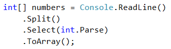

Use **SortedDictionary\<double, int\>** named **counts**.

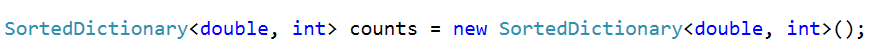

Pass through each input number **num** and increase **counts[num]** (when
**num** exists in the dictionary) or assign **counts[num]** = **1** (when
**num** does not exist in the dictionary).

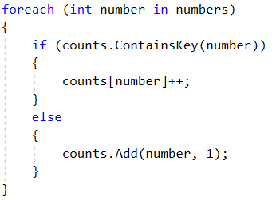

Pass through all numbers in the dictionary and print the number **num** and its
count of occurrences.

Odd Occurrences
---------------

Write a program that extracts from a given sequence of words all elements that
present in it **odd number of times** (case-insensitive).

-   Words are given in a single line, space separated.

-   Print the result elements in lowercase, in their order of appearance.

### Examples

| **Input**                      | **Output** |
|--------------------------------|------------|
| Java C\# PHP PHP JAVA C java   | java c\# c |
| 3 5 5 hi pi HO Hi 5 ho 3 hi pi | 5 hi       |
| a a A SQL xx a xx a A a XX c   | a sql xx c |

### Hints

Read a line from the console and split it by a space

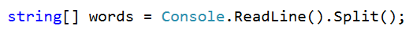

Use a **dictionary** (**string int**) to count the occurrences of each word

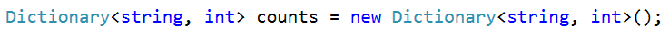

Pass through all elements in the array and count each word.

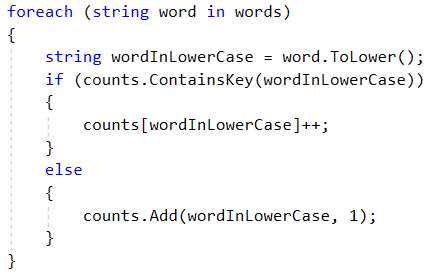

Pass through the dictionary and print words that occures odd times.

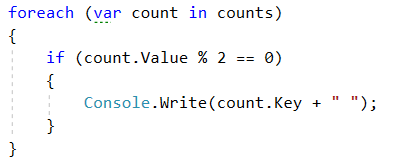

Word Synonyms
-------------

Write a program which keeps a dictionary with synonyms. The **key** of the
dictionary will be the **word**. The **value** will be a **list of all the
synonyms of that word**. You will be given a number **n**. On the next **2 \*
n** lines you will be given a **word** and a **synonym** each on a separate line
like this:

-   {**word**}

-   {**synonym**}

If you get the same word twice just add the new synonym to the list.

Print the words in the following format:

**{word} - {synonym1, synonym2… synonymN}**

### Examples

| **Input**                                  | **Output**                               |
|--------------------------------------------|------------------------------------------|
| 3 cute adorable cute charming smart clever | cute - adorable, charming smart - clever |
| 2 task problem task assignment             | task – problem, assignment               |

### Hints

-   Use **dictionary (string -\> List\<string\>)** to keep track of all words

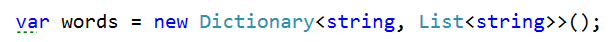

-   **Read n \* 2 lines**

-   **Add the word in the dictionary if it is not present**

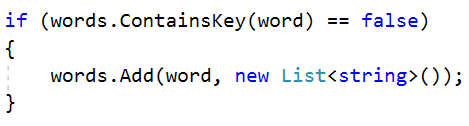

-   **Add the synonym as value to the given word**

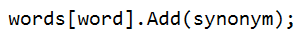

-   Print each word with the synonyms in the required format

LINQ
====

Largest 3 Numbers
-----------------

Read a **list of integers** and **print largest 3 of them**. If there are less
than 3, print all of them.

### Examples

| **Input**        | **Output** |   | **Input** | **Output** |
|------------------|------------|---|-----------|------------|
| 10 30 15 20 50 5 | 50 30 20   |   | 20 30     | 30 20      |

### Hints

-   Read an array of integers

-   **Order the array using LINQ query**

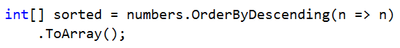

-   **Print top 3 numbers with for loop**

Word Filter
-----------

Read an array of strings, take only words which length is even. Print each word
on a new line.

### Examples

| **Input**                | **Output**         |
|--------------------------|--------------------|
| kiwi orange banana apple | kiwi orange banana |
| pizza cake pasta chips   | cake               |

-   Read an array of strings

-   Filter those whose length is even

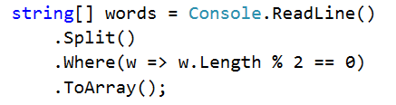

-   Print each word on a new line
