Lab: Lists
==========

Problems for exercises and homework for the "Technology Fundamentals" course \@
SoftUni.

You can check your solutions here: https://judge.softuni.bg/Contests/1210

Remove Negatives and Reverse
----------------------------

Read a **list of integers**, **remove all negative numbers** from it and print
the remaining elements in **reversed order**. In case of no elements left in the
list, print "**empty**".

### Examples

| **Input**        | **Output** |
|------------------|------------|
| 10 -5 7 9 -33 50 | 50 9 7 10  |
| 7 -2 -10 1       | 1 7        |
| \-1 -2 -3        | empty      |

### Solution

Read a list of integers.

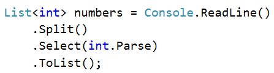

Remove all negative numbers.

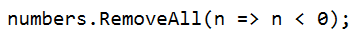

If the list count is equal to 0 print "empty", otherwise print all numbers
joined by space.

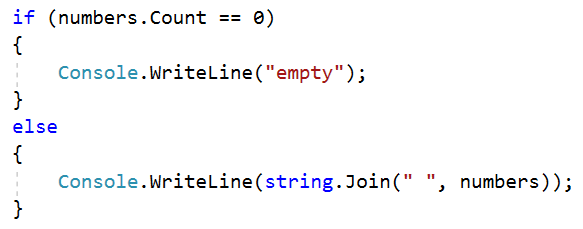

Sum Adjacent Equal Numbers
--------------------------

Write a program to **sum all adjacent equal numbers** in a list of decimal
numbers, starting from **left to right**.

-   After two numbers are summed, the obtained result could be equal to some of
    its neighbors and should be summed as well (see the examples below).

-   Always sum the **leftmost** two equal neighbors (if several couples of equal
    neighbors are available).

### Examples

| **Input**    | **Output** | **Explanation**                                      |
|--------------|------------|------------------------------------------------------|
| 3 3 6 1      | 12 1       | **3 3** 6 1 **6 6** 1 12 1                           |
| 8 2 2 4 8 16 | 16 8 16    | 8 **2 2** 4 8 16 8 **4 4** 8 16 **8 8** 8 16 16 8 16 |
| 5 4 2 1 1 4  | 5 8 4      | 5 4 2 **1 1** 4 5 4 **2 2** 4 5 **4 4** 4 5 8 4      |

### Solution

Read a list from numbers.

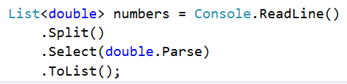

Iterate through the elements. Check if the number at the current index is equal
to the next number. If it is, aggregate the numbers and reset the loop,
otherwise don't do anything.

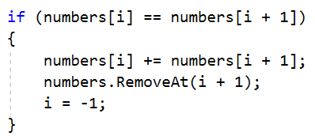

Finally, you have to print the numbers joined by space.

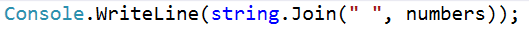

Gauss' Trick
------------

Write a program that **sum** all **numbers in a list** in the following order:

first **+** last, first + 1 **+** last - 1, first + 2 **+** last **-** 2**,** …
first + n, last - n.

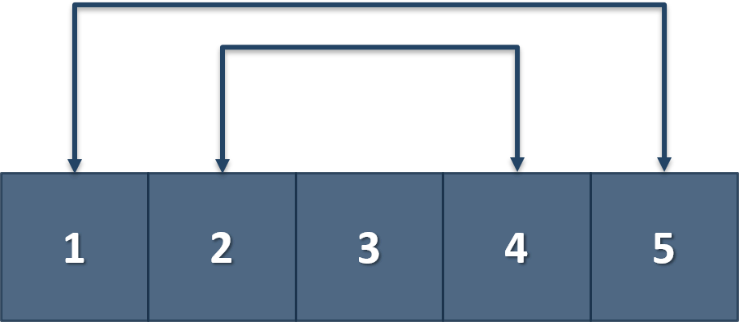

### Example

| **Input** | **Output** |
|-----------|------------|
| 1 2 3 4 5 | 6 6 3      |
| 1 2 3 4   | 5 5        |

List of Products
----------------

Read a number **n** and **n lines of products**. Print a **numbered list** of
all the products **ordered by name**.

### Examples

| **Input**                         | **Output**                              |
|-----------------------------------|-----------------------------------------|
| 4 Potatoes Tomatoes Onions Apples | 1.Apples 2.Onions 3.Potatoes 4.Tomatoes |

### Solution

First, we need to read the number **n** from the console

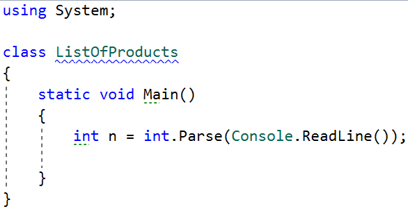

Then we need to create our **list of strings**, because the **products are
strings**

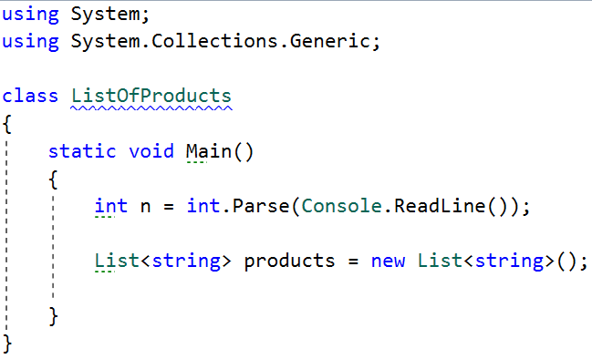

Then we need to iterate **n times** and **read our current product**

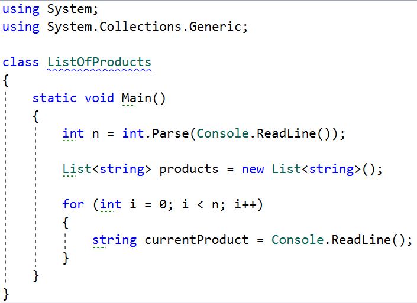

The next step is to **add** the current product to the list

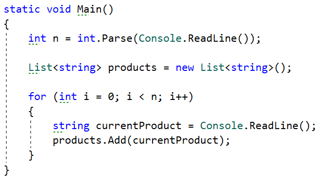

After we finish reading the products we **sort our list alphabetically**

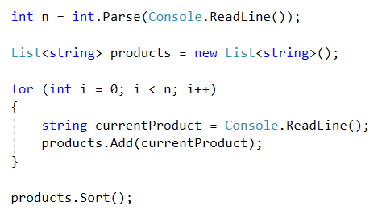

-   The **sort method** sorts the list in ascending order.

>   Finally, we have to **print our sorted** list. To do that we **loop through
>   the list**.

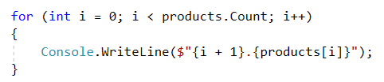

-   We use **i + 1**, because we want to **start counting from 1**, we put the
    **'.'**, and **finally** we put **the actual product**

List Manipulation Basics
------------------------

Write a program that reads a list of integers. Then until you receive **"end"**,
you will be given different **commands:**

**Add {number}:** add a number to the end of the list

**Remove {number}:** remove number from the list

**RemoveAt {index}:** removes number at a given index

**Insert {number} {index}:** inserts a number at a given index

**Note: All the indices will be valid!**

When you receive the **"end"** command print the **final state** of the list
(**separated by spaces**)

### Example

| **Input**                                               | **Output**    |
|---------------------------------------------------------|---------------|
| 4 19 2 53 6 43 Add 3 Remove 2 RemoveAt 1 Insert 8 3 end | 4 53 6 8 43 3 |

### Solution

First let us read the list from the console.

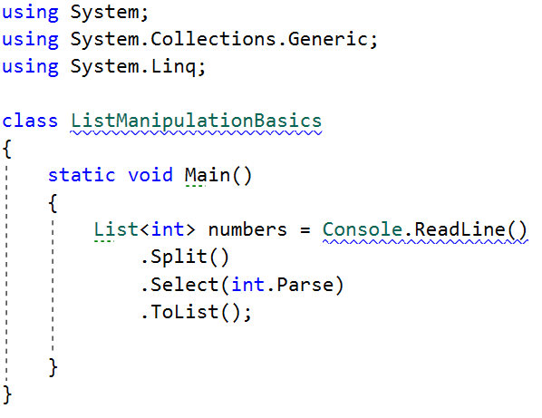

-   We **split** the string read from the console, then we **loop through each
    element** and parse it to **int**

-   This returns **IEnumarable\<int\>,** so we make it into a **list**

Next, we make the while loop for the commands and make switch statement for the
commands

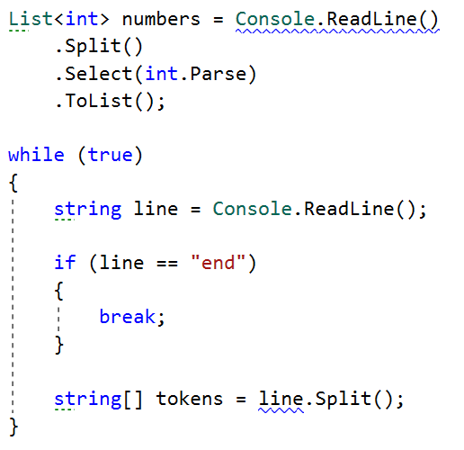

-   We break if the line is end, otherwise we split it into tokens

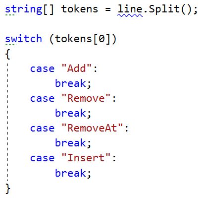

Now let us implement each command

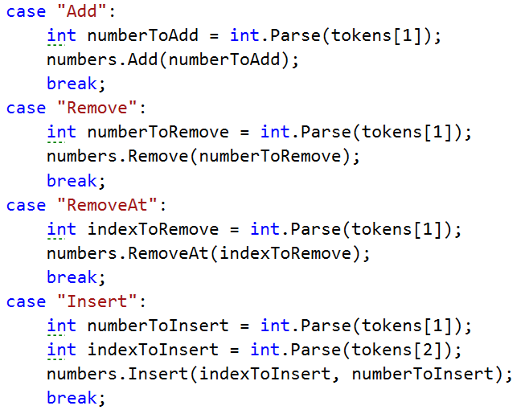

-   For all commands **except from** the **"Insert", tokens[1]** is the
    **number/index**

-   For the **"Insert"** command we receive a **number and an index**
    (**tokens[1], tokens[2]**)

Finally, we **print** the numbers, joined by **a single space**

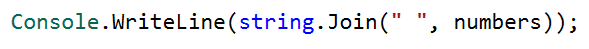

List Manipulation Advanced
--------------------------

Now we will implement more complicated list commands, **extending the previous
task**. Again, read a list, and until you receive **"end"** read commands:

**Contains {number}** – check if the list contains the number. If **yes** print
**"Yes**", **otherwise** print **"No such number"**

**PrintEven** – print **all the numbers** that are **even separated by a space**

**PrintOdd** – print **all the numbers** that are **odd separated by a space**

**GetSum** – print the **sum of all the numbers**

**Filter {condition} {number}** – print all the numbers that **fulfill that
condition**. The condition will be either **'\<'**, **'\>', "\>=", "\<="**

**After** the **end command** print the list **only if** you have made some
**changes** to the **original list**. **Changes** are made **only** from the
commands from the **previous task**.

### Example

| **Input**                                                                                                  | **Output**                                                               |
|------------------------------------------------------------------------------------------------------------|--------------------------------------------------------------------------|
| 2 13 43 876 342 23 543 Contains 100 Contains 543 PrintEven PrintOdd GetSum Filter \>= 43 Filter \< 100 end | No such number Yes 2 876 342 13 43 23 543 1842 43 876 342 543 2 13 43 23 |

Merging Lists
-------------

You are going to receive two lists with numbers. Create a result list which
contains the numbers from both of the lists. The first element should be from
the first list, the second from the second list and so on. If the length of the
two lists are not equal, just add the remaining elements at the end of the list.

### Example

| **Input**                             | **Output**                            |
|---------------------------------------|---------------------------------------|
| 3 5 2 43 12 3 54 10 23 76 5 34 2 4 12 | 3 76 5 5 2 34 43 2 12 4 3 12 54 10 23 |
| 76 5 34 2 4 12 3 5 2 43 12 3 54 10 23 | 76 3 5 5 34 2 2 43 4 12 12 3 54 10 23 |

### Hint

-   Read the two lists

-   Create a result list

-   Start looping through them until you reach the end of the smallest one

-   Finally add the remaining elements (if any) to the end of the list
