Lab: Methods
============

Problems for exercises and homework for the ["Technology Fundamentals" course \@
SoftUni](https://softuni.bg/courses/technology-fundamentals).

You can check your solutions here: <https://judge.softuni.bg/Contests/1208>

Declaring and Invoking Methods
==============================

Sign of Integer Numbers
-----------------------

Create a method that prints the **sign** of an integer number **n**:

### Examples 

| **Input** | **Output**                 |
|-----------|----------------------------|
| 2         | The number 2 is positive.  |
| \-5       | The number -5 is negative. |
| 0         | The number 0 is zero.      |

Grades
------

Write a method that **receives a grade** between **2.00** and **6.00** and
**prints the corresponding grade in words**

-   2.00 – 2.99 - "Fail"

-   3.00 – 3.49 - "Poor"

-   3.50 – 4.49 - "Good"

-   4.50 – 5.49 - "Very good"

-   5.50 – 6.00 - "Excellent"

### Examples

| **Input** | **Output** |
|-----------|------------|
| 3.33      | Poor       |
| 4.50      | Very good  |
| 2.99      | Fail       |

### Hints

1.  Read the grade from the console and pass it to a method

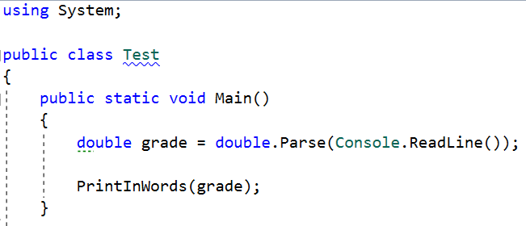

1.  Then create the method and make the if statements for each case

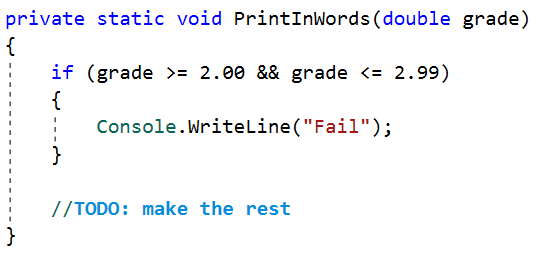

Calculations
------------

Write a program that receives a string on the first line (add, multiply,
subtract, divide) and on the next two lines receives two numbers. Create four
methods (for each calculation) and invoke the right one depending on the
command. The method should also print the result (needs to be void)

### Example

| **Input**    | **Output** |
|--------------|------------|
| subtract 5 4 | 1          |
| divide 8 4   | 2          |

### Hints

1.  Read the command on the first line and the two numbers, and then make an
    if/switch statement for each type of calculation

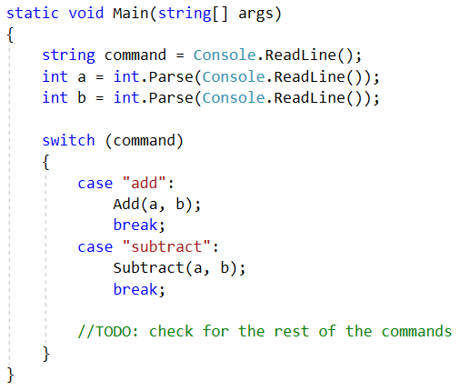

1.  Then create the four methods and print the result

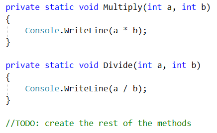

Printing Triangle
-----------------

Create a method for printing triangles as shown below:

### Examples

| **Input** | **Output**                      |
|-----------|---------------------------------|
| 3         | 1 1 2 1 2 3 1 2 1               |
| 4         | 1 1 2 1 2 3 1 2 3 4 1 2 3 1 2 1 |

### Hints

1.  After you read the input

2.  Start by creating a method **for printing a single line** from a **given
    start** to a **given end**. Choose a **meaningful name** for it, describing
    its purpose:

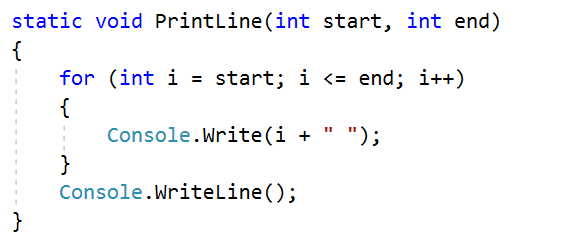

1.  Create another method for printing the whole triangle. Again choose a
    **meaningful name** for it, describing its purpose.

2.  Think how you can use the **PrintLine()** method to solve the problem

3.  After you spent some time thinking, you should have come to the conclusion
    that you will need two loops

4.  In the first loop you can print the first half of the triangle:

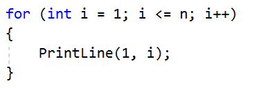

1.  In the second loop you can print the second half of the triangle:

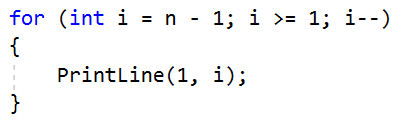

Orders
------

Write a method that calculates the total price of an order and prints it on the
console. The method should receive one of the following products: coffee, coke,
water, snacks; and a quantity of the product. The prices for a single piece of
each product are:

-   coffee – 1.50

-   water – 1.00

-   coke – 1.40

-   snacks – 2.00

Print the result formatted to the second decimal place

### Example

| **Input** | **Output** |
|-----------|------------|
| water 5   | 5.00       |
| coffee 2  | 3.00       |

### Hints

1.  Read the first two lines

2.  Create a method the pass the two variables in

3.  Print the result in the method

Returning Values and Overloading
================================

Calculate Rectangle Area
------------------------

Create a method that calculates and **returns** the
[area](http://www.mathopenref.com/trianglearea.html) of a triangle by given
width and height:

### Examples

| **Input** | **Output** |
|-----------|------------|
| 3 4       | 12         |
| 6 2       | 12         |

### Hints

1.  After reading the input

2.  Create a method, but this time **instead** of typing **"static void"**
    before its name, type **"static double"** as this will make it to **return a
    value of type double**:

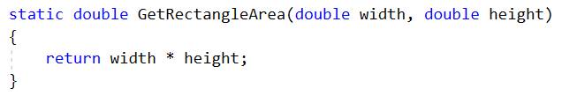

1.  **Invoke** the method in the main and **save the return value in a new
    variable**:

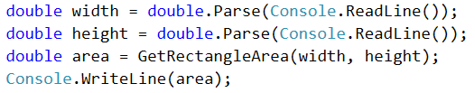

Math Power
----------

Create a method that calculates and returns the value of a number raised to a
given power:

### Examples

| **Input** | **Output** |
|-----------|------------|
| 2 8       | 256        |
| 3 4       | 81         |

### Hints

1.  As usual, read the input

2.  Create a method which will have two parameters - the number and the power,
    and will return a result of type double:

1.  Print the result

Greater of Two Values
---------------------

Create a method **GetMax()** that **returns the greater** of two values (the
values can be of type **int**, **char** or **string**)

### Examples

| **Input**      | **Output** |
|----------------|------------|
| int 2 16       | 16         |
| char a z       | z          |
| string aaa bbb | bbb        |

Multiply Evens by Odds
----------------------

Create a program that **multiplies the sum** of **all even digits** of a number
**by the sum of all odd digits** of the same number:

-   Create a method called **GetMultipleOfEvenAndOdds()**

-   Create a method **GetSumOfEvenDigits()**

-   Create **GetSumOfOddDigits()**

-   You may need to use **Math.Abs()** for negative numbers

### Examples

| **Input** | **Output** | **Comment**                                               |
|-----------|------------|-----------------------------------------------------------|
| \-12345   | 54         | Evens: 2 4 Odds: 1 3 5 Even sum: 6 Odd sum: 9 6 \* 9 = 54 |

Repeat String
-------------

Write a method that receives a string and a repeat count n (integer). The method
should return a new string (the old one repeated n times)

### Example

| **Input** | **Output**   |
|-----------|--------------|
| abc 3     | abcabcabc    |
| String 2  | StringString |

### Hints

1.  Firstly read the **string** and the repeat count **n**

2.  Then create the method and pass it the variables

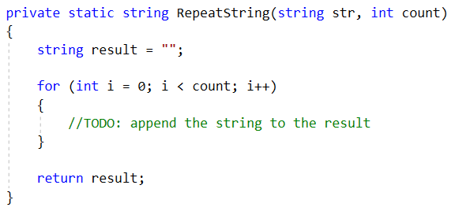

1.  In the main method, print the result

Math operations
---------------

Write a method that receives two number and an operator, calculates the result
and returns it. You will be given three lines of input. The first will be the
first number, the second one will be the operator and the last one will be the
second number. The possible operators are: / \* + -

Print the result rounded up to the second decimal point.

### Example

| **Input** | **Output** |
|-----------|------------|
| 5 \* 5    | 25         |
| 4 + 8     | 12         |

### Hint

1.  Read the inputs and create a method that returns a double (the result of the
    operation)

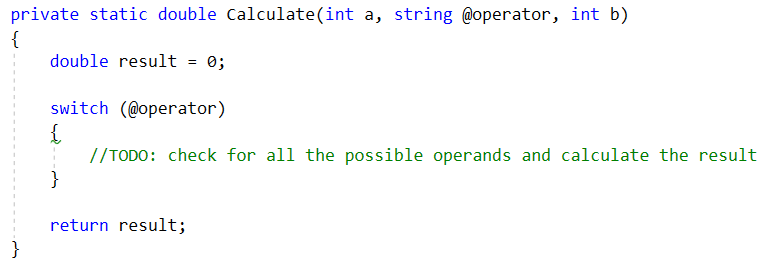
