Lab: Objects and Classes
========================

Problems for exercises and homework for the ["Technology Fundamentals" course \@ SoftUni](https://softuni.bg/courses/technology-fundamentals)
=============================================================================================================================================

You can check your solutions here: <https://judge.softuni.bg/Contests/1214>

Using the Built-in .NET Classes
===============================

Day of Week
-----------

You are given a **date** in format **day-month-year**. Calculate and print the
**day of week** in **English**.

### Examples

| **Input**  | **Output** |
|------------|------------|
| 18-04-2016 | Monday     |
| 27-11-1996 | Wednesday  |

### Hints

-   **Read the date as string** from the Console.

-   Use the method [DateTime.ParseExact(string date, format,
    provider)](https://msdn.microsoft.com/en-us/library/w2sa9yss(v=vs.110).aspx)
    to convert the input string to object of type **DateTime**. Use format
    **“d-M-yyyy”** and **CultureInfo.InvariantCulture**.

    -   Alternatively split the input by “**-**“ and you will get the day, month
        and year as numbers. Now you can create **new DateTime(year, month,
        day)**.

-   The newly created **DateTime** object has property
    [DayOfWeek](https://msdn.microsoft.com/en-us/library/system.datetime.dayofweek(v=vs.110).aspx).

Randomize Words
---------------

You are given a **list of words in one line**. **Randomize their order** and
print each word at a separate line.

### Examples

| **Input**                                            | **Output**                                           | **Comments**                                                                         |
|------------------------------------------------------|------------------------------------------------------|--------------------------------------------------------------------------------------|
| Welcome to SoftUni and have fun learning programming | learning Welcome SoftUni and fun programming have to | The order of the words in the output will be different after each program execution. |

### Hints

-   **Split** the input string by (space) and create an **array of words**.

-   Create a random number generator – an object **rnd** of type **Random**.

-   In a **for-loop exchange each number** at positions 0, 1, …
    **words.Length-1** by a number at **random position**. To generate a random
    number in range use **rnd.**[Next(minValue,
    maxValue)](https://msdn.microsoft.com/en-us/library/2dx6wyd4(v=vs.110).aspx).
    Note that by definition **minValue** is **inclusive**, but **maxValue** is
    **exclusive**.

-   Print each word in the array on new line.

Big Factorial
-------------

You will receive **N** – number in range **[0 – 1000]**. Calculate **Factorial**
of **N** and print the result.

### Examples

| **Input** | **Output**                                                                                                                                                                                                         |
|-----------|--------------------------------------------------------------------------------------------------------------------------------------------------------------------------------------------------------------------|
| 50        | 30414093201713378043612608166064768844377641568960512000000000000                                                                                                                                                  |
| 125       | 188267717688892609974376770249160085759540364871492425887598231508353156331613598866882932889495923133646405445930057740630161919341380597818883457558547055524326375565007131770880000000000000000000000000000000 |

### Hints

Use the class **BigInteger** from the built-in .NET library
**System.Numerics.dll**.

1.  Import the namespace “**System.Numerics**”:

1.  Use the type **BigInteger** to calculate the number **factorial**.

    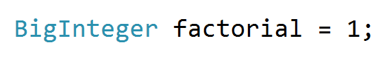

2.  **Loop from 2 to N and multiply every number with factorial.**

Defining Simple Classes
=======================

Songs
-----

Define a class **Song**, which holds the following information about songs:
**Type List**, **Name** and **Time**.

On the first line you will receive the **number of songs - N**.

On the **next N-lines** you will be receiving data in the following format:
**"{typeList}_{name}_{time}".**

On the last line you will receive **Type List** / **"all".** Print only the
**Names of the songs** which are from that **Type List** / **All songs**.

### Examples

| **Input**                                                                                                                 | **Output**                    |
|---------------------------------------------------------------------------------------------------------------------------|-------------------------------|
| 3 favourite_DownTown_3:14 favourite_Kiss_4:16 favourite_Smooth Criminal_4:01 favourite                                    | DownTown Kiss Smooth Criminal |
| 4 favourite_DownTown_3:14 listenLater_Andalouse_3:24 favourite_In To The Night_3:58 favourite_Live It Up_3:48 listenLater | Andalouse                     |
| 2 like_Replay_3:15 ban_Photoshop_3:48 all                                                                                 | Replay Photoshop              |

### Solution

Define class Song with properties: **Type List**, **Name** and **Time**.

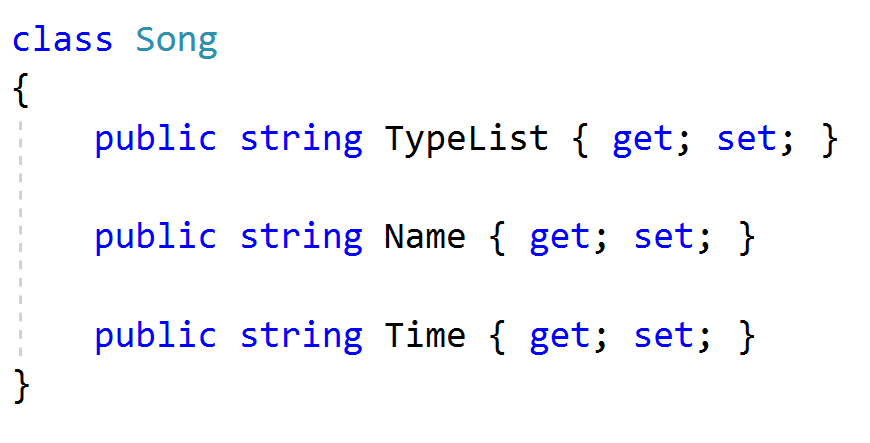

Read the input lines, make collection and store the data.

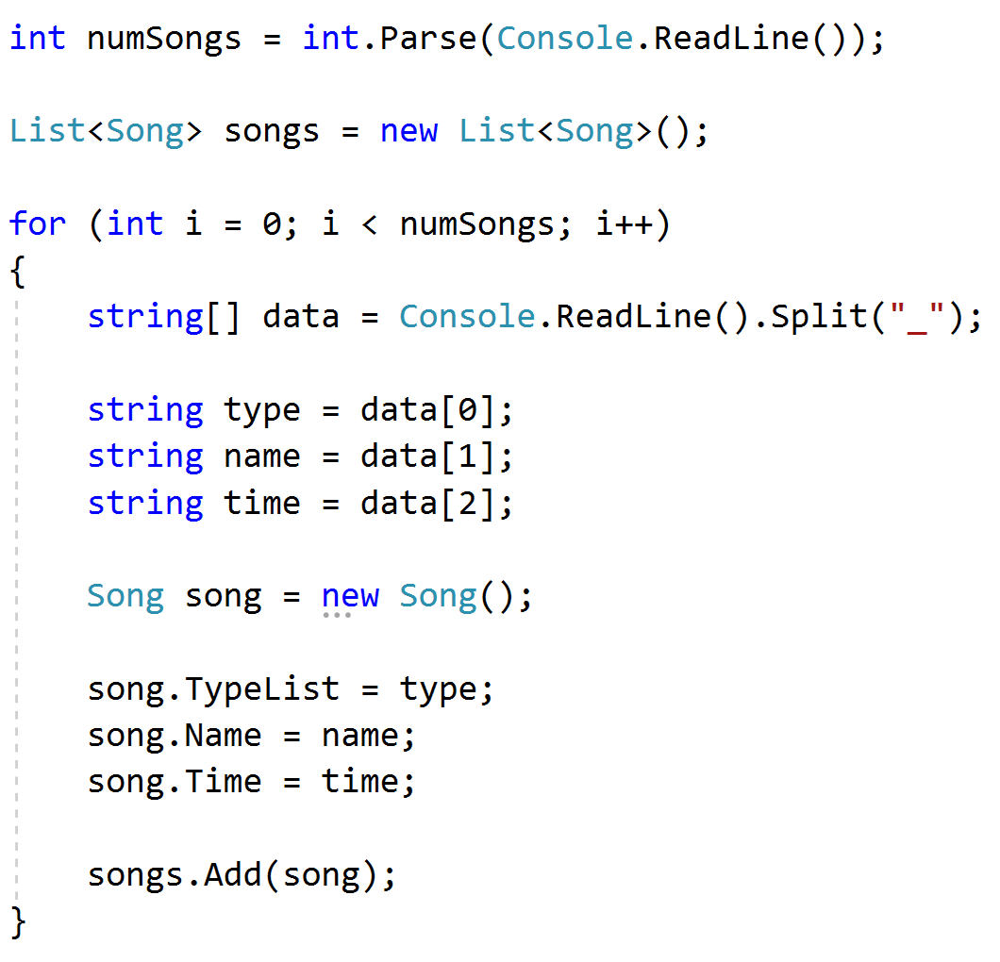

Finally read your last line – **Type List** and **print** the result.

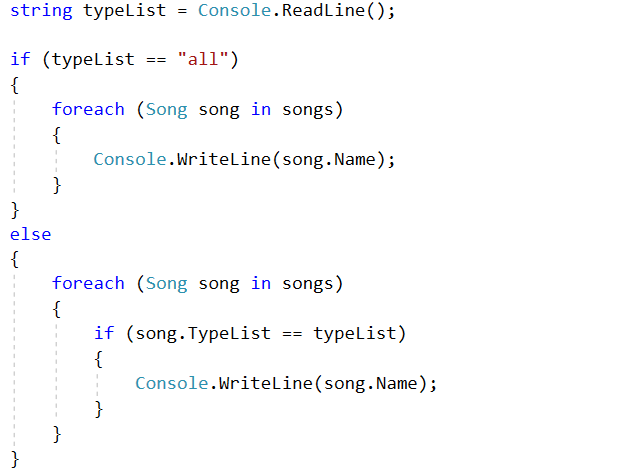

You can use LINQ to filter the collection.

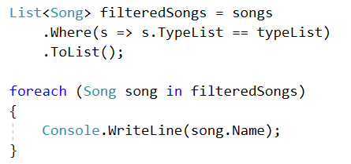

Students
--------

Define a class **Student**, which holds the following information about
students: **first name**, **last name**, **age** and **hometown**.

Read list of students until you receive "**end**" command. After that, you will
receive a **city name**. Print only students which are from the given city, in
the following format: **"{firstName} {lastName} is {age} years old.".**

### Examples

| **Input**                                                                                                     | **Output**                                                                             |
|---------------------------------------------------------------------------------------------------------------|----------------------------------------------------------------------------------------|
| John Smith 15 Sofia Peter Ivanov 14 Plovdiv Linda Bridge 16 Sofia Simon Stone 12 Varna end Sofia              | John Smith is 15 years old. Linda Bridge is 16 years old.                              |
| Anthony Taylor 15 Chicago David Anderson 16 Washington Jack Lewis 14 Chicago David Lee 14 Chicago end Chicago | Anthony Taylor is 15 years old. Jack Lewis is 14 years old. David Lee is 14 years old. |

### Solution

Define a class student with the following properties: **FirstName**,
**LastName**, **Age** and **City**.

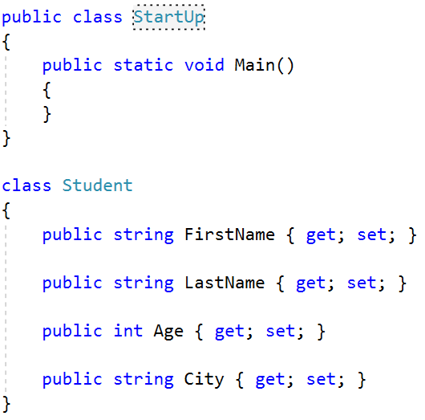

Read a list of students.

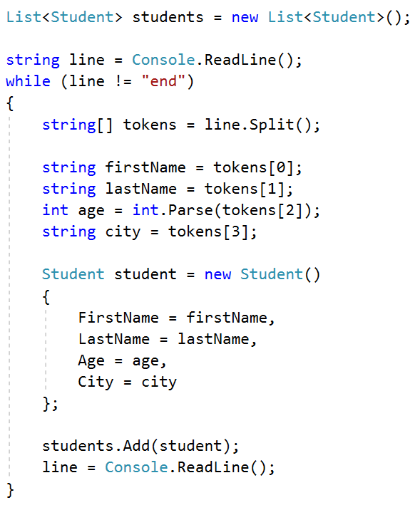

Read a city name and print only students which are from the given city.

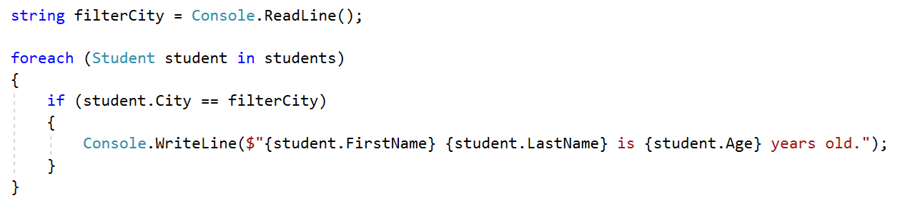

You can filter the students with LINQ.

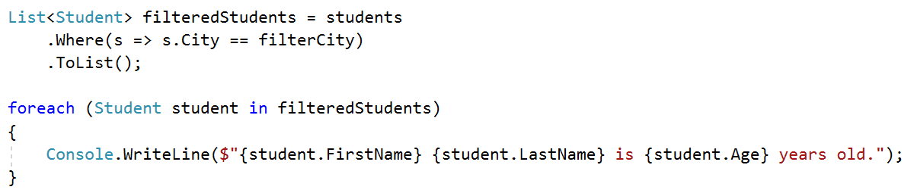

Students 2.0
------------

Use the class from the previous problem. If you receive a student which already
exists (**first name** and **last name** should be **unique**) overwrite the
information.

| **Input**                                                                                                                                                | **Output**                                                                             |
|----------------------------------------------------------------------------------------------------------------------------------------------------------|----------------------------------------------------------------------------------------|
| John Smith 15 Sofia Peter Ivanov 14 Plovdiv Peter Ivanov 25 Plovdiv Linda Bridge 16 Sofia Linda Bridge 27 Sofia Simon Stone 12 Varna end Sofia           | John Smith is 15 years old. Linda Bridge is 27 years old.                              |
| Anthony Taylor 15 Chicago David Anderson 16 Washington Jack Lewis 14 Chicago David Lee 14 Chicago Jack Lewis 26 Chicago David Lee 18 Chicago end Chicago | Anthony Taylor is 15 years old. Jack Lewis is 26 years old. David Lee is 18 years old. |

### Hints

Check if the given student already exists.

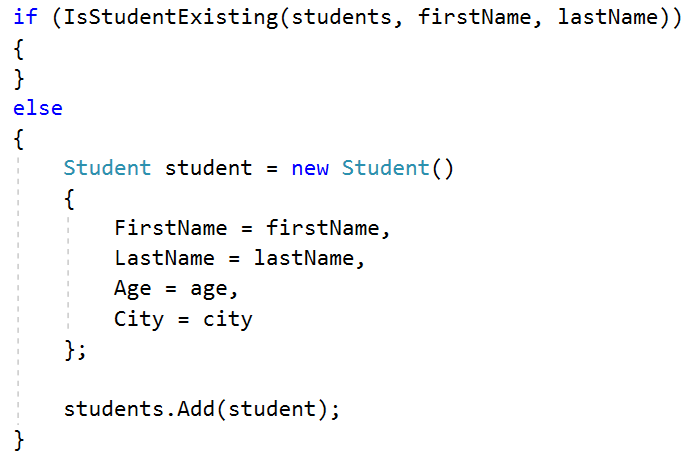

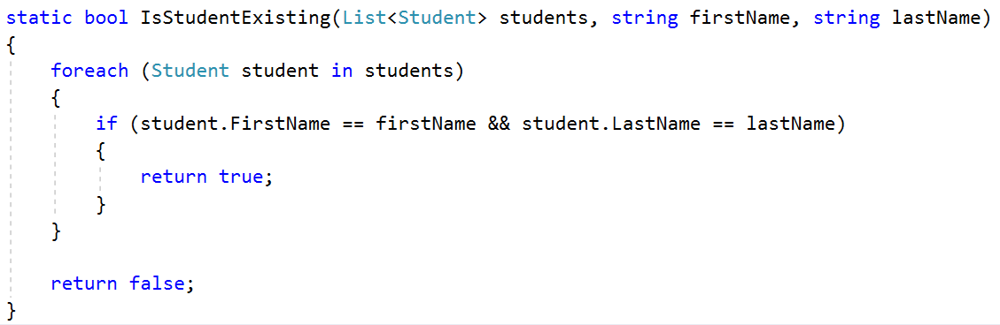

Overwrite the student information.

First, we have to find the existing student.

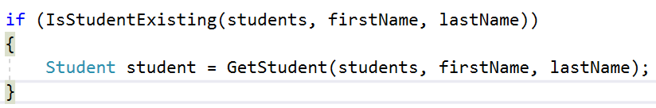

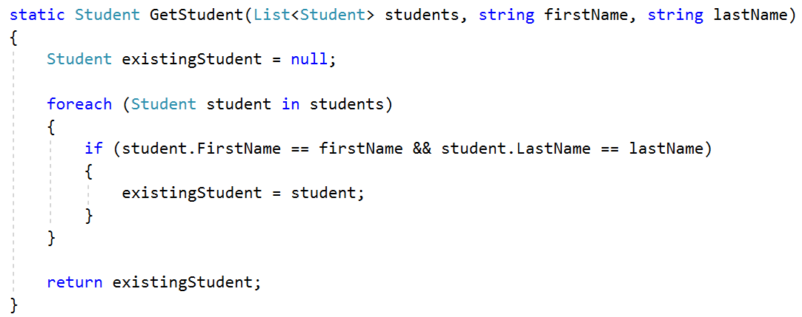

Finally, we have to overwrite the information.

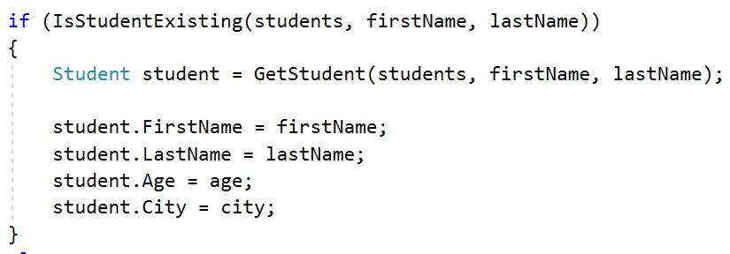

We can use LINQ as well.

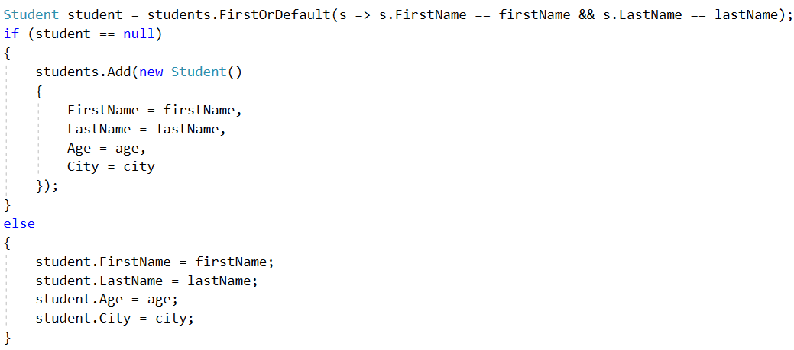

**FirstOrDefault** returns the first occurrence or the default value (null in
this case).

Store Boxes
-----------

Define a class **Item** which contains these properties: **Name and Price.**

Define a class **Box** which contains these properties: **Serial Number, Item,
Item Quantity and Price for a Box.**

Until you receive **"end"** you will be receiving data in the following format:
**{Serial Number} {Item Name} {Item Quantity} {itemPrice}**

The **Price of one box** has to be calculated: **itemQuantity \* itemPrice.**

Print all the boxes, ordered descending by price for a box, in the following
format:

**{boxSerialNumber}**

**-- {boxItemName} – \${boxItemPrice}: {boxItemQuantity}**

**-- \${boxPrice}**

Price should be **formatted to the 2nd character after the decimal point**.

### Examples

| **Input**                                                                                          | **Output**                                                                                                                                                                          |
|----------------------------------------------------------------------------------------------------|-------------------------------------------------------------------------------------------------------------------------------------------------------------------------------------|
| 19861519 Dove 15 2.50 86757035 Butter 7 3.20 39393891 Orbit 16 1.60 37741865 Samsung 10 1000 end   | 37741865 -- Samsung - \$1000.00: 10 -- \$10000.00 19861519 -- Dove - \$2.50: 15 -- \$37.50 39393891 -- Orbit - \$1.60: 16 -- \$25.60 86757035 -- Butter - \$3.20: 7 -- \$22.40      |
| 48760766 Alcatel 8 100 97617240 Intel 2 500 83840873 Milka 20 2.75 35056501 SneakersXL 15 1.50 end | 97617240 -- Intel - \$500.00: 2 -- \$1000.00 48760766 -- Alcatel - \$100.00: 8 -- \$800.00 83840873 -- Milka - \$2.75: 20 -- \$55.00 35056501 -- SneakersXL - \$1.50: 15 -- \$22.50 |

### Hints

This is how your class Box should look like.

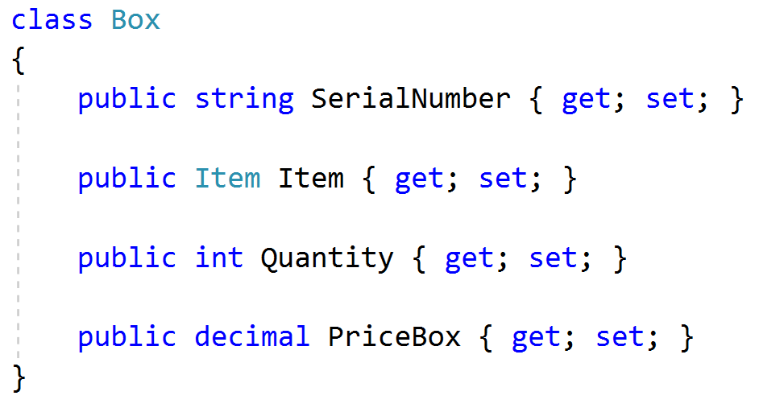

**Create instance of Item** so when you try to set a value to some of the
properties, will not throw you an exception.

There are two ways to do that:

First you can create new instance of Item in the **Box constructor**.

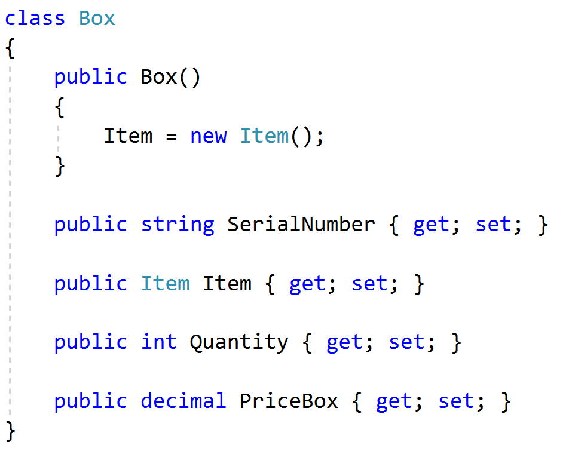

Or every time you create new Box on the next line just access the Item property
and create new instance.

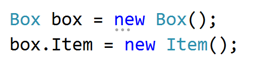

Vehicle Catalogue 
------------------

Your task is to **create Vehicle catalogue** which contains only **Trucks and
Cars**.

Define class **Truck** with these properties: **Brand, Model and Weight**.

Define class **Car** with these properties: **Brand, Model and Horse Power**.

Define class **Catalog** with these properties: **Collections of Trucks and
Cars**.

You have to read your input until you receive the "**end**" command.

The input will be in following format: **{type}/{brand}/{model}/{horse power /
weight}**

In the end you have **to print all vehicles ordered alphabetical by brand,** in
the following format:

**Cars:**

**{Brand}: {Model} - {Horse Power}hp**

**Trucks:**

**{Brand}: {Model} - {Weight}kg**

### Examples

| **Input**                                                                                        | **Output**                                                                                                   |
|--------------------------------------------------------------------------------------------------|--------------------------------------------------------------------------------------------------------------|
| Car/Audi/A3/110 Car/Maserati/Levante/350 Truck/Mercedes/Actros/9019 Car/Porsche/Panamera/375 end | Cars: Audi: A3 - 110hp Maserati: Levante - 350hp Porsche: Panamera - 375hp Trucks: Mercedes: Actros - 9019kg |
| Car/Subaru/Impreza/152 Car/Peugeot/307/109 end                                                   | Cars: Peugeot: 307 - 109hp Subaru: Impreza - 152hp                                                           |

### Hints

This is how your class **Catalog** should look like.

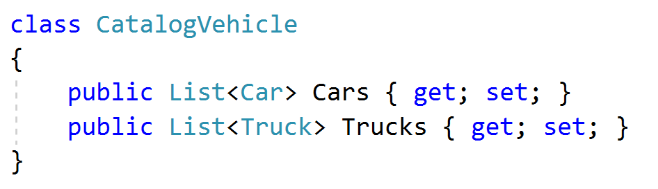

Don’t forget to **create instance for the two Lists**.

You can do it in the **constructor of catalogue** or **after you create instance
of catalogue** you have to access Cars and Trucks and then to create new
instance.
