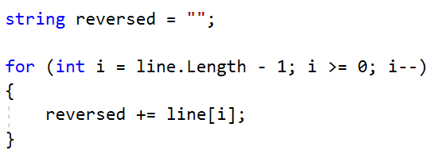
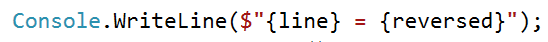
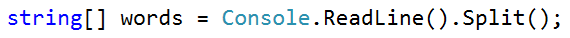
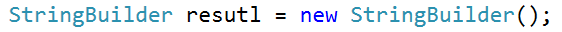
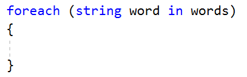
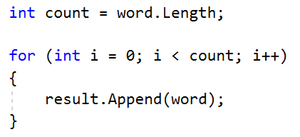

Lab: Text Processing and Regular Expressions
============================================

Problems for exercises and homework for the ["Technology Fundamentals with C\#"
course \@ SoftUni](https://softuni.bg/modules/57/tech-module-4-0).

You can check your solutions in [Judge](https://judge.softuni.bg/Contests/1216).

Reverse Strings
---------------

You will be given series of strings until you receive an **"end"** command.
Write a program that reverses strings and prints each pair on a separate line in
the format **"{word} = {reversed word}"**.

### Examples

| **Input**                | **Output**                                      |
|--------------------------|-------------------------------------------------|
| helLo Softuni bottle end | helLo = oLleh Softuni = inutfoS bottle = elttob |
| Dog caT chAir end        | Dog = goD caT = Tac chAir = riAhc               |

### Solution

Use a while loop and read strings until you receive "end".

Reverse the string with a for loop. Start from the last index and append each
symbol to the new string.

Print the reversed string in the specified format.

Repeat Strings
--------------

### Write a program that reads an array of strings. Each string is repeated N times, where N is the length of the string. Print the concatenated string.

### Examples

| **Input**  | **Output**             |
|------------|------------------------|
| hi abc add | hihiabcabcabcaddaddadd |
| work       | workworkworkwork       |
| ball       | ballballballball       |

### Solution

-   Read a string array.

-   Initialize **StringBuilder**.

-   Iterate through elements in the array.

-   Find the length of the current word and append it.

-   Print the **StringBuilder**.

Substring
---------

On the **first line** you will receive a **string**. On the **second line** you
will receive a second **string**. Write a program that **removes all** of the
**occurrences** of the **first** string **in** the **second, until** there is
**no match**. At the end **print** the **remaining string**.

### Examples

| **Input**        | **Output** | **Comment**                                                                                                                                   |
|------------------|------------|-----------------------------------------------------------------------------------------------------------------------------------------------|
| Ice kicegiciceeb | kgb        | We remove ice once and we get "kgiciceeb" We match "ice" one more time and we get "kgiceb" There is one more match. The finam result is "kgb" |

### Hints

-   Read the input.

-   Find the first index where the key appears.

    -   Use the built-in method **IndexOf**()

-   Remove the match.

    -   Use the built-in method **Remove**(index, length)

-   Repeat it until the text doesn't contain the key anymore.

Text Filter
-----------

Write a program that takes a **text** and a **string of banned words**. All
words included in the ban list should be replaced with **asterisks** "**\***",
equal to the word's length. The entries in the ban list will be separated by a
**comma** and **space** "**,** ".

The ban list should be entered on the first input line and the text on the
second input line.

### Examples

| **Input**                                                                                                                                                                                                               | **Output**                                                                                                                                                                                                      |
|-------------------------------------------------------------------------------------------------------------------------------------------------------------------------------------------------------------------------|-----------------------------------------------------------------------------------------------------------------------------------------------------------------------------------------------------------------|
| Linux, Windows It is not **Linux**, it is GNU/**Linux**. **Linux** is merely the kernel, while GNU adds the functionality. Therefore we owe it to them by calling the OS GNU/**Linux**! Sincerely, a **Windows** client | It is not \*\*\*\*\*, it is GNU/\*\*\*\*\*. \*\*\*\*\* is merely the kernel, while GNU adds the functionality. Therefore we owe it to them by calling the OS GNU/\*\*\*\*\*! Sincerely, a \*\*\*\*\*\*\* client |

### Hints

-   Read the input.

-   Replace all ban words in the text with asterisk (\*).

    -   Use the built-in method **Replace**(banWord, replacement).

    -   Use **new string(**char ch, int repeatCount**)** to create the
        replacement

Digits, Letters and Other
-------------------------

Write a program that receives a **single string** and on the **first line,**
prints **all the digits**. On the **second** – **all the letters**, and on the
**third** – **all the other characters**. **There will always be at least one
digit, one letter and one other character.**

### Examples

| **Input**         | **Output**          |
|-------------------|---------------------|
| Agd\#53Dfg\^&4F53 | 53453 AgdDfgF \#\^& |

### Hints

-   Read the input.

-   Use loop to iterate through all characters in the text. If the char is digit
    print it, otherwise ignore it.

    -   Use char.**IsDigit**(char symbol)

-   Do the same for the letters and other chars

    -   Find something like IsDigit method for the letters.

Problems for exercises and homework for the ["Technology Fundamentals" course \@
SoftUni](https://softuni.bg/courses/technology-fundamentals).  
Please submit your solutions (source code) of all below described problems in
the [Judge
System.](https://judge.softuni.bg/Contests/1344/Regular-Expressions-Lab)

Match Full Name
---------------

Write a program that **matches full names** from a list of names and **prints**
them on the console.

### Writing the Regular Expression

First, write a regular expression to match a valid full name, according to these
conditions:

-   A valid full name has the following characteristics:

    -   It consists of **two words**.

    -   Each word **starts** with a **capital letter**.

    -   After the first letter, it **only contains lowercase letters
        afterwards**.

    -   **Each** of the **two words** should be **at least two letters long**.

    -   The **two words** are **separated** by a **single space**.

To help you out, we've outlined several steps:

-   Use an online regex tester like <https://regex101.com/>

-   Check how to use **character sets** (denoted with square brackets -
    "**[]**")

-   Specify that you want **two words** with a space between them (the **space
    character ' '**, and **not** any whitespace symbol)

-   For each word, specify that it should begin with an uppercase letter using a
    **character set**. The desired characters are in a range – **from** ‘**A**’
    **to** ‘**Z**’.

-   For each word, specify that what follows the first letter are only
    **lowercase letters**, one or more – use another character set and the
    correct **quantifier**.

-   To prevent the capturing of letters across new lines, put "**\\b**" at the
    beginning and at the end of your regex. This will ensure that what precedes
    and what follows the match is a word boundary (like a new line).

In order to check your RegEx, use these values for reference (paste all of them
in the **Test String** field):

| **Match ALL of these** | **Match NONE of these**                                                      |
|------------------------|------------------------------------------------------------------------------|
| Ivan Ivanov            | ivan ivanov, Ivan ivanov, ivan Ivanov, IVan Ivanov, Ivan IvAnov, Ivan Ivanov |

By the end, the matches should look something like this:

After you’ve constructed your regular expression, it’s time to write the
solution in C\#.

### Examples

| **Input**                                                                    |
|------------------------------------------------------------------------------|
| Ivan Ivanov, Ivan ivanov, ivan Ivanov, IVan Ivanov, Test Testov, Ivan Ivanov |
| **Output**                                                                   |
| Ivan Ivanov Test Testov                                                      |

Match Dates
-----------

Write a program, that matches a date in the format
“**dd{separator}MMM{separator}yyyy**”. Use **named capturing groups** in your
regular expression.

### Compose the Regular Expression

Every valid date has the following characteristics:

-   Always starts with **two digits**, followed by a **separator**

-   After that, it has **one uppercase** and **two lowercase** letters (e.g.
    **Jan**, **Mar**).

-   After that, it has a **separator** and **exactly 4 digits** (for the year).

-   The separator could be either of the three: a period (“**.**”), a hyphen
    (“**-**“) or a forward slash (“**/**”)

-   The separator needs to be **the same** for the whole date (e.g.
    13**.**03**.**2016 is valid, 13**.**03**/**2016 is **NOT**). Use a **group
    backreference** to check for this.

You can follow the table below to help with composing your RegEx:

| **Match ALL of these**                | **Match NONE of these**               |
|---------------------------------------|---------------------------------------|
| 13/Jul/1928, 10-Nov-1934, 25.Dec.1937 | 01/Jan-1951, 23/sept/1973, 1/Feb/2016 |

Use **named capturing groups** for the **day**, the **month** and the **year**.

Since this problem requires a more complex RegEx, which includes **named
capturing groups**, we’ll take a look at how to construct it:

-   First off, we don’t want anything at the **start** of our date, so we’re
    going to use a **word boundary** “**\\b**”:  
    

    

-   Next, we’re going to match the **day**, by telling our RegEx to match
    **exactly two digits**, and since we want to **extract** the day from the
    match later, we’re going to put it in a **capturing group**:  
    

    

      
    We’re also going to give our group a **name**, since it’s easier to navigate
    by **group name** than by **group index**:  
    

    

-   Next comes the separator – either a **hyphen**, **period** or **forward
    slash**. We can use a **character class** for this:  
    

    

      
    Since we want to use the separator we have matched here to match the **same
    separator** further into the date, we’re going to put it in a **capturing
    group**:  
    

    

-   Next comes the **month**, which consists of a **capital Latin letter** and
    **exactly two lowercase Latin letters**:  
    

    

-   Next, we’re going to match the **same separator we have matched earlier**.
    We can use a **backreference** for that:  
    

    

-   Next up, we’re going to match the year, which consists of **exactly 4
    digits**:  
    

    

-   Finally, since we don’t want to match the date if there’s anything else
    **glued to it**, we’re going to use  
    another **word boundary** for the end:  
    

    

Now it’s time to find all the **valid dates** in the input and **print each
date** in the following format: “**Day: {day}, Month: {month}, Year: {year}**”,
each on a **new line**.

### Examples

| **Input**                                                                                       |
|-------------------------------------------------------------------------------------------------|
| 13/Jul/1928, 10-Nov-1934, , 01/Jan-1951,f 25.Dec.1937 23/09/1973, 1/Feb/2016                    |
| **Output**                                                                                      |
| Day: 13, Month: Jul, Year: 1928 Day: 10, Month: Nov, Year: 1934 Day: 25, Month: Dec, Year: 1937 |

Match a Phone Number
--------------------

Write a regular expression to match a **valid phone number** from **Sofia**.
After you find all of the **valid phones**, **print** them on the console,
separated by a **comma and a space** “**,** ”.

### Compose the Regular Expression

A valid number has the following characteristics:

-   It starts with "**+359**"

-   Then, it is followed by the area code (always **2**)

-   After that, it’s followed by the **number** itself:

    -   The number consists of **7 digits** (separated in **two groups** of
        **3** and **4 digits** respectively).

-   The different **parts** are **separated** by **either a space or a hyphen**
    ('**-**').

You can use the following RegEx properties to **help** with the matching:

-   Use **quantifiers** to match a **specific number** of **digits**

-   Use a **capturing group** to make sure the delimiter is **only one of the
    allowed characters (space or hyphen)** and **not** a **combination** of both
    (e.g. **+359 2-111 111** has **mixed delimiters**, it is **invalid**). Use a
    **group backreference** to achieve this.

-   Add a **word boundary** at the **end** of the match to avoid **partial
    matches** (the last example on the right-hand side).

-   Ensure that before the **'+'** sign there is either a **space** or the
    **beginning of the string**.

You can use the following table of values to test your RegEx against:

| **Match ALL of these**           | **Match NONE of these**                                                                            |
|----------------------------------|----------------------------------------------------------------------------------------------------|
| \+359 2 222 2222 +359-2-222-2222 | 359-2-222-2222, +359/2/222/2222, +359-2 222 2222 +359 2-222-2222, +359-2-222-222, +359-2-222-22222 |

### Examples

| **Input**                                                                                                                           |
|-------------------------------------------------------------------------------------------------------------------------------------|
| \+359 2 222 2222,359-2-222-2222, +359/2/222/2222, +359-2 222 2222 +359 2-222-2222, +359-2-222-222, +359-2-222-22222 +359-2-222-2222 |
| **Output**                                                                                                                          |
| \+359 2 222 2222, +359-2-222-2222                                                                                                   |
